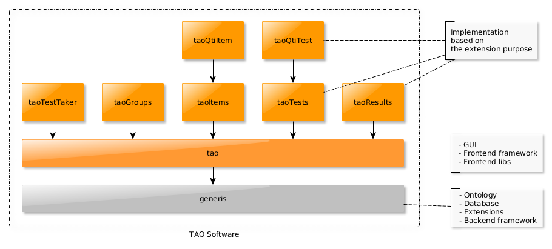

<!--
authors:
    - "Bertrand Chevrier"
tags:
    Frontend Architecture:
        - "Project structure"
-->

# Frontend file structure

> Extension based architecture and file structure

## The extension model

TAO uses an "extension" model as a basement for his architecture. It means the software is composed by many extensions using a hierarchical model : each extension can depend on another extension.



This dependency model is defined at the level of the business logic but also at the level of the code.

**The code inside an extension can be dependent on the code inside another extension only if the dependency to the extension exists too**

For example, in the source code of `taoQtiItem` you can use code from `taoItems`. 

Given a file `taoQtiItem/views/js/controller/Main/index.js` :

```js
define([
    'taoItems/service/assets'
], function(assets){

});
```

The dependency in the `define` is allowed only because `taoQtiItem` depends on `taoItems`. To ensure a dependency exists, please check the extension `manifest.php` file :

```php
return array(
    'name'        => 'taoQtiItem',
    'label'       => 'QTI item model',
    'license'     => 'GPL-2.0',
    'version'     => '18.0.0',
    'author'      => 'Open Assessment Technologies',
    'requires' => array(
        'taoItems' => '>=6.0.0',
        'tao'      => '>=21.0.0',
        'generis'  => '>=7.3.0',
    ),
    //...
);
```

### In which extension should I write my code ?

 - if the code is considered as framework code, generic library or general enough it belongs to the `tao` extension
 - otherwise it should be placed in the correct extension, based on the task, the purpose.

**Don't Repeat Yourself**

If a module, a function or a block is used across multiple extensions, you'll need to find the common ancestor extension, and define it there. It's one of the reason some GUI components are in the `tao` extension.

> In the near future we will try to push generalized code into `npm` libraries to prevent having too much code into the `tao-core` extension.


### Extension structure

The ideal structure :
```
views
├── build                  //build configuration
│   └── grunt              //where grunt loads the config for this extension
├── css                    //result of the SASS compilation
├── scss                   //SASS sources, should be extension generic styles
├── img
├── js                     //JavaScript folder
│   ├── component          //the graphical components
│   ├── controller         //contains the controlers,
│   │   └── routes.js      //mandatory, define how to load the controllers
│   ├── lib                //external libraries
│   ├── loader             //contains the bundles
│   ├── provider           //data providers (gives access to the data, usually through Ajax requests)
│   ├── runner             //runners (test, item, etc.) code
│   └── services           //business logic (loads data from providers and expose meaningfull services)
└── templates              //server side templates, usually page loaders
```

> This structure is unfortunately only theoretical. A huge refactoring would be great.

## Multi-format structure

> Files that serve the same purpose must live together.

It means if a module requires a template, some JSON data or a CSS file, they'll have to live in the same folder.

For example, a component must have the following structure:

```
datetime                //the component folder
├── css                 //compiled css
│   ├── picker.css
│   └── picker.css.map
├── scss                //SASS source
│   └── picker.scss
└── tpl                 //component templates
│   └── picker.tpl
└── picker.js           //the component itself
```

### And tests ?

> The exception to the rule above is the test.

Tests are always located under `extensionName/views/js/test`. The structure reflecting the source structure.
For example the tests files, including fixtures, samples and mocks, of the module `tao/views/js/ui/datetime/picker` will be located under  `tao/views/js/ui/datetime/picker/`.
