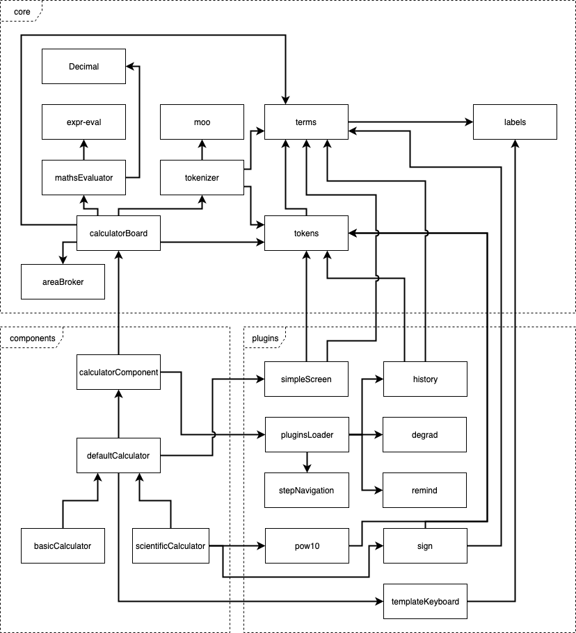
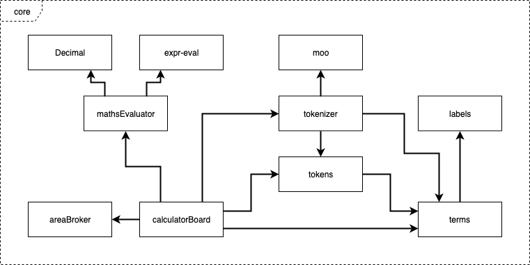
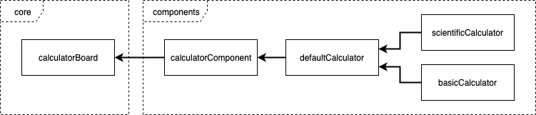
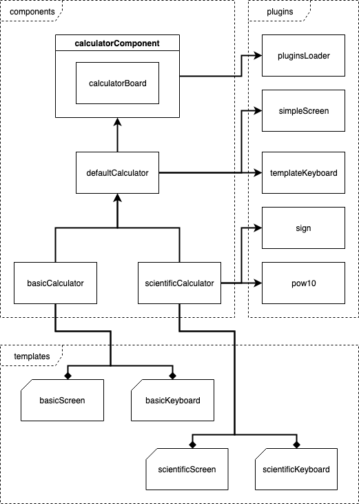
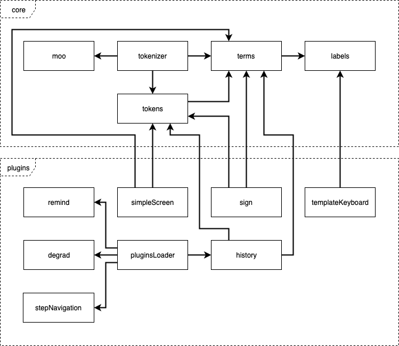

# Calculator component overview

<!-- 
tags:
    JavaScript Components:
        - "Calculator component overview"
    Calculator:
        - "Component overview"
-->

> A calculator component is provided by TAO. This article explains how it works.

TAO already provides a basic 4-functions [calculator implementation](https://github.com/oat-sa/tao-core/blob/master/views/js/ui/calculator.js).
However, this is a simple implementation that immediately computes the operation,
without taking into account the precedence of operators.
 
In order to properly support the [mathematical order of operations](https://en.wikipedia.org/wiki/BODMAS)
we designed another calculator component. Instead of immediately computing the
new value it uses expressions. This way the user is able to build a complex
operation before executing it. The mathematical order is respected, for instance
`*` and `/` are computed before `+` and `-`, and parenthesis are available to
change priorities: `3*(2+1)` will not give the same result as `3*2+1`. 

To process the expression a parser is bundled with the calculator component.
Mathematical precision is handled by an
[arbitrary precision](https://en.wikipedia.org/wiki/Arbitrary-precision_arithmetic)
library which avoid the well known
[round-off issue](https://docs.oracle.com/cd/E19957-01/806-3568/ncg_goldberg.html).
However, some precision issues may still occur, especially when dealing with
irrational values.

## Computation engine
The computation engine relies on several third-party components: a parser, a
number representation engine, and a lexer is used to tokenize the expression.
The choice of those third-party libraries was made with the following concerns
in mind:
- license compatibility (TAO is released under the terms of the GPLv2 license)
- support and maintainability
- ability and ease of extension
- well covered feature set and quality of implementation

As the parser allows to redefine the implementation of the operators and other
mathematical functions, a wrapper is responsible of mixing the parser and the
number representation engine. This is the purpose of the `mathsEvaluator`
module.

### Third-party libraries
A word about the third-party libraries, to present them and explain how they are
utilized in the calculator.

#### Parser
The chosen parser is [expr-eval](https://github.com/silentmatt/expr-eval), which
was forked in [OAT repository](https://github.com/oat-sa/expr-eval) as we needed
to extend its abilities to ease the implementation of the N<sup>th</sup> root
function.

The purpose of this fork was to bring the ability to use any two-entry functions
as a regular binary operator, with the same operator precedence than the
function. The feature is relying on a prefix that transforms the function into
an operator. 

This parser accepts mathematical expressions, including functions, and is able
to process them. It also provides a way to add custom functions, and, last but
not least, accepts to replace the existing implementation of built-in operators
and functions by an arbitrary version.

This library is used to parse and evaluate the expressions built inside the 
calculator, so it is a very important piece in the architecture. The precedence
of operators is managed by the parser, as well as the operations are evaluated
and computed. The parser can be seen as a function accepting expressions and
returning the result of this expression once evaluated.

##### Expressions syntax
The parser expects expressions to be ASCII strings, with the following rules:
- Numerical values are expressed with digits, the decimal separator being the
dot `.`: `3.1415`.
- Scientific notation using exponent part is allowed: `3.1415e10`.
- Regular arithmetic operators are supported, with natural precedence: `+`, `-`,
`*`, `/`, `!`. Operators can be either unary or binary, depending on their
meaning.
- Expressions can be wrapped in parenthesis: `3*(5+2)`.
- Terms are separated by spaces, however regular operators and parenthesis also
act as separators.
- Functions and constants are supported: `cos PI`.
- Variables are supported, but require to be defined: `3 * x`.
- Any functions can be turned into a binary operator by prefixing them
with a `@`: `4 @nthrt 16` is equivalent to `nthrt(4, 16)`. Obviously, only 
functions that accept two parameters can work properly with this trick.

#### Numbers
The number representation library is using
[arbitrary precision](https://en.wikipedia.org/wiki/Arbitrary-precision_arithmetic)
to store and manipulate the numbers. We chose
[Decimal.js](https://github.com/MikeMcl/decimal.js/), which is a good compromise
regarding precision and performances. It exposes a comprehensive API to
manipulate and compute decimal numbers.

As the parser in use is not resilient against the round-off issue, every
built-in operation is replaced by the equivalent provided by `Decimal.js`.
This allows to support a better numerical precision, but it also means the
result of the parser is now a `Decimal` object.

To ensure the parser is still working well after having replaced its built-in
computation functions, some wrappers have been added. They convert the data type
on the fly if required. The benefit is that we can feed the parser with native
types and rely on the wrappers to always ensure a compatible format.

#### Lexer
Manipulating the expression requires to be able to recognize its elements, and
to do so the calculator component is relying on a lexer, that is able to cut the
expression into atomic and clearly identifiable parts.

Our implementation uses the [moo](https://github.com/no-context/moo) library,
which is a well supported and offers an optimized tokenizer. It accepts rational
expressions to define the patterns it is meant to recognize.

It is worth to mention this tokenizer is not utilized by the parser to recognize
the expression, as the parser is bringing its own way to do that. The purpose of
this tokenizer, inside the calculator, is to bring the ability to identify the
elements of the expression, in order to manipulates them. Among other things,
this allows to:
- display properly each element with respect to their meaning (mathematical
symbols or special tokens)
- navigate freely between elements, and add or remove them easily
- apply some business logic on top of them (for instance change the sign of the
current operand, or recognize exponents)  

### mathsEvaluator
The `mathsEvaluator` is a central piece inside the calculator, as it processes
the computation of the expressions and returns the result. Internally it relies
on the third-party parser and the number representation engine presented above.

Basically, this module is mixing in the parser and the number representation
engine, ensuring the link between them is made seamlessly and the data are
represented using a compatible format. Also, as not all required functions are
brought by the parser or the number representation engine, this module is also
implementing some missing functions.

The module exposes a factory function, that returns a configured copy of the
`evaluate` function. Obviously this module is not restricted to the calculator,
and can be used outside, this is a *standalone feature*.

The available config entries mostly concern the number representation engine:
- `precision`: The maximum number of significant digits of the result of an
operation [`Number`, default to `20`].
- `internalPrecision`: Arbitrary decimal precision for some internal related
computations (`sin`, `cos`, `tan`, `ln`) [`Number`, default to `100`].
- `rounding`: The default rounding mode used when rounding the result of an
operation to precision significant digits [`Number`, default to `4`].
- `toExpNeg`: The negative exponent value at and below which toString returns
exponential notation [`Number`, default to `-7`].
- `toExpPos`: The positive exponent value at and above which toString returns
exponential notation [`Number`, default to `21`].
- `maxE`: The positive exponent limit, i.e. the exponent value above which
overflow to Infinity occurs [`Number`, default to `9e15`].
- `minE`: The negative exponent limit, i.e. the exponent value below which
underflow to zero occurs [`Number`, default to `-9e15`].
- `modulo`: The modulo mode used when calculating the modulus: `a mod n`
[`Number`, default to `1`].
- `crypto`: The value that determines whether cryptographically-secure
pseudo-random number generation is used [`Boolean`, default to `false`].
- `degree`: Converts trigonometric values from radians to degrees
[`Boolean`, default to `false`].
- `operators`: The list of operators to enable. 

The generated parser function accepts two parameters:
`evaluate(expression, variables)`.
- The `expression` parameter is self explaining, this is the string representing
the expression itself.
- The `variables` parameter is an object mapping names to values, giving the
ability to use variables inside the expression. Each time the variable is
identified in the expression, the parser will use its value in the evaluation
process. Each variable can be itself another expression.

#### mathsExpression
The returned value of the `evaluate` function is a `mathsExpression` descriptor
containing the following properties:
- `expression`: The evaluated expression [`String`].
- `variables`: Optional variables used from the expression [`Object`].
- `result`: The result of the expression, as returned by the evaluator
[`Decimal|Number|Boolean|String`].
- `value`: The result of the expression, as a native value [`Boolean|String`].

#### mathsEvaluator use sample
Here is a small snippet showing a use case for the `mathsEvaluator`:

```javascript
var evaluate = mathsEvaluatorFactory(config);
var mathsExpression = evaluate('(3 + x) * (5 - y)', {x: 3, y: 7});

/*
    mathsExpression = {
        expression: '(3 + x) * (5 - y)',
        variables: {
            x: 3,
            y: 7
        },
        result: [object Decimal]    // Decimal.js Object
        value:  -12
    } 
*/
```

## Events model
The calculator is a complex and extensible component. It relies on several
mechanisms to perform its job, and one of those mechanisms is the events model:
the calculator is heavily relying on events to communicate.

A detailed explanation on how events model is implemented can be found in the
[Events model](../events-model.md) page.

## Component abstraction
From the outside, the calculator can be seen as a UI component. In fact, it is
composed of several pieces, some of them, the visual ones, are actually UI
components, while some others are not.

UI components are built on top of a [component abstraction](../component-abstraction.md),
controlled by a core module exposing a factory function. This abstraction relies on
delegation pattern, augmenting the default API by linking a specifications object
to the created instance. It also integrates the `eventifier` API, giving to any
components the ability to communicate through events.

## Plugins model
The calculator main component is only exposing the engine. Most of its features
are supplied by sub-components, presented by plugins.

A detailed explanation on how plugins model is implemented can be found in the
[Plugins model](../plugins-model.md) page.

## Architecture overview
The calculator is built using a modularized architecture, heavily relying on
events to communicate between each parts, and a system of plugins to easily
extends its behavior and features.

The following schema shows a global overview of the modules composing the
calculator. Three main areas are identified here:
- the core area, that contains the engine part of the calculator
- the components area, that contains the UI components a client can integrate 
- the plugins area, that contains the modules that implement or extend the
features of the calculator



While the internal mechanisms are built inside the core engine, the visual
features are provided by plugins and top level components. Those points will be
discussed in the following sections.

## Core architecture
Before having a look on the top level components, let's discuss about the core
architecture of the calculator. The calculator's engine is composed by several
modules, mostly related to the expressions handling. A plugins system is also
applied to allow to extend the features easily, this is also the chosen way to
bring the UI on top of the calculator.



The main component, the calculator `board`, is gathering the computation engine
and a system of plugins, exposing an API to access and manipulate the
expression. It also embeds and exposes an area broker, giving access to the
display layout. However, the layout is empty by design, and it is only a
group of placeholders where the UI plugins will place their visual components.
In other words, the `board` can be seen as an abstract component.

Here is a short description of each core module that is part of the calculator
main component:
- `board`: This is the main component, initializing the involved libraries,
exposing the API and managing the plugins.
- `mathsEvaluator`: This is the computation engine, that wraps and use the
parser and the number representation engine.
- `expr-eval`: The third-party parser imported to process the expressions. It is
not directly used by the calculator, as it is wrapped by `mathsEvaluator`. 
- `decimal`: The third-party number representation engine that allows to
manipulate decimal numbers.  It is not directly used by the calculator, as it is
loaded by `mathsEvaluator` and then linked to the parser.
- `tokenizer`: A wrapper factory that initializes and gives access to the lexer
used to tokenize the expressions. This tokenizer is used to manipulate the
expression and properly display it.
- `moo`: The third-party tokenizer that is responsible to split the expression
into atomic elements. It is not directly used by the calculator, as it is
wrapped by the `tokenizer` wrapper factory. 
- `tokens`: A helper module that eases the processing of tokens (atomic elements)
extracted from expressions. It provides functions to qualify tokens by
categories, or transform them into string values. 
- `expression`: A helper module that eases the processing of expressions. It
provides functions to check presence of error, or to properly render the
expression in HTML.
- `terms`: The list of terms an expression can use. This is used to feed the
tokenizer's engine and also to get the meaning of each token. 
- `labels`: The labels corresponding to the terms used in expressions, and the
labels usable for the display. There are directly linked by the list of terms,
as well as by the keyboard layouts.
- `areaBroker`: The component responsible for the management of the layout
display, giving access to the placeholders.
- `plugin`: The plugins abstraction on which each calculator plugin should rely
to be compatible with the calculator.

Events model is the core concept allowing to communicate with the calculator
`board`, but a particular mechanism has also been built in to interact with the
expression: the commands layer.

### Commands layer
The commands layer is built on top of the events model, as it relies on events
to trigger each command. A strong difference though, with standard events,
should be mentioned: commands have to be registered, otherwise an error event
will be emitted when a client will try to use them.

Commands are the recommended way to add behavior on the calculator, as they
provide a particular meaning. Each plugins can then expose their particular
commands, or link to existing ones. The calculator `board` is also defining
standard commands, like the general purpose cleaning commands or the execute
computation one. The list of known commands will be detailed later in this doc.  

### API
The calculator `board` is the main component, exposing the essential API to
manage the calculator and process to computations. However, by default nothing
is displayed, as it focuses on the engine layer. Display and other fancy stuff
are delegated to plugins, which are using the events and the API to allow the
user to interact with the component. The `board` is an abstract component.

#### calculator board factory
The entry point to this calculator `board` is its factory function: 
`calculatorBoardFactory($container, plugins, config)`, that returns an instance
of the component.

- `$container`: The first parameter is the DOM container in which the component
will be rendered. This is mandatory since the area broker component requires
access to the rendered layout, and the plugins system do need a valid area 
broker. So the component is immediately rendered during the initialization
process. `$` indicates `jQuery`, it should therefore be represented by a
`jQuery` Object.
- `plugins`: The second parameter is a collection of plugins factories. It could
be empty, but the MVP is lead by plugins, so the `board` component won't
directly bring user interactions without them.
- `config`: The third parameter allows to setup the `board`, by providing a
config descriptor.
    - `expression`: the initial expression to work on, default none
    - `position`: the position in the initial expression, default 0
    - `maths`: additional config to forward to the `mathsEvaluator` function
    - `plugins`: config for each plugins, indexed by names of plugin 

##### component overview
Since the calculator `board` is a UI component, it inherits from the standard
component API. And as any components is also an event emitter, hence it inherits
from the `eventifier` mixin.

The `board` component supplies its own business API, and also produces some
changes on the default component behavior. Among other appended API, some
noteworthy differences from the default implementation are listed here. 

###### `init(config)`
The component initialization method. It should not be called directly, as it is
for internal purpose. The `board` factory is calling it while building the
instance. The important thing to know is this initialization is deferred, so 
the component is not immediately available. However, that allows to listen to
the `init` event to be able to extend the initialization process.

> Emits the `init` event, once config initialized, but before any rendering
process.

###### `render(container)`
Renders the component in the provided container. The calculator `board` is
automatically calling this method, so it should not be called directly. The
`board` component also initializes plugins a this stage.

**Note**: this is a life cycle method, and must not be called more than one
time. The *update* of the component has to be managed by the component itself.
The `board` component is taking care of this.

> Emits the `render` event, as well as the `ready` event when all plugins are in
place and the component is ready to work. The `"rendered"` state is also set.

###### `getExpression()`
Returns the current expression.

###### `setExpression(expression)`
Changes the current expression.

> Emits the `expressionchange` event, with the new expression as parameter.

###### `getPosition()`
Gets the current position inside the expression.

###### `setPosition(position)`
Sets the current position inside the expression. The value is constrained to the
limits of the current expression.

> Emits the `positionchange` event, with the new position as parameter.

###### `getTokens()`
Gets the tokens from the current expression. Applies the internal tokenizer on
the expression if needed. The result is put in local cache till the next change
applied on the expression.

###### `getToken()`
Gets the token at the current position from the current expression. Applies the
internal tokenizer on the expression if needed.

###### `getTokenIndex()`
Gets token index from the current position in the expression. Applies the
internal tokenizer on the expression if needed.

###### `getTokenizer()`
Gets access to the tokenizer.

###### `getVariable(name)`
Gets a variable defined for the expression. The returned value is a
`mathsExpression` descriptor.
 
###### `hasVariable(name)`
Checks if a variable is registered.

###### `setVariable(name, value)`
Sets a variable that can be used by the expression. The value will be casted to
a `mathsExpression` descriptor.

> Emits the `variableadd` event, with the name and the value as parameters.

###### `deleteVariable(name)`
Deletes a variable defined for the expression.

> Emits the `variabledelete` event, with the name as parameter.

###### `getVariables()`
Gets the list of variables defined for the expression. Returns an object indexed
by variables names.

###### `setVariables(variables)`
Sets a list of variables that can be used by the expression. The `variables`
parameter is an object indexed by variables names.

> Emits the `variableadd` event for each add, with the name and the value as
parameters.

###### `deleteVariables()`
Deletes all variables defined for the expression.

> Emits the `variabledelete` event, providing `null` as parameter. The variable
used to store the last result is reset to `0`, and the `variableadd` event will
also be emitted.

###### `setLastResult(result)`
Sets the value of the last result. The targeted variable is `ans`. If the value
is missing, or contains any errors, it will be replaced by a `0`.

> Emits the `variableadd` event.

###### `getLastResult()`
Gets the value of the last result. The returned value is a `mathsExpression`
descriptor.

###### `setCommand(name, label, description)`
Registers a command.

> Emits the `commandadd` event with the name as parameter.

###### `getCommand(name)`
Gets the definition of a registered command. The returned value is an object
containing the following properties: `name`, `label`, `description`.

###### `getCommands()`
Gets the list of registered commands. The returned value is an object indexed by
names.

###### `hasCommand(name)`
Checks if a command is registered.

###### `deleteCommand(name)`
Delete a registered command.

> Emits the `commanddelete` event, with the name as parameter.

###### `addTerm(name, term)`
Inserts a term in the expression at the current position. The `name` of the term
should be the identifier of a token, like `NUM0` or `SQRT`. The `term` itself
should be a `term` descriptor, say an object containing at least the following
properties: `type`, `value`, `label`. This method takes care of the meaning of
the added term, ensuring it does not break the expression by wrapping with
spaces if needed. It also apply some business logic regarding the existing 
expression, it will replace it if:
- it is a 0, and the term to add is not an operator nor a dot
- it is the last result, and the term to add is not an operator.

> Emits the `termerror` event if the term to add is invalid.

> Emits the `termadd` event when the term has been added, and then emits the
`termadd-<name>` event, `<name>` being replaced by the name of the term.

###### `useTerm(name)`
Inserts a term in the expression at the current position. The provided name
should exist in the collection of registered terms, defined in the `terms`
module. The function to operator prefix `@` is supported, if the token is
prefixed with it, the inserted value will be too.

> Emits the `termerror` event if the term to add is invalid.

> Emits the `termadd` event when the term has been added, and then emits the
`termadd-<name>` event, `<name>` being replaced by the name of the term.

###### `useTerms(names)`
Inserts a list of terms in the expression at the current position. The names of
the terms to insert could be either an array of names or a list separated by
spaces.

> For each term, emits the `termerror` event if the term to add is invalid.

> Emits the `termadd` event when the term has been added, and then emits the
`termadd-<name>` event, `<name>` being replaced by the name of the term.

###### `useVariable(name)`
Inserts a variable as a term in the expression at the current position. The
variable is treated as a regular term, but the name is inflected in upper case
and prefixed with `VAR_`.

> Emits the `termerror` event if the term to add is invalid.

> Emits the `termadd` event when the term has been added, and then emits the
`termadd-<name>` event, `<name>` being replaced by the name of the term.

###### `useCommand(name)`
Calls a command. Any additional parameters will be forwarded to the called
command.

> Emits the `commanderror` event if the command is invalid.
> Emits the `command` event, and then emits the `command-<name>` event,
`<name>` being replaced by the name of the command. All command parameters are
added to the event parameters.

###### `replace(newExpression, newPosition)`
Replaces the expression and set the position of the cursor. If the position is
not provided, just move the cursor at the end.

> Emits the `replace` event, with the old expression and position as parameters.

###### `insert(subExpression)`
Inserts a sub-expression in the current expression and move the cursor.

**Note**: the added expression is not checked.

> Emits the `insert` event, with the old expression and position as parameters.

###### `clear()`
Clears the expression, and resets the position.

> Emits the `clear` event.

###### `evaluate()`
Evaluates the current expression, and returns a `mathsExpression` descriptor.

> Emits the `syntaxerror` event if the expression contains an error.

> Emits the `evaluate` after the expression has been evaluated.

###### `runPlugins(method)`
Runs a method in all plugins. Returns a bundled `Promise`, that will resolve the
result of all calls.

###### `getPlugins()`
Gets the calculator plugins as an array.

###### `getPlugin(name)`
Gets a plugin by its name.

###### `getAreaBroker()`
Gets access to the areaBroker.

###### `setupMathsEvaluator()`
Sets the maths evaluator up with the configuration that has been set as the most
recent one

###### `getMathsEvaluator()`
Gets access to the `mathsEvaluator` function.

### Events
To have a clearer view, here is a summary of the standard events emitted by the
calculator `board` component.

#### Life-cycle events
These events are related to the component's life cycle.

- `init`: Emitted while the component is initializing. The config should be set
at this time, but initialization is still running.
- `render`: Emitted while the component is rendering. The DOM will be ready soon.
- `ready`: Emitted once the component has been rendered, and all plugins
properly initialized. At this time the component is ready to work.
- `error`: Emitted when a general error occurs in the component.
- `destroy`: Emitted while the component is disposing its resources. It will be
destroyed soon, and won't be available anymore.

#### Calculator events
Those events are related to the calculator's logic. However, this list only
covers the standard events emitted by the main component, and does not cover
the events managed by the plugins.

- `expressionchange`: Emitted each time the expression is modified.
- `positionchange`: Emitted each time the position inside the expression is
modified.
- `variableadd`: Emitted each time a variable is added.
- `variabledelete`: Emitted each time a variable is removed.
- `commandadd`: Emitted each time a command is registered.
- `commanddelete`: Emitted each time a command is removed
- `termerror`: Emitted each time an invalid term is used.
- `termadd`: Emitted each time a term is inserted into the expression.
- `termadd-<name>`: Emitted each time a term is inserted into the expression,
`<name>` being replace by the name of the term.
- `commanderror`: Emitted each time an invalid command is called.
- `command`: Emitted each time a command is called.
- `command-<name>`: Emitted each time a command is called, `<name>` being
replace by the name of the term.
- `replace`: Emitted each time the expression is replaced.
- `insert`: Emitted each time a sub-expression is inserted into the expression.
- `clear`: Emitted each time the expression is cleared.
- `evaluate`: Emitted each time the expression is evaluated.
- `syntaxerror`: Emitted each time the expression is evaluated and a syntax
error is raised.

### Commands
Here is a summary of the standard commands exposed by the calculator `board`
component. This list only covers the standard commands directly registered by
the main component, and does not cover the commands managed by the plugins.

- `clear`: Clears the current expression.
- `clearAll`: Clears all the data, including the expression and the variables.
- `execute`: Computes the expression and gets the result.
- `var`: Use a variable. The command expects to receive the name of the variable
to use as a parameter.
- `term`: Use a term. The command expects to receive the name of the term to use
as a parameter.

## Components
The main calculator's component, `board`, is only exposing the engine. In a
rough state it cannot directly interact with the user. Other components are
required to bring this ability.



The `board` component is an abstract component. With the addition of some
plugins it can be able to perform satisfying UI. However, it does not bring any
frameset. For that purpose, another abstract component is added: the 
`calculatorComponent` wraps the `board` into a movable panel, and loads core
plugins, but still without any usable UI.



The `calculatorComponent` is loaded by another module, a factory function that
will load UI plugins, with default display: the `defaultCalculator`.
 
Then two other factories make use of this module, bringing proper templates.

- `basicCalculator`: a basic [BODMAS](https://en.wikipedia.org/wiki/BODMAS)
calculator, providing basic arithmetic operations, with support of parenthesis.
The components imports its own templates to properly display the expected
features.
- `scientificCalculator`: an advanced [BODMAS](https://en.wikipedia.org/wiki/BODMAS)
calculator, providing arithmetic, algebric and trigonometric operations.
The components imports its own templates to properly display the expected
features. 

## Plugins
The main calculator component only exposes an engine, but it supports a plugin's
system to augment its abilities. Hence several features are brought by plugins.



### Core plugins
A subset of plugins is part of the core implementation, and therefore are loaded
by the `pluginsLoader` built-in with the `calculatorComponent`.

#### degrad
Plugin that switches mode between `degree` and `radian` in the calculator.

It exposes the commands: 
- `degree`: Sets the trigonometric function to work in degrees.
- `radian`: Sets the trigonometric function to work in radians.

It sets the states `degree` and `radian` according to the invoked command.

#### history
Plugin that manages an history of evaluated expressions in the calculator.
The related variables are also stored each expression, and restored when
the expression is reminded.

It exposes the commands:
- `historyClear`: Clears the history.
- `historyGet`: Gets the history list, by emitting the event `history`.
- `historyUp`: Remind the previous expression in the history, replacing the
displayed expression by the reminded one. Related variables are also restored.
- `historyDown`: Remind the next expression in the history, replacing the
displayed expression by the reminded one. Related variables are also restored.

#### remind
Plugin that manages a simple value reminder in the calculator. It keeps track of
the result of the last evaluated expression.

It exposes the commands:
- `remind`: Reminds the recorded value, and insert it at the current position.
- `remindLast`: Reminds the last value, and insert it at the current position.
- `remindStore`: Stores the value a variable.
- `remindClear`: Clears the stored variables.

#### stepNavigation
Plugin that manages a navigation by tokens within the current expression.

It exposes the commands:
- `stepMoveLeft`: Moves the cursor one step on the left.
- `stepMoveRight`: Moves the cursor one step on the right.
- `stepDeleteLeft`: Deletes the term on the left side of the cursor.
- `stepDeleteRight`: Deletes the term on the right side of the cursor.

### UI plugins
By default, the calculator component does not display anything. This is why some
plugins are in charge to bring some user interface.

#### templateKeyboard
Plugin that manages a keyboard for the calculator, with configurable layout.
Each displayed key must declare the target command, using DOM attributes:
- `data-command`: The name of the command to call.
- `data-param`: The optional parameter to apply to the command.

This plugin does not expose any command, but renders a layout that displays a
grid of buttons, each one targeting a particular command. The plugin listen to
button events, and then invoke the commands bound to those buttons.

The layout is configurable as it is provided as a template. To simplify the
rendering, the plugin give access to the shared labels as a template variable. 

Here is a layout sample:
```html
<div class="calculator-keyboard">
    <div class="row">
        <button class="key operator" data-command="term" data-param="SQRT"><span>{{{labels.SQRT}}}</span></button>
        <button class="key operator" data-command="term" data-param="LPAR"><span>{{{labels.LPAR}}}</span></button>
        <button class="key operator" data-command="term" data-param="RPAR"><span>{{{labels.RPAR}}}</span></button>
        <button class="key command" data-command="clear"><span>{{{labels.CLEAR}}}</span></button>
        <button class="key command" data-command="clearAll"><span>{{{labels.CLEARALL}}}</span></button>
    </div>
    <div class="row">
        <button class="key operator" data-command="term" data-param="CBRT"><span>{{{labels.CBRT}}}</span></button>
        <button class="key operand" data-command="term" data-param="NUM7"><span>{{{labels.NUM7}}}</span></button>
        <button class="key operand" data-command="term" data-param="NUM8"><span>{{{labels.NUM8}}}</span></button>
        <button class="key operand" data-command="term" data-param="NUM9"><span>{{{labels.NUM9}}}</span></button>
        <button class="key operator" data-command="term" data-param="DIV"><span>{{{labels.DIV}}}</span></button>
    </div>
    <div class="row">
        <button class="key operator" data-command="term" data-param="POW NUM2"><span>{{{labels.POW2}}}</span></button>
        <button class="key operand" data-command="term" data-param="NUM4"><span>{{{labels.NUM4}}}</span></button>
        <button class="key operand" data-command="term" data-param="NUM5"><span>{{{labels.NUM5}}}</span></button>
        <button class="key operand" data-command="term" data-param="NUM6"><span>{{{labels.NUM6}}}</span></button>
        <button class="key operator" data-command="term" data-param="MUL"><span>{{{labels.MUL}}}</span></button>
    </div>
    <div class="row">
        <button class="key operator" data-command="term" data-param="POW NUM3"><span>{{{labels.POW3}}}</span></button>
        <button class="key operand" data-command="term" data-param="NUM1"><span>{{{labels.NUM1}}}</span></button>
        <button class="key operand" data-command="term" data-param="NUM2"><span>{{{labels.NUM2}}}</span></button>
        <button class="key operand" data-command="term" data-param="NUM3"><span>{{{labels.NUM3}}}</span></button>
        <button class="key operator" data-command="term" data-param="SUB"><span>{{{labels.SUB}}}</span></button>
    </div>
    <div class="row">
        <button class="key operator" data-command="term" data-param="POW"><span>{{{labels.POWY}}}</span></button>
        <button class="key operand" data-command="term" data-param="NUM0"><span>{{{labels.NUM0}}}</span></button>
        <button class="key operand" data-command="term" data-param="DOT"><span>{{{labels.DOT}}}</span></button>
        <button class="key execute" data-command="execute"><span>{{{labels.EXECUTE}}}</span></button>
        <button class="key operator" data-command="term" data-param="ADD"><span>{{{labels.SUB}}}</span></button>
    </div>
</div>
```

#### simpleScreen
Plugin that manages a simple screen for the calculator, with configurable layout.

This plugin does not expose any command, but renders a layout that displays the
current expression, as well as an history showing the last result and the last
computed expression.

It relies on the `tokens` helper to properly render the expression, taking care
of Maths symbols.

The layout is configurable as it is provided as a template.

Here is a layout sample:
```html
<div class="calculator-screen simple-screen">
    <div class="screen-panel history">{{{history}}}</div>
    <div class="screen-panel expression">{{{expression}}}</div>
</div>
```

### Behavior plugins
The calculator main component only exposes an engine, and does not implement
complex behaviors. This can be done thanks to the plugin's system and the events
model.

#### sign
Plugin that allows to change the sign of the current operand.

It exposes the command `sign`, that changes the sign of the current operand when
invoked.

Not all situations can be elligible to a sign change, and for that reason a set
of strategies is applied.

This plugin is quite complex, so here is a summarize of what it is doing.

When the `sign` command is invoked, the expression is tokenized, and then the
following strategies are applies:
- if the expression only contains `0`, nothing is made
- based on what is under the cursor:
    - numeric value:
        - the operand is the first of the expression, so the sign is implicit +,
        negate the value
        - the operand is preceded by something else, apply a sign change on the
        previous token
    - operator:
        - the operator is -, replace it by +
        - the operator is +, replace it by -
        - the operator is !, need to identify the operand, and then apply the
        full strategies on it
    - identifier (function, variable, constant):
        - the token is the first of the expression, so the sign is implicit +,
        negate the value
        - the token is preceded by something else, apply a sign change on the
        previous token
    - sub-expression:
        - the token is the first of the expression, so the sign is implicit +,
        negate the value
        - the token is preceded by something else, apply a sign change on the
        previous token
- when a sign change need to be applied:
    - if an operator precedes the operand:
        - the operator is -, replace it by +
        - the operator is +, replace it by -
        - the operator is not + or -, negate the value
    - if a function or a left parenthesis precedes the operand, negate
    the operand

Then the current expression is replaced the sign changed one.

#### pow10
Plugin that multiplies the current operand by `10^x`.

It exposes the command `pow10`, that will insert the expression `10^` at the
current position when invoked. The insertion context is taken into account, and
depending on what is present at the target position, the expression to insert
will be adapted.

Basically, 3 solutions are possible:
- just replace the current expression with `10^`
- insert the shorter version at the current position: `10^`
- insert the longer version at the current position: `*10^`

The choice of the solution is based on the context:
- empty expression or `0`, should be replaced by the shorter version
- the current position already contains operator or this is the start of a
sub-expression, insert the shorter version
- the current position requires an operator to properly link to the added
expression, insert the longer version

## Known issues and drawbacks
Thanks to the numbers representation engine, the calculator is able to give a
good computation precision. However, due to the nature of computation, some known
issues are still there, and cannot be simply addressed.

### Loss of precision of inlined variables
Internally, the computed value have hundreds of decimal digits, and only a few is
displayed. So, if a variable is inlined, i.e. its displayed value is used instead
of the variable itself, the result won't be accurate. For instance, compute the
square root of 2. If you immediately elevate it at a power of 2, you will
retrieve the former value, said 2. However, if you take the displayed value and
elevate it to the power of 2, the result will be different, and could be
considered wrong if you expected to retrieve the former value.

### Loss of precision in some irrational numbers
Mathematically, it is impossible to have a bijective computation with the
inverse of 3: `1/3` gives `0.3333333333333`, and we can continue indefinitely
with the `3` after the decimal point. Now if you multiply this value by 3, no
matter the amount of `3` you will add after the decimal point, you will never
retrieve `1`, but `0.9999999999` instead. A mathematical trick is to add a `4`
as a last digit, but unfortunately this won't work with the calculator's engine.
In fact, it can only works by doing: `0.333333333 + 0.333333333 + 0.333333334`.
Which is not the same.