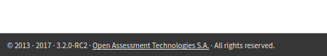

<!--
created_at: '2017-10-30 13:49:42'
tags:
    - 'Developer Guide'
    - 'Installation and Upgrading'
-->

# Upgrade the TAO platform from 3.1 to 3.2

> This page aims to explain how you can upgrade TAO from the version 3.1 to version 3.2

## Prerequisite

To start this tutorial be sure to have the version 3.1 of the TAO platform.
You can see your version at bottom left of the screen


If you don't have a TAO platform version 3.1 running please have a look to [installation guide](../../forge/Installation and Upgrading/installubuntuapachemysql.md)


Download the release 3.2 [here](https://www.taotesting.com/get-tao/official-tao-packages) and unzip it

## Upgrade

Copy files from the newly downloaded release 3.2 to the directory where is stored the release 3.1 on your server.
You should replace everything except data and config directories.
Make sure that the user that will access the directories (www-data) have the rights on them.

### Fix taoWorkspace

If you had taoWorkspace installed on your installation you should manually add this extension.
To do so you should first get the latest release using `composer require "oat-sa/extension-tao-workspace":~1.1` or by downloading the [archive](https://github.com/oat-sa/extension-tao-workspace/releases) and placing files in the correct directory.

### Update extensions
On your web server launch the command 
```
# Linux
sudo -u www-data php tao/scripts/taoUpdate.php

# Windows
php tao/scripts/taoUpdate.php
```

You should now see something like the following image.



### Fix Tests

This version change will break some part of the application to fix them you will need to change some config files.
First go into the file `config\generis\filesystem.conf.php`. You should see an array and something like 
```php
'http://tao-31.dev/tao31.rdf#i1514541812949527' => array(
    'class' => 'Local',
    'options' => array(
        'root' => '/var/www/tao-31/data/taoQtiTest/'
    )
),
```
Add `testData` and the end of the root so you will end up with : 
```php
'http://tao-31.dev/tao31.rdf#i1514541812949527' => array(
    'class' => 'Local',
    'options' => array(
        'root' => '/var/www/tao-31/data/taoQtiTest/testData'
    )
),
```

### Update server
It is highly recommended to update PHP from 5.6 to 7.0 after TAO is upgraded to TAO 3.2. Unlike TAO 3.2, TAO 3.1 is not fully compatible with PHP 7.0 so please update the TAO software prior to updating PHP.
