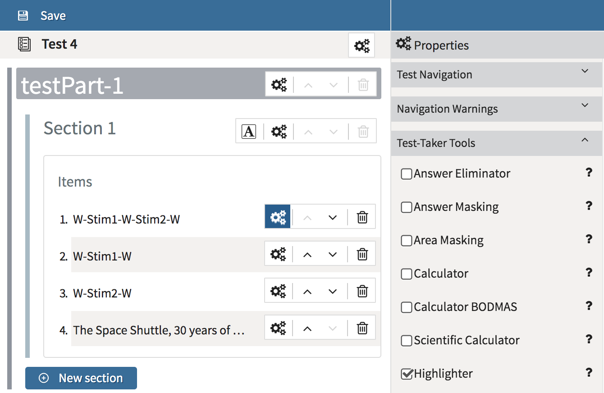
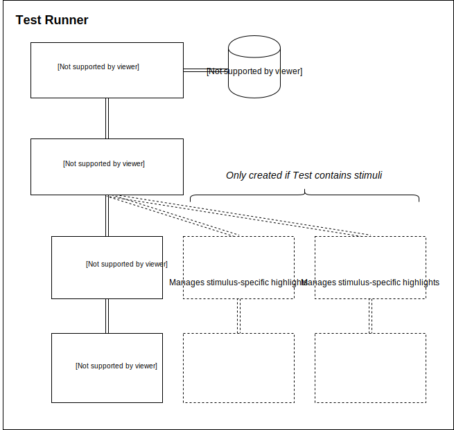
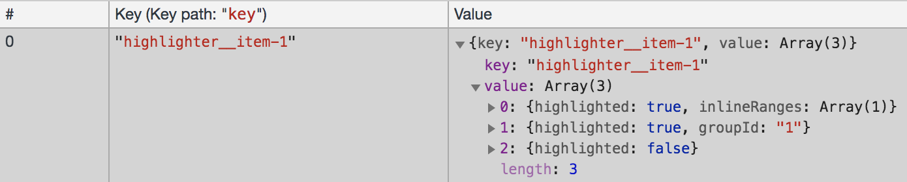

<!--
parent: 'Test Runner Plugins'
created_at: '2019-04-03 16:28:43'
authors:
    - 'Martin Nicholson'
tags:
    - 'Frontend'
    - 'Test Runner'
    - 'Plugin'
-->

# Test Runner plugins

## Highlighter

### Purpose

The highlighter allows a Test-Taker to mark passages of text in an Item.

### Configuration / Enabling

The highlighter plugin is enabled by default on the TAO platform. Its presence is governed by the following code block in `/config/taoTests/test_runner_plugin_registry.conf.php`:
```php
'taoQtiTest/runner/plugins/tools/highlighter/plugin' => array(
    'id' => 'highlighter',
    'module' => 'taoQtiTest/runner/plugins/tools/highlighter/plugin',
    'bundle' => 'taoQtiTest/loader/testPlugins.min',
    'position' => null,
    'name' => 'Text Highlighter',
    'description' => 'Allows the test taker to highlight text',
    'category' => 'tools',
    'active' => true,
    'tags' => array(
    )
)
```

The highlighter tool can be enabled in *Item Authoring* on a per-item or per-section basis. It can also be enabled by applying the `x-tao-option-highlighter` category directly in a QTI XML file.



### Fundamentals

The highlighter's UI is designed to work as similar as possible to the same tools found in e.g. MS Word or Google Docs. So there are two modes of operation: (1) the *continuous highlighting* mode, where the tool is enabled first and then every subsequent drag or double-click action can create new highlights on a text; and (2) *one-shot highlight*, where the user creates a text selection first and then clicks the tool button once to mark the selected text (and the tool returns to *off*).

On a code level, the actions of the highlighter tool are based upon the browser [Selection API](https://developer.mozilla.org/en-US/docs/Web/API/Selection). After the user interacts, we are starting a new highlight by querying `window.getSelection()`. We also rely on the browser [Range API](https://developer.mozilla.org/en-US/docs/Web/API/Range/Range) in order to be able to create, extend and analyse DOM node ranges within the item body.

As highlights are created, an *index* is built up, which is a flat array representing the item root node's highlightable children. Each entry in the index corresponds to a DOM text node, and can have the value of `false` (not highlighted), `true` (fully highlighted), or an `InlineRanges` object containing a start and/or end value (which represent character indexes within the text node). (See [Storage](#Storage) section below)

### Architecture

The highlighter plugin uses a somewhat complex architecture consisting of 4 levels of components:



#### Level 1: Plugin

Source: `/taoQtiTest/views/js/runner/plugins/tools/highlighter/plugin.js`

The main plugin behaves like various other Test Runner plugins in the Tools category: when initialised it creates two buttons using the AreaBroker. Handlers are attached to these buttons, and also to other Test Runner events such as `loaditem`, `renderitem`, `skip`, `move`, `timeout` and so on.

When an Item renders, the plugin can create new highlighter instances, or decide which of the existing ones to enable/disable, based on what it finds in the Item data.

The plugin is also responsible for handling the loading and saving of *highlighter indexes* in the Test Store (which are asynchronous operations).

Methods exposed: the standard Plugin methods: `install`, `init`, `destroy`, `enable`, `disable`, `show`, `hide`

Events fired: `start`, `end`, `clear`

#### Level 2: Collection

Source: `/taoQtiTest/views/js/runner/plugins/tools/highlighter/collection.js`

During the plugin's init, a collection is created. The collection is just a simple wrapper component around an array which will contain some number of highlighter instances (described in the next section).

The convention used is that the first item (index 0) added to the empty array will be the main, item-level highlighter. If additional highlighters are required (for stimuli or some other use case), they start at index 1.

Methods exposed: `addHighlighter`, `getHighlighterById`, `getAllHighlighters`, `getItemHighlighter`, `getNonItemHighlighters`, `getLength`, `empty`

#### Level 3: Highlighter

Source: `/taoQtiTest/views/js/runner/plugins/tools/highlighter/highlighter.js`

This component creates and manages a highlighter instance, working directly with the browser selection API

Methods exposed: `enable`, `disable`, `isEnabled`, `toggleHighlighting`, `highlight`, `restoreIndex`, `getIndex`, `clearHighlights`, `getId`

Events fired: `start`, `end`

#### Level 4: Highlighter helper

Source: `/tao/views/js/ui/highlighter.js`

This component performs the recursive scanning of the QTI item DOM, detection of highlightable (and already highlighted) DOM nodes, wrapping of the DOM nodes in `<span>` tags, and indexing of the highlights.

Methods exposed:`highlightRanges`, `highlightFromIndex`, `getHighlightIndex`, `clearHighlights`

### Stimulus Highlighters

When a Test Item is loaded which includes a *Shared Stimulus* (a text specifically created in a QTI XML document and uploaded through the Media Manager extension), this triggers the instantiation of an additional highlighter beside the default, item-level highlighter. The item-level highlighter will ignore DOM nodes specified in its *containersBlackList*, while the stimulus highlighter ignores everything outside of its root node. So their areas of influence within the DOM will always be completely separate.

Stimulus highlights are saved to the highlighter Test Store under the key of their `href` attribute (which also appears as a data-attribute on the stimulus's root element in the DOM), while item-level highlights are saved under their `itemIdentifier`.

The purpose of this design is to allow highlights to persist on a shared stimulus which is used in multiple items in a test delivery.

It is also possible to have more than one stimulus in an item (there is no upper limit). 3 stimuli will result in 3 stimulus highlighters, all operating independently of each other.

### Storage

Like other Test Runner plugins, the highlighter plugin has access to a Test Store, which by default is configured as browser storage (indexeddb). You can explore this store live in Chrome Dev Tools to see the state of the stored highlights:



Test Stores can be defined as *volatile* (cleared on browser change) or *non-volatile*. The highlighter store is volatile.

#### Tool State Storage

The highlights a user creates on Test Items can be made to persist between Test sessions (i.e. when the same user logs in at different times using the same or different machines or browsers). This makes use of another feature of the Test Runner: the Tool State Storage. Essentially this syncs the highlighter tool state via the server. This feature is *disabled* on the platform by default.

To set up Tool State Storage, an install or update script needs to be run to configure the platform (link to be provided). The config that needs to be added should match the following example:

*config/taoQtiTest/conf.testRunner.php*:
```php
return new oat\oatbox\config\ConfigurationService(array(
    'config' => array(
        // ...
        'tool-state-server-storage' => array(
            'highlighter'
        )
    )
));
```

*config/taoQtiTest/ToolsStateStorage.conf.php*:
```php
return new oat\taoQtiTest\models\runner\toolsStates\RdsToolsStateStorage();
```

### Known Limitations

-   When a stimulus appears in an item, it is not possible to drag a continuous selection and create highlights on both the item text and the stimulus in one go. The highlight will be created only if its start and end point are determined to be valid. All text is still fully highlightable, providing you target one container at a time.

-   Highlights are saved to the Test Store whenever the tool is turned on or off, when highlights are cleared, and also before every Test navigation move. However, they are *not* yet able to be saved on the `mouseup` / `touchend` events. In rare cases (making a highlight then immediately reloading the page), the last highlight can be lost.
