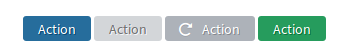
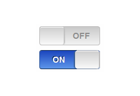

<!--
parent: 'Developer Guide'
toc: true
skip : true
authors:
    - 'Bertrand Chevrier'
tags:
    - 'Frontend'
    - 'Component'
    - 'GUI'
    - 'JavaScript'
-->
Components: the Front end building blocks
=========================================

Since TAO 3.1.0, the TAO development framework embraces a _component oriented_ architecture for the user interface.

## What's a component

A component is a chunk of the user interface, for example a button, a progress bar or a data table. But components can be composed of sub components.

## Benefits

 - *Standard lifecycle* 
 All components use the same base lifecycle : `init`, `render`, `destroy`
 - *Better state management*
 A component has a state at a given timeframe. The GUI of the component reacts on the component state. Here we have buttons in different states : rendered, disabled, loading or success. 
 - *Unified API* 
 Each component has the same base API.
 - *Atomic* 
 Each component can be used as is, in any context. A component works by itself.
 - *Composable* 
 A component can be reused anywhere, and a component can be composed of sub component.
 - *Unit Tested* 
 Each component is unit tested.

## Let's create a component

In this tutorial we will create a switch component. A switch is a very simple GUI element that enables the user to switch a value on or off. 



### File structure

In order to create a component we need : 

1. The JavaScript module
2. A template _optional_
3. A stylesheet _optional_

#### The JavaScript module

Inside any extension, we recommand to create components in the folder `views/js/components`. But in order to support the legacy structure, in the `tao` extension, the components are located under `views/js/ui`.

So let's create the JavaScript module under `tao/views/js/ui/switch/switch.js`, using this boilerplate code :

```js
define([
    'ui/component',
], function(component){
    'use strict';

    var defaultConfig = {
        //default configuration
    };

    return function switchFactory(){
        var api = {
            //component methods
        };
        return component(api, defaultConfig);
    };
});

```

We always use the same pattern to declare component : a factory (`switchFactory`) that returns a `component`. So you instantiate the component using : 

```js
var mySwitchButton = switchFactory();
```

#### Template

That's a good start, but we need to create DOM elements for our switch component. So we will bind a template to our component.  Let's add the file, `tao/views/js/ui/switch/switch.tpl`, an [Handlebars](http://handlebarsjs.com/) template : 


```html
<div class="switch">
    <span class="off">Off</span>
    <span class="on">On</span>
</div>
```

And we will associate this template to our component : 

```js
define([
    'ui/component',
    'tpl!ui/switch/switch'
], function(component, switchTpl){
    'use strict';

    var defaultConfig = {
        //default configuration
    };

    return function switchFactory(){
        var api = {
            //component methods
        };
        return component(api, defaultConfig)
                .setTemplate(switchTpl);
    };
});

```

We import the template using the usual AMD import `tpl!path/to/tpl` and bind it to the component using the dedicated method `setTemplate`. 

#### CSS

Without CSS, our component won't look like a switch button. We will attach a CSS file to this particular component.


> You can use this file as a template for new components

It means each small chunk of the user interface is an atomic component.
For example, a button is component. Then we can have bigger components that contains smallest components.

> Most elements of the user interface are not yet components, but we are in a transition phase.

This part will explain you how to clean you TAO instance. At a certain point you may will to remove all data linked to deliveries.

