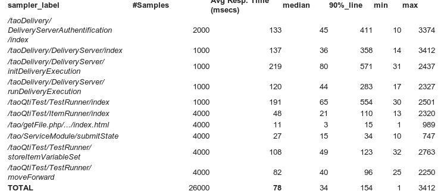

<!--
author:
    - 'Cyril Hazotte'
created_at: '2014-01-28 16:39:03'
updated_at: '2014-02-18 11:35:31'
-->

{{\>toc}}

Bt26tag2
========

Benchmarks
----------

### Deployment benchmarked description

Migration
---------

The migration to Bt26tag1 to Bt26tag2 consists in 6 steps:

\# Do a complete backup of the TAO Platform.

\# Apply the provided patch.

\# (**optional**) Add following line at the end of file `your_install_path/generis/common/conf/generis.conf.php`, the file was not under version control so will not be updated by the patch.

    define('VENDOR_PATH' , GENERIS_BASE_PATH.DIRECTORY_SEPARATOR.'vendor'.DIRECTORY_SEPARATOR);

\# (**To be tested again**) A QTI Tests Migration script is required to modify test structure to support new feature such as RubricBlock,add following line at the beginning of the script `your_install_path/taoQtiTest/scripts/update/migrateQtiTests.php`

    require_once dirname(__FILE__) .'/../../includes/raw_start.php';

Launch the QTI Tests Migration script located at `your_install_path/taoQtiTest/scripts/update/migrateQtiTests.php`. **Make sure the current user has correct read/write permissions and that the script is executed on behalf of the apache/www-data user**.

1.  Delivery published with Bt26tag1 should be recompiled due to change in the Tests and Results in Bt26tag2, simply go to Delivery Extension a re-published all deliveries, if not you will have no responses in Results.
2.  (**optional**) Copy the file attachment:“tao.eot” in the `your_install_path/tao/views/css/font/tao` directory.

QTI Tests Packaging
-------------------

See the below examples to learn how to package IMS QTI Tests:

-   attachment:“Basic.zip”
-   attachment:“BasicNonLinear.zip”
-   attachment:“Comments.zip”
-   attachment:“MathML.zip”
-   attachment:“PreConditions.zip”
-   attachment:“RubricBlocks.zip”
-   attachment:“RubricBlocksStylesheetsBackground.zip”
-   attachment:“RubricBlocksStylesheetsBasic.zip”
-   attachment:“TestDefinitionInSubFolders.zip”
-   attachment:“TestPartMaxTimeLinearIndividual.zip”

Suggested Deployment model for the delivery of Tests
----------------------------------------------------

-   Load balancing appliance (Varnish see configuration below)
-   N application server (TAO) with local mysql,\
    you may deploy them using database migration tools and htdocs copy (needed for the local media files)

1.  For large scale each application server should use **php5-fpm** (default prefork may result in under use of the application server resources)

-   Test delivery data (service state, deliveryExecution, results) storage externalized.

We recommend to configure tao adequately in order to reach a deployment model where all the data that needs to be written at test delivery time is stored in Redis and where any data consulted to delvier the test (items, test) is read from the local mysql database

This requires to configure tao to :

-   store results in a Redis Server.
-   store service state in a Redis Server.
-   store delivery execution state in a Redis server.
-   store session in a Redis server

Our tests used the same redis server for all three, note that you may use different servers.

### Storing Results in a Redis server

-   Make sure you have installed the packages :\
    “redis-server” (on the server you want to use for the storage)\
    “phpredis” on the tao application server

<!-- -->

-   In the extension manager, install the extension called taoAltResultStorage. If you switch to the tab called “Manage Result Server”, you will be able to see a new result Server called KeyValueResults.

-   If you have chosen to use a remote redis server or wanted to have redis running on a different port than the default one (6379)\
    you may have to adapt the configuration file /generis/common/conf/default/persistences.conf.php

<!-- -->

-   When you configure a delivery, you may now decide to send the results to the redis server, choose the option *KeyValueResultStorage* in the delivery configuration tool.\
    

<!-- -->

-   Results storage migration tool\
    Once the data colellection is finished, you won’t get the results directly visible under taoResutls, you need first to migrate them from redis back into TAO :

This process takes a couple of minutes if you migrate back into taoResults database

We suggest that, once you have successfully migrated all the data, you backup your redis database and dump all keys. To avoid multiple copies of the same data into the target storage.

### Storing service states in a Redis server

Service states are always stored in a KeyValue storage which is defined in *generis.conf.php*. By default this is using the *phpfile* driver which stores the states in files. To switch this to Redis exchange it with the following bit:

    'serviceState' => array(
        'driver' => 'phpredis',
        'host' => '127.0.0.1',
        'port' => 6379
    )

### Storing delivery execution informations in a Redis server

Which delivery executions are currently active by which user is by default stored in the ontology. To switch this to a KeyValue persistence the constant *DELIVERY\_EXECUTION\_HANDLER* in *generis.conf.php* needs to be set to *taoDelivery\_models\_classes\_execution\_KeyValueService*:

    define('DELIVERY_EXECUTION_HANDLER', 'taoDelivery_models_classes_execution_KeyValueService');

Additionally the persistence used for the KeyValue service needs to be defined in *persistences.conf.php* by adding:

    'deliveryExecution' => array(
        'driver' => 'phpredis',
        'host' => '127.0.0.1',
        'port' => 6379
    )

### Storing the session in a Redis server

KeyValue Session storage is enabled by default on this tag (constant *PHP\_SESSION\_HANDLER* in *generis.conf.php*). The persistence used\
for the session is defined in *persistences.conf.php* and set to *SqlKvWrapper* by default. In order to switch to Redis exchange the session\
configuration with the following:

    'session' => array(
        'driver' => 'phpredis',
        'host' => '127.0.0.1',
        'port' => 6379
    )

Redis configuration check
-------------------------

-   By default Redis creates snapshots on the file system from the memory according to some rules :

<!-- -->

    ################################ SNAPSHOTTING  #################################
    #
    # Save the DB on disk:
    #
    #   save  
    #
    #   Will save the DB if both the given number of seconds and the given
    #   number of write operations against the DB occurred.
    #
    #   In the example below the behaviour will be to save:
    #   after 900 sec (15 min) if at least 1 key changed
    #   after 300 sec (5 min) if at least 10 keys changed
    #   after 60 sec if at least 10000 keys changed
    #
    #   Note: you can disable saving at all commenting all the "save" lines.

    save 900 1
    save 300 10
    save 60 10000

-   You may also have to adapt your *maxclients* depending on the number of concurrent test takers :

<!-- -->

    ################################### LIMITS ####################################

    # Set the max number of connected clients at the same time. By default there
    # is no limit, and it's up to the number of file descriptors the Redis process
    # is able to open. The special value '0' means no limits.
    # Once the limit is reached Redis will close all the new connections sending
    # an error 'max number of clients reached'.
    #
    # maxclients 128

-   Optionnaly, you may create a slave of your redis server, and acting as a backup server

<!-- -->

    slaveof 192.168.250.46 6379

Load Balancing using Varnish
----------------------------

Varnish Cache is a caching reverse proxy —often referred to as an HTTP accelerator, which sits between your application server and the client’s requests.

Using a specific director, we may achieve the load balancing of several instances of TAO. A load balancing mechanism will avoid overloading of a single server instance of TAO. Depending on server availability, a specific request or client host, the backend server may change.

We have to define in Varnish a director group and choose the most suited director type amongst the six directors available: random, client, hash, round-robin, DNS and fallback.

For a multiple TAO server pool, the main requirement is to support sticky sessions, which is done by using the specific ‘client’ director. Thus, after a client connects for the first time to TAO, each time it goes back to TAO, it will be redirected to the same backend server.

### Configuration

The initial setup of Varnish starts with the Varnish daemon options configuration file, usually located at /etc/default/varnish. It allows 4 configuration alternatives (cf this file to see the differences). For our own setup, we the second one is needed: a configuration with the VCL (Varnish Configuration Language).\
The Varnish Configuration Language (VCL) is a domain-specific language used to define the caching policy. Most of the configuration is written into subroutines and follows a pre-defined flow during the request and response phase. The default configuration is seen as commented.

It contains the load balancing service URL and port (default port is 6081), the cache file type and size to use, the worker threads.\
A common value for the VARNISH\_STORAGE\_SIZE is to set it to 85% of available RAM. Also, the VARNISH\_STORAGE line should be uncommented and set to: <pre>VARNISH\_STORAGE=“malloc,\${VARNISH\_STORAGE\_SIZE}”</pre>

The VCL configuration file, usually located at /etc/varnish/default.vcl. This file defines the configuration that Varnish will use during the life cycle of the request. It includes the backend servers list, the server health rules to check, the load balancing type.

A simple health check for TAO would be to check that the file ‘version’ exists at the root url level.

    probe healthcheck {
            .url = "/version";
            .timeout = 600ms;
            .interval = 2s;
            .window = 5;
            .threshold = 3;
    }

A backend server is considered as available or sick depending on the options in the probe section, and the following metrics: timeout, check interval, threshold, window, …

    backend taoServer1 {
            .host = "192.168.56.3";
            .port = "80";
            .probe = healthcheck;
    }

    backend taoServer2 {
           .host = "192.168.56.4";
           .port = "80";
           .probe = healthcheck;
    }

Note: For several TAO working instances, we consider that the probe healthcheck should be identical, but it may not be the case, for instance with a slower server the timeout value may be higher that with a powerful one.

After the backend servers are defined, we need to group them and specify how this pool of servers will be used, with the director directive:

    director clientDirector client {
            { .backend = server01; .weight = 1; }
            { .backend = server02; .weight = 1; }
    }

The required director that allow us to support cookie-based sticky sessions is the ‘client’ director. To set the director stated before, we need to slightly redefine the vcl\_recv subroutine and the following entries:

    set req.backend = clientDirector;
    set client.identity = req.http.cookie;

The weight attribute is optional and will help the load balancer to choose the most reliable server to use priorly. The more the weight is, the most often this server will be selected amongst the other backend servers of the pool.

To run Varnish with the configuration set above, use the following command:

    service varnish start

In case an error occurs, use the following command to get further details:

    /usr/sbin/varnishd -Cf /etc/varnish/default.vcl

### Varnish commands

The main Varnish-related commands are varnishtop and varnishstat:\
- varnishtop gives regular feedbacks about backend server status (healthy, sick, back healthy, went sick).\
- varnishstat is a real-time monitoring and statistics tool. The main values to monitor are probably the hitrate and hitrate average values.\
varnishlog and varnishhist are complementary commands.

### Logging with Varnish

By default, Varnish logging is disabled. To enable it, set to the VARNISHNCSA\_ENABLED attribute from 0 to 1 in /etc/default/varnishncsa.\
To reload the logging configuration, use the command:

    service varnishncsa reload

The default log file path will be located at /var/log/varnish/varnishncsa.log.\
To get a more detailed logging, especially in a multiple backend configuration, a custom logging helps us to know who serves a given client.\
A good example of an exhaustive log configuration is given [here](http://giantdorks.org/alain/workaround-for-broken-varnishncsa-logging-due-to-shell-mishandling-of-spaces-in-log_format-variables/).

Constraints
-----------

1.  This distributed deployment model applies for the delivery of tests. Handling the backoffice operations like item banking is not supported using that distribution model.
2.  This distributed deployment model is intended for QTI test driven scenarios.

Benchmarks
----------

Our benchmarks were achieved using a topology on our network as such:\
- One load balancer appliance (Varnish)\
- Two desktop computers acting as application servers with php-fpm (one high end with 8 cores-SSD, one mid end 4 cores)\
- One redis server . (a low end computer)

That small topology allowed us to reach 1000 test takers simultaneously taking a test (they all start the test in a 30 secs time frame, they all go through all the items and respond to the items quickly).\
Total Avg response time from the server \< 100 msecs

Known Issues
------------

-   We noticed that QTI tests had to be published again to see results appearing in the Results extension.

