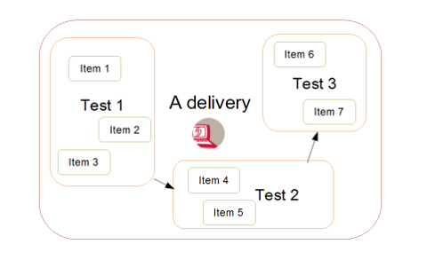

<!--
parent: 'Documentation for core components'
created_at: '2011-03-03 10:36:14'
updated_at: '2013-03-13 13:07:59'
authors:
    - 'Jérôme Bogaerts'
contributors:
    - 'Somsack Sipasseuth'
tags:
    - 'Documentation for core components'
-->

Delivery
========

------------------------------------------------------------------------

### 1. Create and author a delivery|Create and Author a delivery 

2. Compile a delivery 

3. Delivery server|Execute a delivery

------------------------------------------------------------------------

Overview
--------

### 1. The content

A delivery defines a sequence of tests to be delivered, the same way as a test contains a number of items. 

The diagram below sums up the relationship between deliveries, tests and items.

### 2. The context

On top of that, it allows defining the conditions and the context of tests delivery. 

The following issues are addressed:

-   When can it be delivered?
-   Who can execute it?
-   How many times can it be executed by allowed test takers?
-   Where are the results uploaded?

The delivery model on the Generis representation below shows the properties of the delivery resource class:

Please refer the Delivery server|delivery server section to see how this properties apply on delivery execution

