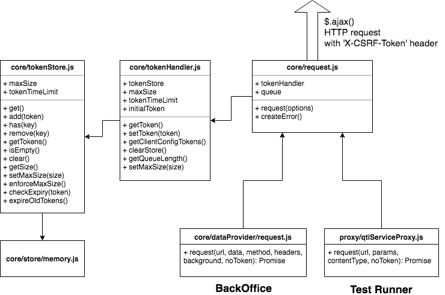

<!--
parent: 'Documentation for core components'
created_at: '2019-04-12 16:36:27'
updated_at: '2019-05-12 22:20:01'
authors:
    - 'Martin Nicholson'
    - 'Martijn Swinkels'
tags:
    - 'Documentation for core components'
-->

# Requests Tokenisation (CSRF-protection)

> Certain endpoints in the TAO backend are risks for Cross-Site Request Forgery attacks. In order to protect those endpoints, requests should each be sent with a unique, single-use token which is generated on the backend and validated there on its receipt.

-   AJAX requests will go through a single module, `core/request`, which will attach the tokens
-   A pool of tokens will be managed simultaneously on the backend and frontend, to allow for concurrent requests
-   Forms will still be protected by the old method: a token is rendered by PHP to a hidden input field, and validated when the submitted form is received on the server

## Specifications

-   To call a protected endpoint, the client must provide a token
-   If no token is provided, the request will be logged as a possible CSRF attempt
-   The token will be sent in the HTTP header of a tokenised request, under the `X-CSRF-Token` key
-   Each tokens cannot be used more than once
-   Tokens are stored on a per-user-session basis
-   A token may not live longer than the session of the user to which it belongs

Furthermore, a REST endpoint for such requests is expected to match the following criteria:

-   contentType : `application/json; charset=UTF-8`
-   headers : contains `X-CSRF-Token` value when needed
-   the responseBody:
      `{ success : true, data : [the results]}`
      `{ success : false, data : {Exception}, message : 'Something went wrong' }`
-   returns 204 for empty content

## Frontend

How are the different components of this system related?



### core/request module

At its heart, it is a basic `$.ajax()` request to a given URL. But the logic also includes fetching and attaching a token, and a mechanism which can force requests to run sequentially if desired.

Params:

```
* @param {Object} options
* @param {String} options.url - the endpoint full url
* @param {String} [options.method = 'GET'] - the HTTP method
* @param {Object} [options.data] - additional parameters (if method is 'POST')
* @param {Object} [options.headers] - the HTTP headers
* @param {String} [options.contentType] - what kind of data we're sending - usually 'json'
* @param {String} [options.dataType] - what kind of data expected in response
* @param {Boolean} [options.noToken = false] - if true, disables the token requirement
* @param {Boolean} [options.background] - if true, the request should be done in the background, which in practice does not trigger the global handlers like ajaxStart or ajaxStop
* @param {Boolean} [options.sequential] - if true, the request must join a queue to be run sequentially
* @param {Number}  [options.timeout] - timeout in seconds for the AJAX request
```

It returns:

```
* @returns {Promise} resolves with response, or reject if something went wrong
```

Usage example:

```javascript
request({
    url: '/',
    method: 'POST',
    data: { foo: 'bar' },
    noToken: false
})
.then(function(response) {
    if (response.data && response.data.something) {
        doSomething();
    }
})
.catch(function(err) {
    logger.error(err);
})
```

By default, tokens are always used on `core/request` requests. However, they can be turned off (on the frontend side) by passing a `noToken: true` parameter, or also by setting `noToken: true` in the platform config for the `core/request` module. There is not currently a way to turn the token requirement off on the backend side - most of the endpoints are protected for a good reason.

### tokenHandler

The tokenHandler is the middle-man between the `core/request` module and the `core/tokenStore`. It is not normally accessed directly, except in special cases (e.g. unit tests).

Usage:

```javascript
// Initialise:
var tokenHandler = tokenHandlerFactory();

// Set an initial token:
tokenHandler.setToken('mytoken').then(function() {
    // ready to be used
});

// Retrieve and use a token (outside of a request):
tokenHandler.getToken().then(function(token) {
    // use token...
});
```

### tokenStore

The tokenStore is an interface for the `core/store` browser-based storage component. It has been decided to create the tokenStore using the `memory` store implementation, for maximum security. The alternative `indexeddb` implementation could also be used instead, for example if it is necessary for the tokens to be shared between multiple open tabs of TAO.

> In the case where the browser is offline (internet connection loss), failed requests which consume a token will result in that token being recycled back into the tokenStore, to prevent "running dry".


### Token format

A token is pretty simple, it looks like this when in storage:

```json
{
    "value": "c8cd47bab63e1a6c4a9a9017252b1166131e996f",
    "ts": "1554907980137"
}
```

The timestamp allows tokens to be expired when they exceed the lifetime of the PHP session (24 minutes by default). This value can also be configured when instantiating the `tokenHandler`. If all the tokens in the frontend `tokenStore` expire, the user will be prompted to reload the page (thus delivering a fresh batch of tokens).

### Token delivery mechanism

The tokens in the backend pool are provided to the frontend via the call to `/tao/ClientConfig/config` which is made on each page load.

## Backend

### Token pool generation

During a request the `\tao_actions_ClientConfig::config()` method is called. In this method we generate a token pool using the TokenService. This pool gets picked up and stored by the frontend.

### Token Model

The Token model is the basic definition of a token object. It's a serializable object that contains the token's value, and the token's creation timestamp (float) generated by `microtime(true)`.
This model can be used to generate a new token by calling 

```php
$token = new Token();
```

Alternatively data can be passed to the Token class to initialize a predefined token. This can be achieved by calling:

```php
$existingToken = [
    Token::TOKEN_KEY => 'exampletoken',
    Token::TIMESTAMP_KEY => 1556111298.3326
];

$token = new Token($existingToken);
```

### TokenService

In the token service we handle the generation of the token pool, additionally the service is used to validate, and revoke tokens.

### Protecting a request

In order to protect a request, we add a call to the `\tao_actions_CommonModule::validateCsrf()` method. This method checks if the token header is sent with the request, and if the token that was provided in this header is valid.

#### Validation failure

If a protected request did not receive the token header, or if the provided token is not valid, a `\common_exception_Unauthorized()` exception is thrown. This exception should be caught, and an appropriate response should be shown to the user.
Currently this is done using the following control structure:

```php
try {
    $this->validateCsrf();
} catch (common_exception_Unauthorized $e) {
    $this->response = $this->getPsrResponse()->withStatus(403, __('Unable to process your request'));
    return;
}
```

### Protecting a Form

Forms are protected by a hidden element that contains the CSRF token. This token is not generated as part of the normal generation process, but instead gets appended to the token pool if a protected form is requested.

Protecting a form can be done by providing the `csrf_protection` option, as per the example below:
```php
$formFactory = new tao_actions_form_CspHeader(
    ['serviceLocator' => $this->getServiceLocator()],
    [FormContainer::CSRF_PROTECTION_OPTION => true]
);
```

By providing this option, a `\oat\tao\helpers\form\elements\xhtml\CsrfToken` element gets added to the form. This handles the validation of the posted CSRF token, meaning the form will be invalidated if the CSRF validation fails.
