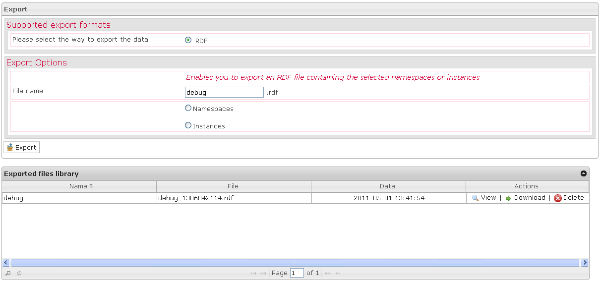

Export
======

The Export box is displayed when a test or a class is selected in the Tests library and when you click on the Export action.

When you export your data, you have just to indicate the data you want.

