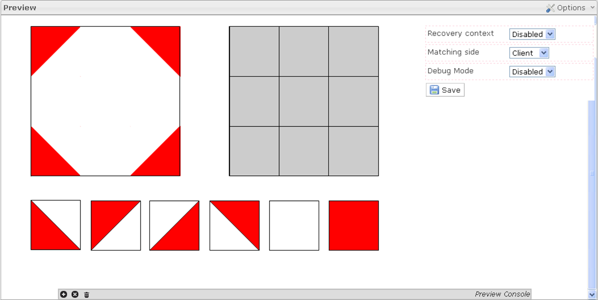

Full Preview
============

The big function of this tab:\
\> \* The Preview box is displayed when an item is selected in the Items library and when you click on the Preview tab.\
\> \* There are three options in the preview box. The Recovery context option allows checking the response saved as correct in the item by the visualization of the correct response in the item preview. The Matching side option allows determining where the item score is calculating (on the client side, the matching is not secure but the item can be used without the platform; on the server side, the matching is secure but the item cannot be extracted alone). The Debug mode option allows visualizing the clickable areas.
------------------------------------------------------------------------------------------------------------------------------------------------------------------------------------------------------------------------------------------------------------------------------------------------------------------------------------------------------------------------------------------------------------------------------------------------------------------------------------------------------------------------------------------
