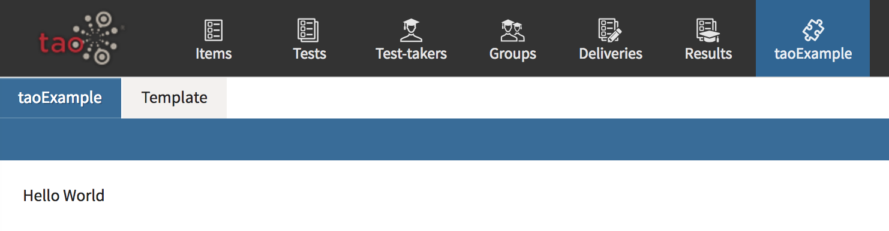
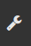
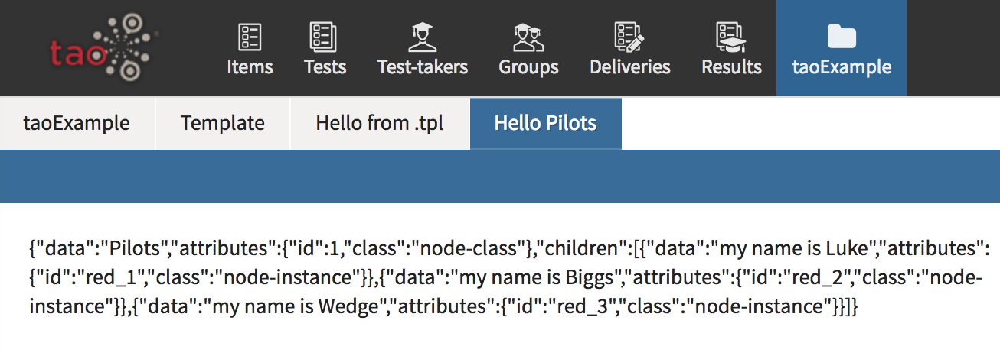
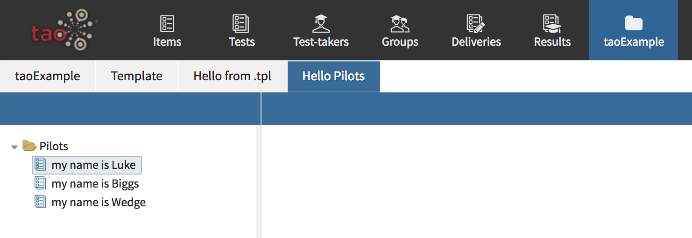
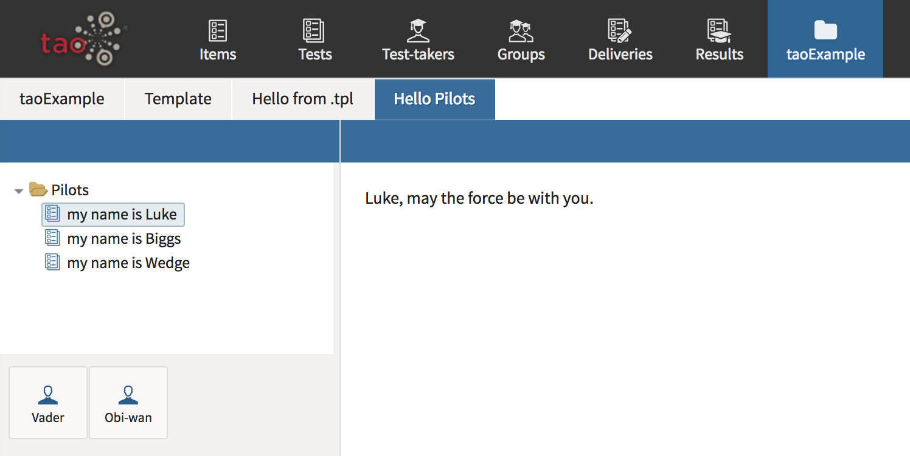

<!--
parent: 'TAO 3 1'
created_at: '2015-06-18 13:17:42'
updated_at: '2018-10-10 08:48:53'
authors:
    - 'Christophe Garcia'
    - 'Martin Nicholson'
tags:
    - 'Legacy Versions:TAO 3.0'
-->

# How to make a new extension in TAO 3.3

## Preparation

1. Install TAO (3.x) (https://github.com/oat-sa/package-tao)
2. Download `taoDevTools` extension using composer:
    `composer require "oat-sa/extension-tao-devtools" --dev`
3. Make sure the extension has been installed (See https://github.com/oat-sa/taohub-articles/blob/master/forge/Wiki/installing-a-new-extension.md)

## Create the extension

1. Log into TAO BackOffice with your admin account.
2. Go to "Settings" (upper right corner) > "Extensions Manager".
3. Click on "create new" to create your new extension.
4. Fill out the form and call your new extension `taoExample`.
   (If you wish, you can select some Samples to generate extra structure).
5. Return to the Extensions Manager, refresh the page, select the checkbox for `taoExample`, and install it.
6. In your IDE, go to your tao project root folder and verify the folder `taoExample` now exists.
7. Go into the `taoExample` folder, you will see a standard extension structure.
8. Go into the `controller` folder, open `TaoExample.php`. This is a simple controller example.

## Import the extension

Before the extension can be imported, composer needs to know where to find it. One way we can achieve this is by placing the code in a git repo. It will be easiest if we push this repo to GitHub and then tell composer the address of that repo.

1. Create a new repo in your GitHub account with a sensible name, e.g. `taoExample`.
2. In your local `taoExample` folder, run `git init` to start a new repo just for this extension.
3. Edit `composer.json` in the root of your extension. Change the name field from `oat/taoExample` to `yourgithubusername/taoExample`.
4. Add the GitHub repo as a remote to your local repo. For example, `git remote add origin https://github.com/yourgithubusername/taoExample.git`.
5. Run `git add .` and `git commit` in your local repo.
6. Push the commit to GitHub e.g. `git push -u origin master`.
7. Edit the other `composer.json` at the root level of your TAO installation.
    There are 2 parts you will need to add:

    At the top level, a new repository definition:
    ```json
        "repositories": [
            {
                "type": "git",
                "url": "https://github.com/yourgithubusername/taoExample.git"
            }
        ],
    ```

    And within the existing require block:

    ```json
        "require" : {
            // long list of other repos,
            "yourgithubusername/taoExample" : "dev-master"
        }
    ```
8. You are now finally ready to run `composer update` which should find your package on Github and pull it in.
9. Refresh your open instance of TAO.

A `taoExample` section should have appeared in the top main menu. Click on it and look at your new empty extension.



## Begin editing your extension

### Step 1: “Hello World” from a template

To create your first controller, go into the `taoExample/controller` folder and create a file named `Greeter.php`. Create a class like so:

```php
<?php

namespace oat\taoExample\controller;

class Greeter extends \tao_actions_CommonModule {
    /**
     * initialize the services
     */
    public function __construct() {
        parent::__construct();
    }
}
```

Now, add the following action inside the class (after the constructor):

```php
    public function helloFromTemplate() {
        $this->setData('name', 'tao');
        $this->setView('Greeter/myName.tpl');
    }
```

To create your first template file: go into the `views/templates` folder and create a folder named `Greeter`.

Create the template file `myName.tpl` with the following content:

```php
<div class="main-container tao-scope">
    Hello my name is <?=(get_data('name'))?>
</div>
```

To test this action visit `/taoExample/Greeter/myName`.

#### Adding a link to a section on the extension's horizontal menu

Return to the `controller` folder and open `structures.xml`. This important file defines how the menus, pages, trees and action buttons within the extension are going to be structured. For a guide to what is allowed in this file, check out the file `/tao/doc/structures.dtd`.

Inside the `<sections>` tag, add this new section:

```xml
    <section id="taoExample_template" name="Hello from .tpl" url="/taoExample/Greeter/myName" />
```

And save.

#### Viewing your work so far

In TAO, go to Tools  > Scripts, and click on "Empty cache".

Refresh your page and you should see:


#### Changing the extension's icon

Reopen `structures.xml` and add the line `<icon id="icon-folder" />` after the `<description>` tag, like this:

```xml
    <structure id="taoExample_main" name="taoExample" level="15" group="main">
        <description />
        <icon id="icon-folder"/>
        <sections>
            ...
        </sections>
    </structure>
```


Empty cache and refresh. More icons to choose from here: http://style.taotesting.com/icon-listing/

### Step 2: create a more complex structure

1. Reopen `Greeter.php` and add a data structure inside the constructor:

```php
    public function __construct() {
        parent::__construct();

        // Data for our example extension:
        $this->pilots = [
            'red_1' => 'luke',
            'red_2' => 'biggs',
            'red_3' => 'wedge',
        ];
    }
```

2. Also add a new controller method:

```php
    public function getPilotsList() {

        $data = array(
            'data'  => __("Pilots"),
            'attributes' => array(
                    'id' => 1,
                    'class' => 'node-class'
                ),
            'children' => array()
            );

        foreach ($this->pilots as $index => $name) {
            $data['children'][] =  array(
                'data'  => 'my name is ' . ucfirst($name),
                'attributes' => array(
                        'id' => $index,
                        'class' => 'node-instance'
                    )
            );
        }
        echo json_encode($data);
    }
```

3. Add your new section to `structures.xml`:

```xml
    <sections>
        ...
        <section id="taoExample_pilots" name="Hello Pilots" url="/taoExample/Greeter/getPilotsList" />
    </sections>
```

Empty cache and refresh; you should see a new tab in the `taoExample` menu.



For the moment, this section only outputs the JSON string we created. We'll turn that into something nicer in the next step.

### Step 3: rendering a node tree

The `getPilotsList` JSON-outputting action we created in the controller will be passed as an attribute to a `<tree>` tag in our XML file.

Open `structures.xml` again and add a `<trees>` tag inside your final `<section>` tag:

```xml
    <section id="taoExample_pilots" name="Hello Pilots" url="/taoExample/Greeter/getPilotsList">
        <trees>
            <tree name="Pilots"
                className="Pilots"
                rootNode="http://www.tao.lu/Ontologies/TAOGroup.rdf#Group"
                dataUrl="/taoExample/Greeter/getPilotsList"
            />
        </trees>
    </section>
```

Empty cache, refresh TAO, and you should see the following:



 If you inspect the `<li>` elements in your browser you will see that they possess the id and class we specified in our `getPilotsList` action, and the text content is what we built there.

### Step 4: customized actions

We are going to add action buttons to the left hand pane, which can launch actions on the selected item. Our intent is simply to display a text based on the name of the item selected, and the button that was clicked.

1. Add `vader` and `obiwan` actions to the `Greeter.php` controller:

```php
    public function vader() {
        $name = '';
        if($this->hasRequestParameter('uri')) {
            $uri = $this->getRequestParameter('uri');
            if(array_key_exists($uri, $this->pilots)) {
                $name = $this->pilots[$uri];
            }
        }
        echo ucfirst($name) . ', I\'m your father';

    }

    public function obiwan() {
        $name = '';
        if($this->hasRequestParameter('uri')) {
            $uri = $this->getRequestParameter('uri');
            if(array_key_exists($uri, $this->pilots)) {
                $name = $this->pilots[$uri];
            }
        }
        echo ucfirst($name) . ', may the force be with you';
    }
```

2. Next, add the corresponding actions to `structures.xml`:

```xml
    <section id="taoExample_pilots" name="Hello Pilots" url="/taoExample/Greeter/getPilotsList">
        <trees>
            ...
        </trees>
        <actions>
            <action id="vader" name="Vader" url="/taoExample/Greeter/vader" group="tree" context="resource">
                <icon id="icon-user"/>
            </action>
            <action id="obiwan" name="Obi-wan" url="/taoExample/Greeter/obiwan" group="tree" context="resource">
                <icon id="icon-user"/>
            </action>
        </actions>
    </section>
```

3. Empty cache, refresh, and enjoy playing with your completed extension!


