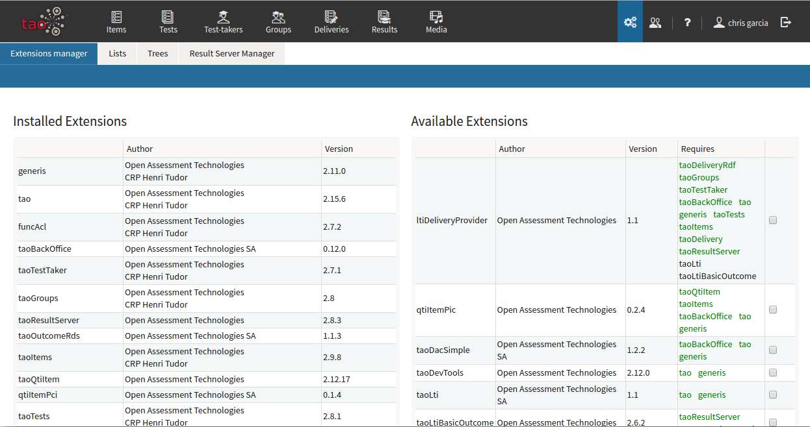
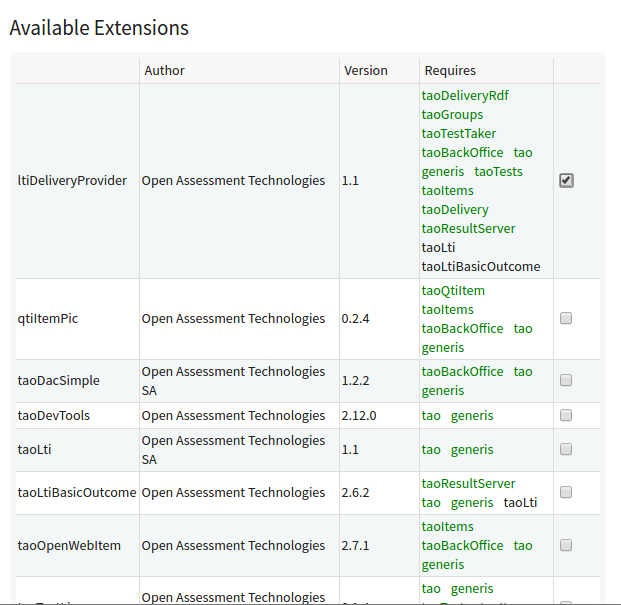
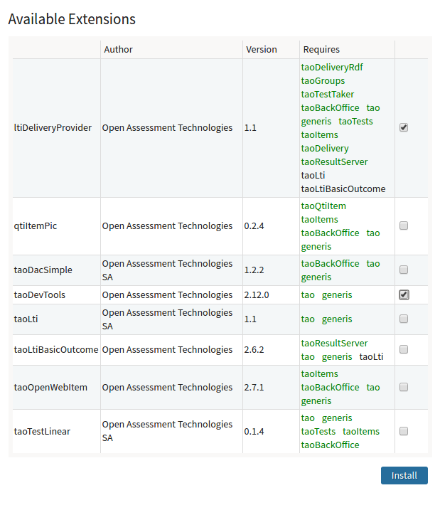
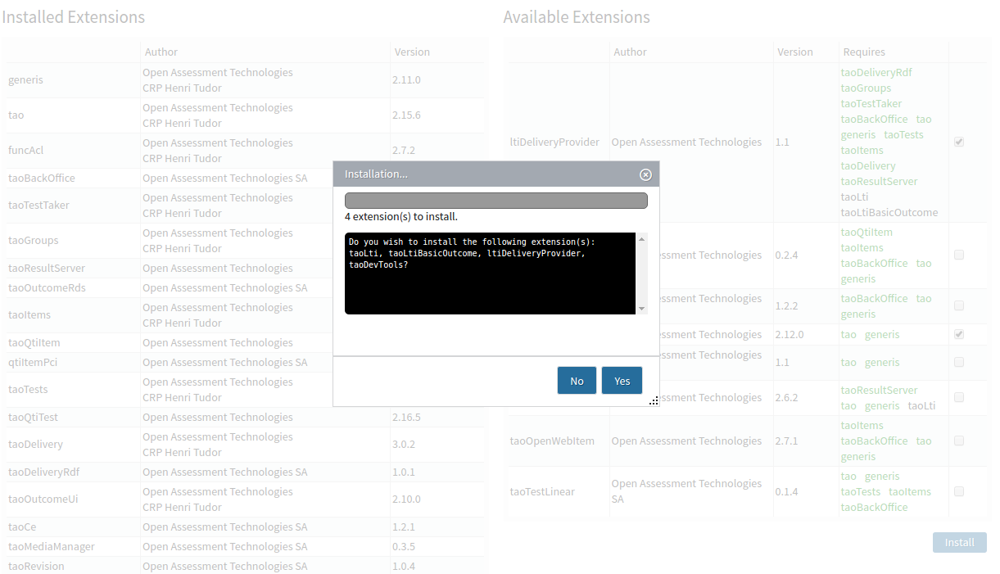
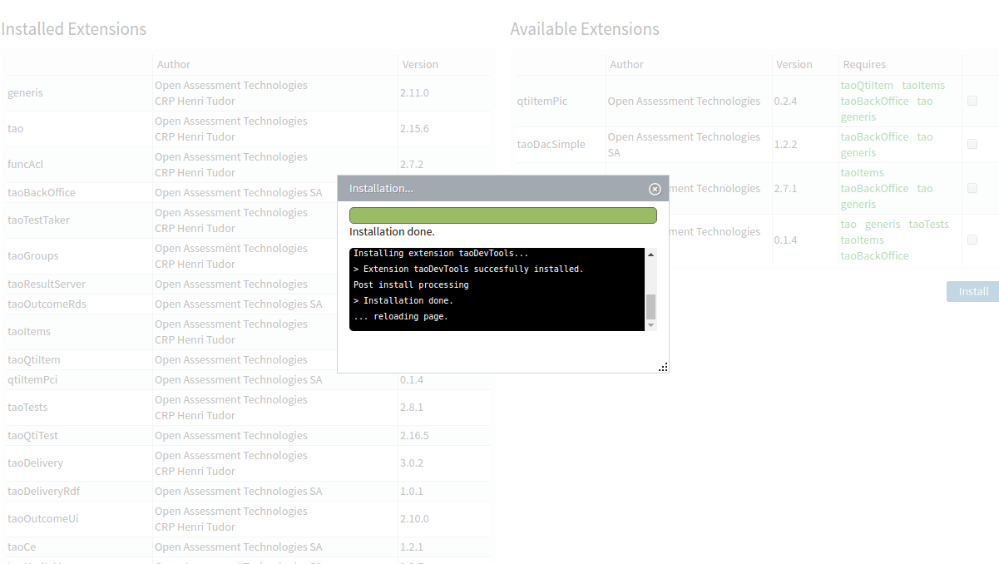

How to install an extension
===========================

With the CLI
------------

    php tao/scripts/installExtension.php

With the GUI
------------

go to settings section :

you can see installed extensions and available extensions.

Check the box, on your wished extension.

You can select more extensions :

click on “install” :

confrim installation :

Done !

