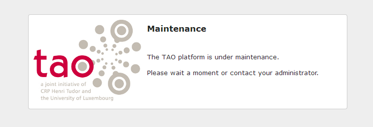

Maintenance
===========

The TAO Platform provides a *Maintenance Mode* aiming at helping administrators to shut down the system while maintaining it. To do so you need to change a *PHP constant* in the Generis configuration file. It is located at */generis/common/config.php*.

To set the system in *Maintenance Mode*, find the following constant and set it to *false*.

    # application state
    define('SYS_READY', false);

**Users** will then see the following page to be informed that the platform is under maintenance.

**Client scripts** will receive the following json

    {"success":false,"type":"Exception","message":"TAO is under maintenance","data":{"ExceptionType":"common_exception_SystemUnderMaintenance"}}

To make the system running again and available to your users, set the *SYS\_READY* constant to *true*.

    # application state
    define('SYS_READY', true);
