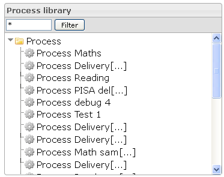
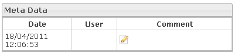
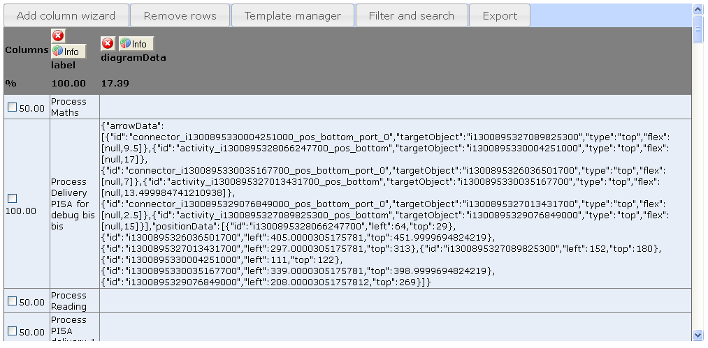
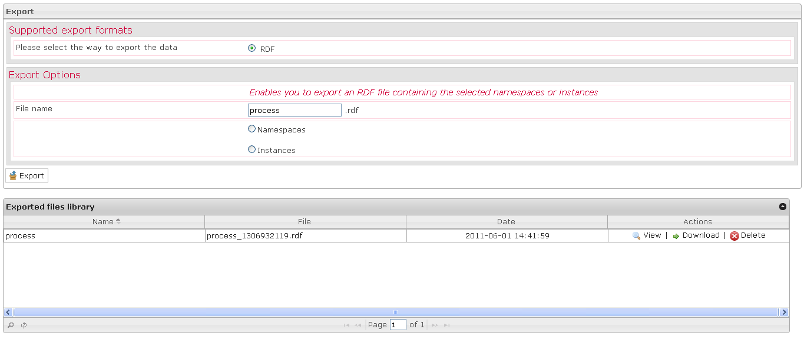

Manage Processes
================

The big functions of this tab:

Process library box
-------------------

-   It is possible to put a filter on the processes tree view. Only processes and classes containing the input string will be displayed.
-   When right-clicking the selection in the tree is done, the actions are also displayed as context menu.

Actions box
-----------

-   According to your actions in the interface, the actions icons will be activated or deactivated.

Process properties box
----------------------

-   The Process properties box is displayed when a process is selected in the Processes library box.
-   The Process properties box provides the process properties to define.
-   The Init ACL mode (Initialization Acess Control List mode) property allows restraining the access of the process initialization. The ACL mode integrates three options: Role, Role restricted user and User. The Role option consists in restricting the access to one Role, in this situation all users that have this Role can access the process initialization. The Role restricted user consists in restricting the access to the process initialization to the first user that has the Role. The User option consists in restricting the access to one user, in this situation only the selected user can access the process initialization.
-   The Init restricted role property allows indicating the specific Role used to restrict the access at the process initialization.

Search box
----------

-   The Search box is displayed when you click on the Search action, in the Actions box.
-   In the first part of the Search box, you should define the search options which permit to refine search results.
-   In the second part of the Search box, you should define one filter to minimum to allow the search.

Meta data box
-------------

-   The Meta data box is displayed when a process is selected in the Processes library and when you click on the Meta data action.
-   You can edit a comment at the selected process. For that you should click on the Edit icon, write a comment in the box which appears and click on the Save button.

Create table box
----------------

-   The Create table box is displayed when a class is selected in the Processes library and when you click on the Create table action.
-   The Create table box is a workspace where it is possible to build a table to view data selected among all the data that can be viewed on the platform.

Export box
----------

-   The Export box is displayed when a process or a class is selected in the Processes library and when you click on the Export action.
-   When you export your data, you have just to indicate the data you want.

