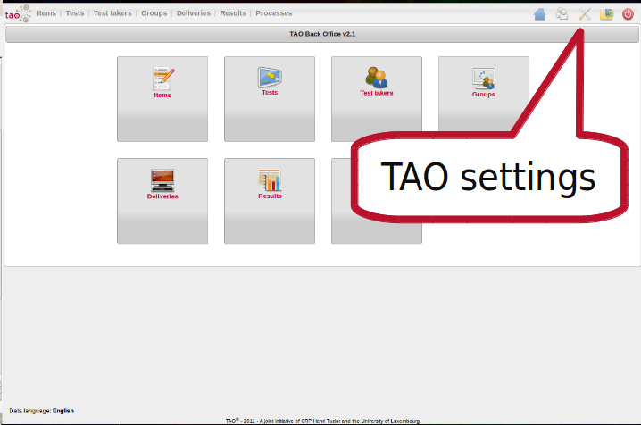
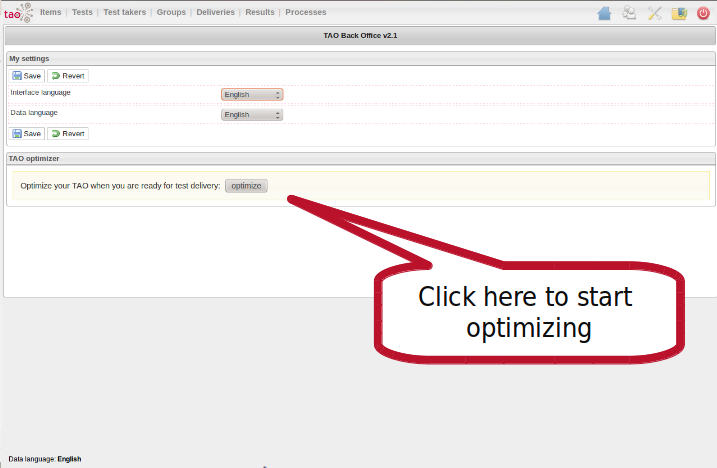
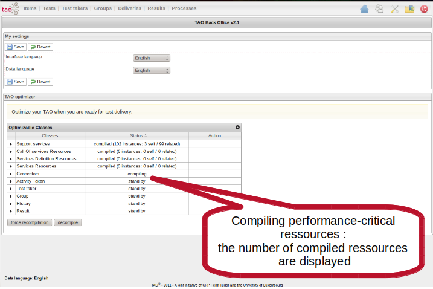
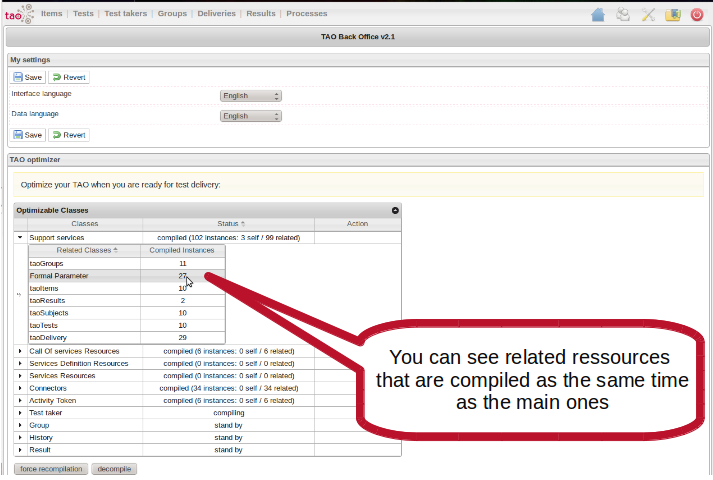
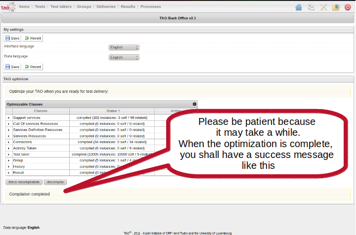
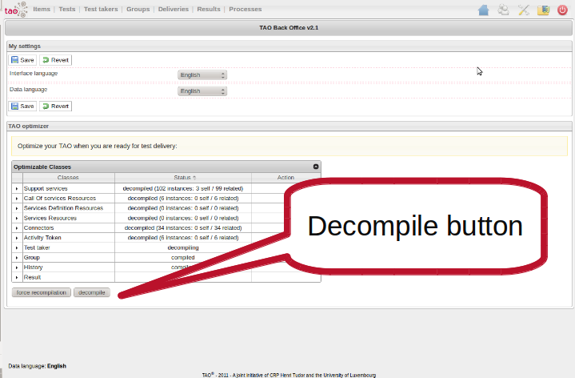

Performance optimization
========================

{{\>toc}}

1. Performance issue
--------------------

TAO v2.0 achieved a functional maturity that covers large possibilities of computer based assessment projects. However, the issue back then was the performance for large scale assessment. Since large scale assessment is one of main goal for TAO, from v2.1 performance has become a top priority. The TAO team addressed this issue and came up with the following optimizations :

-   performance improvement through business logic, in algorithm within code
-   data base optimization (e.g. multi indexing in mysql tables)
-   compilation of the performance-critical resources to test deliveries

2. TAO optimisation = data compilation, how it works
----------------------------------------------------

The issue in previous version of TAO was due to one single sql table containing all the rdf triples. This enables TAO to be highly flexible regarding the data model it can support. However, on production time, as flexible as this knowledge base can be, it faces difficulty to cope with a large concurrent access to this single table, the more so as the size of the table goes bigger and bigger. (since every data (knowledge) is saved into that table, from the login credentials of all test takers to the final test results).\
The idea is thus simple:

1.  to ease the database from concurrent access (have users read, write on several tables at a time)
2.  to group actual related data together, which means separate non related data (separate results data from user information or system configuration for instance)

The solution is to move the data from the rdf statements table to common relational tables, to make the most of widely used and known relational database optimization techniques. Since the flexibility must remain one main characteristic of TAO, only the required performance critic resources are moved to such relational tables, while the models remain in the statements table, which keeps its main role as flexible model store.\
The performance on test deliveries depends on a set of specific resources. Those resources have been identified, and their relation to one another optimized (indexed columns in mysql table).

In short, TAO optimization consists in compiling the performance-critical data into their relational tables.

The reverse action is also provided to get the data form optimized (“compiled”) relational tables back to the statements table if need be.

3. How to optimize my TAO/how to compile my data:
-------------------------------------------------

### 3.1. From CLI

Go to the script path located on *TAO\_ROOT/wfEngine/scripts/* then execute the following command:\
to compile:\
`php wfEngineOptimizer.php -c -i`\
(c for complie, i for indexing)

to decompile:\
`php wfEngineOptimizer.php -d`\
(d for decompile)

Please be patient, it may take a while according to the quantity of data you have.

### 3.2. From GUI: via tao backoffice

This functionality is also available in the TAO back office, accessible via the “setting” menu from the TAO home as illustrated below:\

Click on the “optimize” button to start the data compilation.

Note: it is important to note that launching TAO optimization is only useful when everything is ready for test delivery, i.e. all test takers created and ready to execute their compiled deliveries. There will be little improvement when applied to a fresh install of TAO.

The compilation then shall start:

During the data compilation, you can see the dependent resources that are compiled at the same time as a given resources.

When the compilation is completed, you can have a look at the results.\
Right to the compiled field, you can see the number of compiled resources: instances show the number of resources moved to relational databases, by type (i.e. class)

Decompile button works the same way: you only need to click on the “decompile” button:

4. Benchmark
------------

### 4.1. TAO v2.0 vs v2.1

Benchmark has been done with Jmeter to compare the prformance improvement between v2.0 and 2.1 (to see how to banchmark with Jmeter see the related section):

The 2 tables below show the average time of execution for each action performed during a test exection:

1.  authentification (time to authentificate the test taker)
2.  delivery listing (page to display the list of available delivery for the logged test taker)
3.  process initialization (the time between the click of the test taker on the selected delivery and the moment the first item is displayed to the screen
4.  get item (the average time to display an item on the screen)
5.  perfom next (the time the server takes to move from from one item to another: it includes all processing time on the server side, such as user’s role identification, finding the next item, saving the user variables)

The database is filled with **1000 test takers**. A given number of test taker (from 1 to 200) execute each a small test with **4 items**, within a short among of time of **30 seconds**.

The server configuration is as follow (on virtual machine):\
processors : 4\
vendor\_id : GenuineIntel\
cpu family : 6\
model : 26\
model name : Intel® Xeon® CPU E5530 @ 2.40GHz\
stepping : 5\
cpu MHz : 2400.085\
cache size : 8192 KB\
memory : 3 Go

The two tables below show the benchmark results, before and after optimization. The number is the **average time in milliseconds** to accomplish the action.

Before (TAO v2.0):

  ---------------------------- ----------------------- ---------------- ------------------- --------------- -------------------
  \_=.                         \_=. Authentification   \_=. Main View   \_=. Process Init   \_=. Get Item   \_=. Perform Next
  \_=. Simultaneous subjects   \\5.
  \_=. 5                       =. 212                  =. 87            =. 560              =. 249          =. 557
  \_=. 10                      =. 265                  =. 125           =. 604              =. 181          =. 334
  \_=. 20                      =. 363                  =. 216           =. 733              =. 209          =. 375
  \_=. 50                      =. 3352                 =. 2009          =. 3706             =. 2315         =. 2573
  \_=. 100                     =. 15117                =. 14056         =. 10029            =. 8987         =. 6551
  ---------------------------- ----------------------- ---------------- ------------------- --------------- -------------------

After (TAO v2.1 - optimized):

  ---------------------------- ----------------------- ---------------- ------------------- --------------- -------------------
  \_=.                         \_=. Authentification   \_=. Main View   \_=. Process Init   \_=. Get Item   \_=. Perform Next
  \_=. Simultaneous subjects   \\5.
  \_=. 20                      =. 57                   =. 56            =. 221              =. 100          =. 87
  \_=. 50                      =. 60                   =. 71            =. 221              =. 113          =. 103
  \_=. 100                     =. 97                   =. 111           =. 410              =. 190          =. 167
  \_=. 150                     =. 667                  =. 756           =. 2172             =. 973          =. 876
  \_=. 200                     =. 778                  =. 905           =. 2353             =. 904          =. 716
  ---------------------------- ----------------------- ---------------- ------------------- --------------- -------------------

### 4.2. more realistic scenario on TAO v2.1

The benchmark results below show a more realistic scenario, with **10000 test takers** in the data base. In **60 seconds**, the given number of test takers log into the delivery server and executes a delivery of **25 items**. Each action is triggered by a Gaussian random timer defined as follow:

  ---------------------------- ------------------------- --------------------
  \_=. Action                  \_=. Constant delay (s)   \_=. Deviation (s)
  \_=. Authentificaiton        =. 0.3                    =. 0.1
  \_=. Delivery Section time   =. 2                      =. 0.6
  \_=. Item solving time       =. 10                     =. 5
  ---------------------------- ------------------------- --------------------

This simulates a delivery during which each test taker takes on average **2 seconds** to select the delivery to execute and about **10 seconds** on each of item.

  ---------------------------- ----------------------- ---------------- ------------------- --------------- -------------------
  \_=.                         \_=. Authentification   \_=. Main View   \_=. Process Init   \_=. Get Item   \_=. Perform Next
  \_=. Simultaneous subjects   \\5.
  \_=. 100                     =. 95                   =. 137           =. 327              =. 152          =. 144
  \_=. 200                     =. 430                  =. 608           =. 2206             =. 1237         =. 1086
  \_=. 300                     =. 535                  =. 793           =. 2819             =. 2070         =. 1765
  ---------------------------- ----------------------- ---------------- ------------------- --------------- -------------------

