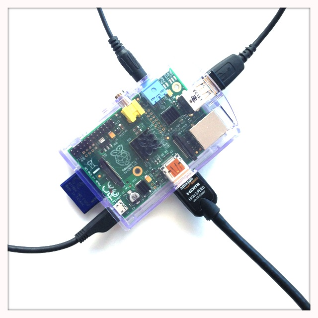

<!--
created_at: '2013-10-10 18:13:43'
updated_at: '2013-10-11 10:25:58'
authors:
    - 'Patrick Plichart'
tags: {  }
-->

TAO on a Raspberry
==================

 

So, you want to use raspberry as a TAO web server and deliver your tests over a local Wi-Fi ?

1. Download RaspDebian
----------------------

It is right here : http://downloads.raspberrypi.org/raspbian_latest

2. Prepare a SD card
--------------------

From Windows : http://sourceforge.net/projects/win32diskimager\
From Mac OS X : http://ivanx.com/raspberrypi\
From Linux :

    sudo apt-get install ImageWriter

Follow the instructions specific to the tool to deploy the image on the SDcard

Insert the sd card into your raspberry, plug the power.

3. Plug the ethernet cable into the raspberry
---------------------------------------------

4. Find the IP of your raspberry
--------------------------------

*Scenario 1: You have a screen connected on the raspberry.*

Login as “pi” using password “raspberry” 

Type in the shell

     ifconfig

    eth0      Link encap:Ethernet  HWaddr b8:27:eb:c2:ec:3d
              inet addr:*192.168.2.74*  Bcast:192.168.2.255  Mask:255.255.255.0
              UP BROADCAST RUNNING MULTICAST  MTU:1500  Metric:1
              RX packets:6511 errors:0 dropped:0 overruns:0 frame:0
              TX packets:298 errors:0 dropped:0 overruns:0 carrier:0
              collisions:0 txqueuelen:1000
              RX bytes:446904 (436.4 KiB)  TX bytes:29571 (28.8 KiB)

    lo        Link encap:Local Loopback
              inet addr:127.0.0.1  Mask:255.0.0.0
              UP LOOPBACK RUNNING  MTU:16436  Metric:1
              RX packets:0 errors:0 dropped:0 overruns:0 frame:0
              TX packets:0 errors:0 dropped:0 overruns:0 carrier:0
              collisions:0 txqueuelen:0
              RX bytes:0 (0.0 B)  TX bytes:0 (0.0 B)

and take note of the resulting IP address.

*Scenario 2: Like us, you couldn’t afford buying a screen …*

This one is difficult, all raspberry have a MAC address starting with b8:27:eb\
Ping all the IP addresses, and check the MAC addresses for the first 6 hex characters. 

From a mac you may use conveniently http://ivanx.com/raspberrypi/files/PiFinder.zip\
From Linux :

    #!/bin/bash
    # findPi:
    #       Find all Pi's on the LAN

    fping -a -r1 -g 192.168.254.0/24  &> /dev/null
    arp -n | fgrep " b8:27:eb"

From Windows : ???

5. Connect to your raspberry PI
-------------------------------

ssh pi@THEFOUNDIP\
using the default password raspberry

6. Give your Raspberry a fixed IP
---------------------------------

You may follow this guide : https://www.modmypi.com/blog/tutorial-how-to-give-your-raspberry-pi-a-static-ip-address\
This step may become mandatory especially if you don’t use vhost. As TAO memorizes the root url at installation time, if you use the IP for installing tao (step 8) and that afterwards its ip change, test takers won’t be able to connect. We recommend either to use a vhost configuration or to use a fixed IP.

7. Change pi password
---------------------

    passwd pi

8. Start the LAMP stack installation : 

http://forge.taotesting.com/projects/tao/wiki/InstallUbuntuApacheMySQL
----------------------------------------------------------------------

9. Start TAO installation\
From any computer on the same network : 

http://yourip/tao/install\
or vhost\
http://vhost/tao/install
----------------------------------------

10. Optimize your PI .
----------------------

    sudo apt-get install php-apc

