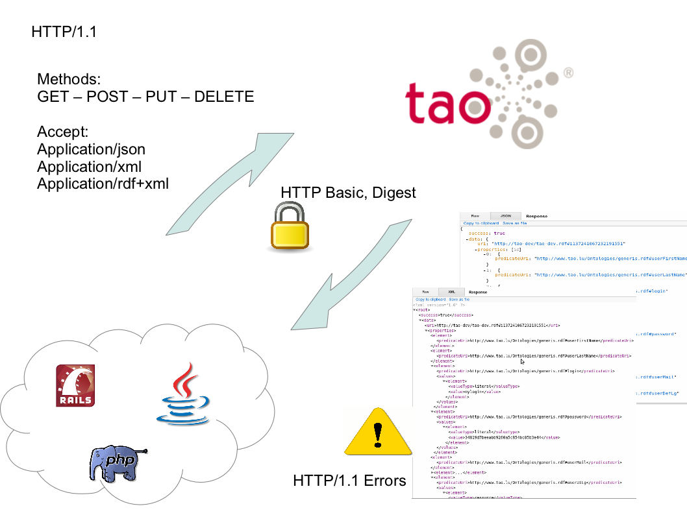
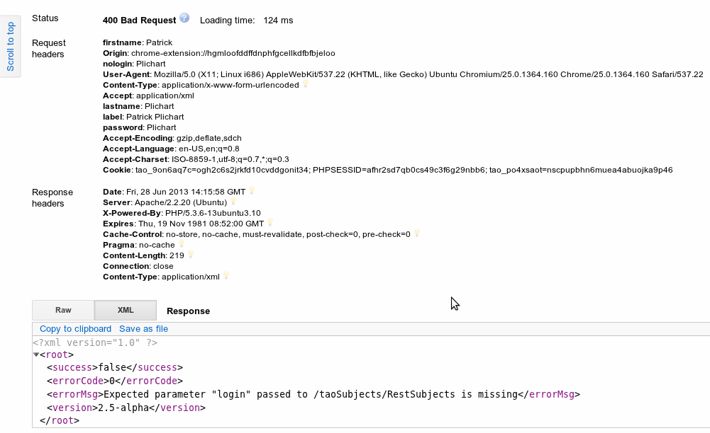

<!--
created_at: '2013-06-28 08:39:33'
updated_at: '2015-10-04 14:10:25'
authors:
    - 'Rex Wallen Tan'
contributors:
    - 'Patrick Plichart'
tags: {  }
-->

Rest Services Layer Tutorial
============================

Introduction
------------

Starting from **TAO 2.5**, a [Representational State Transfer (REST)](http://en.wikipedia.org/wiki/Representational_state_transfer) layer allows you to manipulate data in TAO from any location and technology through simple HTTP requests. **This may not work in TAO 3.x as of yet.**

The four basic methods from [HTTP](https://en.wikipedia.org/wiki/Http) : GET / POST / PUT / DELETE allows you to fetch / create /modify or delete the different resources like test takers or items from any TAO node.

Authentication mechanisms built in HTTP: Basic and Digest are being used for user identification and further restrictions are applied according to the functionality rights access settings as they are setup in the TAO node you want to access.

An exception handler treats the different cases and allows for catching any errors that may be triggered while executing your queries. A content negotiation is being implemented and supports application/json and application/xml data exchange formats.



TAO Rest Documentation
----------------------

-   Rest Services Layer

Basic Test Takers exploitation
------------------------------

The following describes how to call remotely services from TAO. They are illustrated in PHP using cURL but you may also want to try the services using any REST client.

(Chrome addon : [Advanced Rest Client](https://chrome.google.com/webstore/detail/advanced-rest-client/hgmloofddffdnphfgcellkdfbfbjelo))

Connection and Identification (Basic)
-------------------------------------

Under PHP, you may use [cURL](http://php.net/manual/fr/book.curl.php)

As per the Basic HTTP authentication, you will need to send the credentials over each request.

Let’s assume you want to retrieve the list of test takers … (for other methods, please check subsequent parts of this tutorial)


    //initialize the cURL request
    $process = curl_init("http://foo/taoSubjects/RestSubjects");

    //Since you want to get information, you need to use the GET method, please note this step is optionnal as cURL php use GET by default
    curl_setopt($process, CURLOPT_HTTPGET, 1);

    //You may want to customize the returned content encoding Accept header (JSON by default)
    curl_setopt($process,CURLOPT_HTTPHEADER, array("Accept: application/json"));

    //set your credentials
    curl_setopt($process, CURLOPT_USERPWD, "myLogin:myPassword");

    //return the transfer as a string of the return value of curl_exec() instead of outputting it out directly.
    curl_setopt($process, CURLOPT_RETURNTRANSFER, 1);

    $returnedData = curl_exec($process);

    //allways check the http code returned
    $httpCode = curl_getinfo($process, CURLINFO_HTTP_CODE);

    $data = json_decode($returnedData, true);

    curl_close($process);

The outcome according to application/json :

```json

    {  
       "success":true,
       "data":[  
          {  
             "uri":"http:\/\/tao-dev\/taodev.rdf#i1372425843494221",
             "properties":[  
                {  
                   "predicateUri":"http:\/\/www.tao.lu\/Ontologies\/generis.rdf#userFirstName",
                   "values":[  
                      {  
                         "valueType":"literal",
                         "value":"Patrick"
                      }
                   ]
                },
                {  
                   "predicateUri":"http:\/\/www.tao.lu\/Ontologies\/generis.rdf#userLastName",
                   "values":[  
                      {  
                         "valueType":"literal",
                         "value":"Plichart"
                      }
                   ]
                },
                {  
                   "predicateUri":"http:\/\/www.tao.lu\/Ontologies\/generis.rdf#login",
                   "values":[  
                      {  
                         "valueType":"literal",
                         "value":"ppl"
                      }
                   ]
                },
                {  
                   "predicateUri":"http:\/\/www.tao.lu\/Ontologies\/generis.rdf#password",
                   "values":[  
                      {  
                         "valueType":"literal",
                         "value":"5396681eea50ad639ae3c9f8ca17b7d8"
                      }
                   ]
                },
                {  
                   "predicateUri":"http:\/\/www.tao.lu\/Ontologies\/generis.rdf#userMail",
                   "values":[  
                      {  
                         "valueType":"literal",
                         "value":"patrick@taotesting.com"
                      }
                   ]
                },
                {  
                   "predicateUri":"http:\/\/www.tao.lu\/Ontologies\/generis.rdf#userDefLg",
                   "values":[  
                      {  
                         "valueType":"resource",
                         "value":"http:\/\/www.tao.lu\/Ontologies\/TAO.rdf#Langen-US"
                      }
                   ]
                },
                {  
                   "predicateUri":"http:\/\/www.tao.lu\/Ontologies\/generis.rdf#userUILg",
                   "values":[  
                      {  
                         "valueType":"resource",
                         "value":"http:\/\/www.tao.lu\/Ontologies\/TAO.rdf#Langen-US"
                      }
                   ]
                },
                {  
                   "predicateUri":"http:\/\/www.tao.lu\/Ontologies\/generis.rdf#userRoles",
                   "values":[  
                      {  
                         "valueType":"resource",
                         "value":"http:\/\/www.tao.lu\/Ontologies\/TAO.rdf#DeliveryRole"
                      }
                   ]
                },
                {  
                   "predicateUri":"http:\/\/www.tao.lu\/Ontologies\/generis.rdf#generisRessourceComment"
                },
                {  
                   "predicateUri":"http:\/\/www.w3.org\/1999\/02\/22-rdf-syntax-ns#type",
                   "values":[  
                      {  
                         "valueType":"resource",
                         "value":"http:\/\/www.tao.lu\/Ontologies\/TAOSubject.rdf#Subject"
                      }
                   ]
                },
                {  
                   "predicateUri":"http:\/\/www.w3.org\/1999\/02\/22-rdf-syntax-ns#value"
                },
                {  
                   "predicateUri":"http:\/\/www.w3.org\/2000\/01\/rdf-schema#comment"
                },
                {  
                   "predicateUri":"http:\/\/www.w3.org\/2000\/01\/rdf-schema#label",
                   "values":[  
                      {  
                         "valueType":"literal",
                         "value":"Patrick Plichart"
                      }
                   ]
                },
                {  
                   "predicateUri":"http:\/\/www.w3.org\/2000\/01\/rdf-schema#seeAlso"
                },
                {  
                   "predicateUri":"http:\/\/www.w3.org\/2000\/01\/rdf-schema#isDefinedBy"
                },
                {  
                   "predicateUri":"http:\/\/www.w3.org\/2000\/01\/rdf-schema#member"
                }
             ]
          }
       ],
       "version":"2.5-alpha"
    }
```

The outcome according to application/xml :


      true


          http://tao-dev/taodev.rdf#i1372425843494221


              http://www.tao.lu/Ontologies/generis.rdf#userFirstName


                  literal
                  Patrick


              http://www.tao.lu/Ontologies/generis.rdf#userLastName


                  literal
                  Plichart


              http://www.tao.lu/Ontologies/generis.rdf#login


                  literal
                  ppl


              http://www.tao.lu/Ontologies/generis.rdf#password


                  literal
                  5396681eea50ad639ae3c9f8ca17b7d8


              http://www.tao.lu/Ontologies/generis.rdf#userMail


                  literal
                  patrick@taotesting.com


              http://www.tao.lu/Ontologies/generis.rdf#userDefLg


                  resource
                  http://www.tao.lu/Ontologies/TAO.rdf#Langen-US


              http://www.tao.lu/Ontologies/generis.rdf#userUILg


                  resource
                  http://www.tao.lu/Ontologies/TAO.rdf#Langen-US


              http://www.tao.lu/Ontologies/generis.rdf#userRoles


                  resource
                  http://www.tao.lu/Ontologies/TAO.rdf#DeliveryRole


              http://www.tao.lu/Ontologies/generis.rdf#generisRessourceComment


              http://www.w3.org/1999/02/22-rdf-syntax-ns#type


                  resource
                  http://www.tao.lu/Ontologies/TAOSubject.rdf#Subject


              http://www.w3.org/1999/02/22-rdf-syntax-ns#value


              http://www.w3.org/2000/01/rdf-schema#comment


              http://www.w3.org/2000/01/rdf-schema#label


                  literal
                  Patrick Plichart


              http://www.w3.org/2000/01/rdf-schema#seeAlso


              http://www.w3.org/2000/01/rdf-schema#isDefinedBy


              http://www.w3.org/2000/01/rdf-schema#member


      2.5-alpha

}}

**Error codes :**

-   401 Your login/password is probably incorrect.
-   406 The specified Accepted content type is not supported by TAO (application/xml, application/json)

Create a new Test taker
-----------------------

You will have to provide some mandatory parameters (in this case the login and the password).

For some parameters (Type, language) default values are applied, but you may explicit a different type or language.

In general, you need to identify the parameters using URIs, for your convenience aliases for the default parameters were added. You may define any other information according to the properties defined along with your test takers.

The list of aliases is the following, (and if it is mandatory bit):

-   “login”=> PROPERTY_USER_LOGIN,true
-   “password” => PROPERTY_USER_PASSWORD,true
-   “guiLg” => PROPERTY_USER_UILG, false
-   “dataLg” => PROPERTY_USER_DEFLG, false
-   “firstName”=> PROPERTY_USER_LASTNAME,false
-   “mail”=> PROPERTY_USER_MAIL,false
-   “type”=> RDF_TYPE,false


    $process = curl_init("http://foo/taoSubjects/RestSubjects");
    curl_setopt($process, CURLOPT_POST, 1);

    //needed using curl on apache
    curl_setopt($process, CURLOPT_POSTFIELDS, "");


    curl_setopt($process,CURLOPT_HTTPHEADER, array(
    "Accept: application/json",
    "label: Patrick Plichart",
    "lastname: Plichart",
    "firstname: Plichart",
    "login: pplichart",
    "password: dummy"
    ));

    //set your credentials
    curl_setopt($process, CURLOPT_USERPWD, "myLogin:myPassword");

    //return the transfer as a string of the return value of curl_exec() instead of outputting it out directly.
    curl_setopt($process, CURLOPT_RETURNTRANSFER, 1);

    $returnedData = curl_exec($process);

    //allways check the http code returned
    $httpCode = curl_getinfo($process, CURLINFO_HTTP_CODE);

    $data = json_decode($returnedData, true);

    curl_close($process);

If your request is successful, you will receive the URI of the newly created resource.


      true

        http://tao-dev/taodev.rdf#i137242883388823


        core_kernel_persistence_smoothsql_Class::createInstanceWithProperties

      2.5-alpha


**Possible error codes returned**

\* 412 Precondition Failed\
You probably tried to create a test taker with an already existing login


    false
    0
    login already exists
    2.5-alpha


-   400 Bad Request\
    A mandatory parameter is missing
    

Creating a test taker with custom properties / type or language
---------------------------------------------------------------


    $process = curl_init("http://foo/taoSubjects/RestSubjects");
    curl_setopt($process, CURLOPT_POST, 1);

    //needed using curl on apache
    curl_setopt($process, CURLOPT_POSTFIELDS, "");


    curl_setopt($process,CURLOPT_HTTPHEADER, array(
    "Accept: application/json",
    "label: Patrick Plichart",
    "lastname : Plichart",
    "firstname : Plichart",
    "login: pplichart",
    "password: dummy",

    "type: http://tao-dev/taodev.rdf#i1372428806753422",
    "datalg: http://www.tao.lu/Ontologies/TAO.rdf#Langfr-FR",

    //uses a property defines on the particular class hosting the newly created test taker or by inheritance
    "http://tao-dev/taodev.rdf#i1372429454323825: 35"
    ));

    //set your credentials
    curl_setopt($process, CURLOPT_USERPWD, "myLogin:myPassword");

    //return the transfer as a string of the return value of curl_exec() instead of outputting it out directly.
    curl_setopt($process, CURLOPT_RETURNTRANSFER, 1);

    $returnedData = curl_exec($process);

    //always check the http code returned
    $httpCode = curl_getinfo($process, CURLINFO_HTTP_CODE);

    $data = json_decode($returnedData, true);

    curl_close($process);

If you don’t know the URIs of properties or classes, you may use the ontoBrowser extension of TAO, it is available from the default package of TAO and needs to be installed using the settings pane in the Back Office.

Update an existing test taker
-----------------------------

In the case of an update, you have to specify only the values which you would like to update. You can’t update the login (in this case, you will have to remove the test taker account and create a new one).

You may re-assign a new type to the test taker.


    $process = curl_init("http://foo/taoSubjects/RestSubjects");
    curl_setopt($process, CURLOPT_PUT, 1);
    curl_setopt($process,CURLOPT_HTTPHEADER, array(
    "Accept: application/json",
    "uri: http://tao-dev/taodev.rdf#i1372425843494221",

    "label: Patrick Plichart",
    "lastname: Plichart",
    "firstname: Plichart",
    "type: http://tao-dev/taodev.rdf#i1372428806753422",
    "datalg: http://www.tao.lu/Ontologies/TAO.rdf#Langfr-FR"

    ));
    curl_setopt($process, CURLOPT_USERPWD, "myLogin:myPassword");
    curl_setopt($process, CURLOPT_RETURNTRANSFER, 1);

    $returnedData = curl_exec($process);
    $httpCode = curl_getinfo($process, CURLINFO_HTTP_CODE);
    $data = json_decode($returnedData, true);
    curl_close($process);

**Possible error codes returned**

-   412\
    Modifying the login of a subject is not allowed : 412

Retrieve a particular test taker
--------------------------------


    $process = curl_init("http://foo/taoSubjects/RestSubjects");
    curl_setopt($process, CURLOPT_HTTPGET, 1);
    curl_setopt($process,CURLOPT_HTTPHEADER, array(
    "Accept: application/json",
    "uri: http://tao-dev/taodev.rdf#i1372425843494221"
    ));
    curl_setopt($process, CURLOPT_USERPWD, "myLogin:myPassword");
    curl_setopt($process, CURLOPT_RETURNTRANSFER, 1);

    $returnedData = curl_exec($process);
    $httpCode = curl_getinfo($process, CURLINFO_HTTP_CODE);
    $data = json_decode($returnedData, true);
    curl_close($process);


      true

        http://tao-dev/taodev.rdf#i1372425843494221


            http://www.tao.lu/Ontologies/generis.rdf#userFirstName


                literal
                Patrick


            http://www.tao.lu/Ontologies/generis.rdf#userLastName


                literal
                Plichart


            http://www.tao.lu/Ontologies/generis.rdf#login


                literal
                ppl


            http://www.tao.lu/Ontologies/generis.rdf#password


                literal
                5396681eea50ad639ae3c9f8ca17b7d8


            http://www.tao.lu/Ontologies/generis.rdf#userMail


                literal
                patrick@taotesting.com


            http://www.tao.lu/Ontologies/generis.rdf#userDefLg


                resource
                http://www.tao.lu/Ontologies/TAO.rdf#Langen-US


            http://www.tao.lu/Ontologies/generis.rdf#userUILg


                resource
                http://www.tao.lu/Ontologies/TAO.rdf#Langen-US


            http://www.tao.lu/Ontologies/generis.rdf#userRoles


                resource
                http://www.tao.lu/Ontologies/TAO.rdf#DeliveryRole


            http://www.tao.lu/Ontologies/generis.rdf#generisRessourceComment


            http://www.w3.org/1999/02/22-rdf-syntax-ns#type


                resource
                http://www.tao.lu/Ontologies/TAOSubject.rdf#Subject


            http://www.w3.org/1999/02/22-rdf-syntax-ns#value


            http://www.w3.org/2000/01/rdf-schema#comment


            http://www.w3.org/2000/01/rdf-schema#label


                literal
                Patrick Plichart


            http://www.w3.org/2000/01/rdf-schema#seeAlso


            http://www.w3.org/2000/01/rdf-schema#isDefinedBy


            http://www.w3.org/2000/01/rdf-schema#member


      2.5-alpha


}}

**Possible error codes returned**

-   204 No Content\
    Nothing was found with respect to the uri provided

Delete a test taker.
--------------------


    $process = curl_init("http://foo/taoSubjects/RestSubjects");
    curl_setopt($process, CURLOPT_CUSTOMREQUEST, "DELETE");
    curl_setopt($process,CURLOPT_HTTPHEADER, array(
    "Accept: application/json",
    "uri: http://tao-dev/taodev.rdf#i1372425843494221"
    ));
    curl_setopt($process, CURLOPT_USERPWD, "myLogin:myPassword");
    curl_setopt($process, CURLOPT_RETURNTRANSFER, 1);

    $returnedData = curl_exec($process);
    $httpCode = curl_getinfo($process, CURLINFO_HTTP_CODE);
    $data = json_decode($returnedData, true);
    curl_close($process);

Identification using Digest
---------------------------

The Digest protocol is not yet implemented. Steps left for implementing it:

- Store along user definition their hash upon user creation and update\
- Retrieve this hash and combine it within RestCommonModule.php

How to contribute here ?
------------------------

-   A library for php to connect on our REST layer would probably help programmers, this library would expose 
get($uri=null), post($parameters), put($uri, $parameters), delete($uri) methods.

    Difficulty: easy

How to add rest services on top of my custom TAO extension I wrote ?
--------------------------------------------------------------------

You will need to add a rest controller extending the rest convenience built in TAO and to implement the four commands from REST.

Example taken from test takers:


    service = taoSubjects_models_classes_CrudSubjectsService::singleton();
        }

        /**
         * Optionnaly a specific rest controller may declare
         * aliases for parameters used for the rest communication
         */
        protected function getParametersAliases(){
            return array_merge(parent::getParametersAliases(), array(
                "login"=> PROPERTY_USER_LOGIN,
                "password" => PROPERTY_USER_PASSWORD,
                "guiLg" => PROPERTY_USER_UILG,
                "dataLg" => PROPERTY_USER_DEFLG,
                "firstName"=> PROPERTY_USER_LASTNAME,
                "mail"=> PROPERTY_USER_MAIL,
                "type"=> RDF_TYPE
            ));
        }
        /**
         * Optionnal Requirements for parameters to be sent on every service
         *
         */
        protected function getParametersRequirements() {
            return array(
            /** you may use either the alias or the uri, if the parameter identifier
             *  is set it will become mandatory for the operation in $key
            * Default Parameters Requirents are applied
            * type by default is not required and the root class type is applied
            */
            "post"=> array("login", "password")
            );
        }
    }
    ?>

then implement your own service layer exposing get/put/delete for that particular type of resources


    class taoSubjects_models_classes_CrudSubjectsService
        extends tao_models_classes_CrudService
    {
       protected $subjectClass = null;

        public function __construct(){
        parent::__construct();
        $this->subjectClass = new core_kernel_classes_Class(TAO_SUBJECT_CLASS);
        }

        public function getRootClass(){
            return $this->subjectClass;
        }
        public function get($uri){
        return parent::get($uri);
        }
        public function getAll(){
        return parent::getAll();
        }

        public function delete( $uri){
        return parent::delete($uri);
        }
         public function deleteAll(){
        return parent::deleteAll();
        }

        public function create(array $propertiesValues){

            (...)
            $resource =  parent::create($label, $type, $propertiesValues);
            (...)

        }

        public function update($uri = null,array $propertiesValues){
            (...)
            parent::update($uri, $propertiesValues);
            (...)
        }

Sending multiple values for a property
--------------------------------------

You may send multiple values for a property using the standard multi valued http parameters.


    curl_setopt($process,CURLOPT_PUT, array(
    "Accept: application/json",
    "member: http://tao-dev/taodev.rdf#i1372775158285588, http://tao-dev/taodev.rdf#i1372775318526138"
    "uri: http://tao-dev/taodev.rdf#i1372775158243322"
    ));

How to submit files for creating a new item ?
---------------------------------------------

For transmitting files, you need to use the File payload part of your HTTP request.


