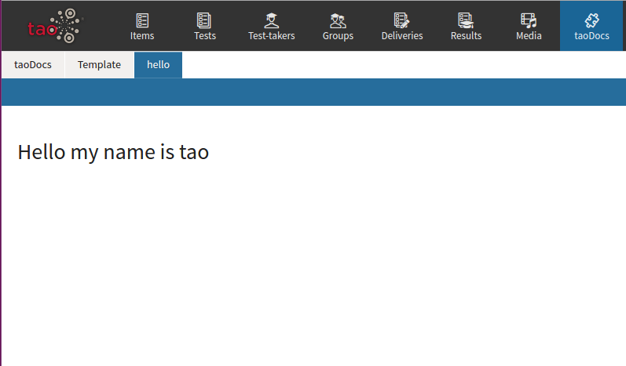

<!--
parent: 'TAO 3 1'
created_at: '2015-06-18 13:17:42'
updated_at: '2016-06-20 10:08:45'
authors:
    - 'Christophe Garcia'
tags:
    - 'Legacy Versions:TAO 3.0'
-->

How to make a new extension 3 0 v2
==================================

Preparation
-----------

1.  Install TAO (3.0) (https://github.com/oat-sa/package-tao)
2.  download taoDevTools extension using composer : 

    <code>composer require “oat-sa/extension-tao-devtools” —dev</code>
3.  Make sure the extension taoDevTools has been installed (How to install an extension).

Create the extension
--------------------

1.  Log into TAO Back Office with your TaoManager account
2.  Go to “Settings”(upper right corner) - 
> “Extensions Manager”
3.  Click on “create new” to create your new extension
4.  Fill out the form and call your new extension “taoDocs” ( you can select some Samples to generate extra structure, according to your choice )
5.  Return to the extension manager, refresh with F5 , select taoDocs, and install it
6.  go to project root directory and verify folder “taoDocs” exists.
7.  Go to taoDocs directory, you can see a standard extension structure.
8.  Go to controller directory, open TaoDocs.php. This is a simple controller sample.
9.  A “taoDocs” section has appear on top main menu. Go to “taoDocs” section and look at your new extension.

Step 1 : “Hello World”
----------------------

to create your first controller, go to taoDocs/controller directory and create a file named Hello.php. Create a php class Hello extends tao_actions_CommonModule

Now, create a simple action using a template file.

    public function myName() {
            $this->setData('myName', 'tao');
            $this->setView('myName.tpl');

        }

To create your first template: go to directory views/templates and create Hello folder. 

Create myName.tpl file.

        Hello my name is <?=(get_data('name'))?>

-   To test this action visit **

to Add link to hello world on extension menu. Return to controller directory and Open structures.xml. 

In the sections tag, add this section

go to tools section  (right upper side) and click on “empty cache” button.

refresh your page and see :

change extension icon : reopen structures.xml and add <icon id="icon-folder" /> like this :

Empty cache and refresh. More icons here http://style.taotesting.com/icon-listing/

Step 2 : create complexe structure :
------------------------------------

1\. reopen Hello.php and add a new controller method

    Public function helloAll() {

    }

    public function getHelloList() {

            $dataName =
                    [
                        'luke',
                        'biggs',
                        'wedge',
                    ];

            $data = array(
                'data'  => __("Hello"),
                'attributes' => array(
                        'id' => 1,
                        'class' => 'node-class'
                    ),
                'children' => array()
                );

            foreach ($dataName as $index => $name) {
     $data['children'][] =  array(
                    'data'  => 'my name is ' . ucfirst($name),
                    'attributes' => array(
                            'id' => 'name_' . $index,
                            'class' => 'node-instance'
                        )
                );
            }
            echo json_encode($data);
        }

Add your new section to structures.xml

empty cache and refresh, you can see a new tab on “taoDocs” menu.

Step 3 : customized actions :
-----------------------------

Add some actions on structures.xml :

**Add vader and obiwan actions on Hello.php controller :**

     'luke',
                        'red_2' => 'biggs',
                        'red_5' => 'wedge',
                        ];

        /**
         * initialize the services
         */
        public function __construct(){
            parent::__construct();
        }

        public function myName() {

            $name = 'tao';

            if($this->hasRequestParameter('uri')) {
                $uri = $this->getRequestParameter('uri');
                if(array_key_exists($uri, $this->pilots)) {
                $name = $this->pilots[$uri];
                }
            }

            $this->setData('myName', $name);
            $this->setView('myName.tpl');
        }

        public function helloAll() {

        }

        public function getHelloList() {

            $data = array(
                'data'  => __("Hello"),
                'attributes' => array(
                        'id' => 1,
                        'class' => 'node-class'
                    ),
                'children' => array()
                );

            foreach ($this->pilots as $index => $name) {
                 $data['children'][] =  array(
                    'data'  => 'my name is ' . ucfirst($name),
                    'attributes' => array(
                            'id' => $index,

                            'class' => 'node-instance'
                        )
                );
            }
            echo json_encode($data);
        }

        public function vader() {
            $name = '';
            if($this->hasRequestParameter('uri')) {
                $uri = $this->getRequestParameter('uri');
                if(array_key_exists($uri, $this->pilots)) {
                    $name = $this->pilots[$uri];
                }
            }
            echo ucfirst($name) . ', I\'m your father';

        }

        public function obiwan() {
            $name = '';
            if($this->hasRequestParameter('uri')) {
                $uri = $this->getRequestParameter('uri');
                if(array_key_exists($uri, $this->pilots)) {
                    $name = $this->pilots[$uri];
                }
            }
            echo ucfirst($name) . ', may the force be with you';

        }

    }

**Empty cache and enjoy.**

