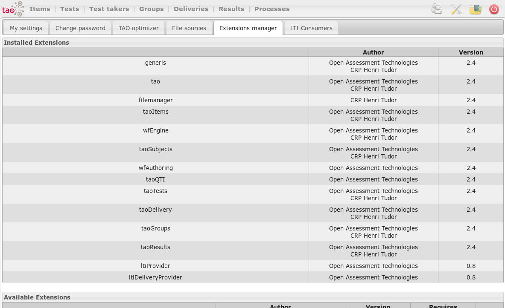
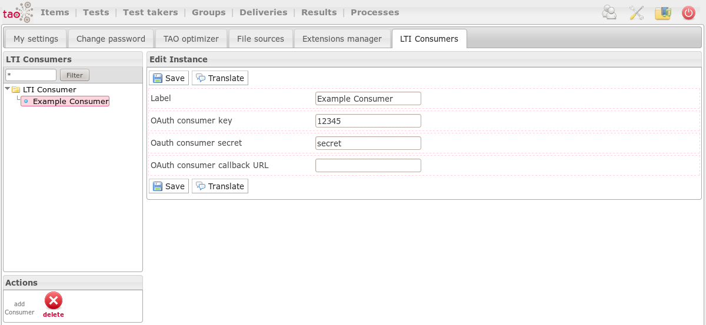
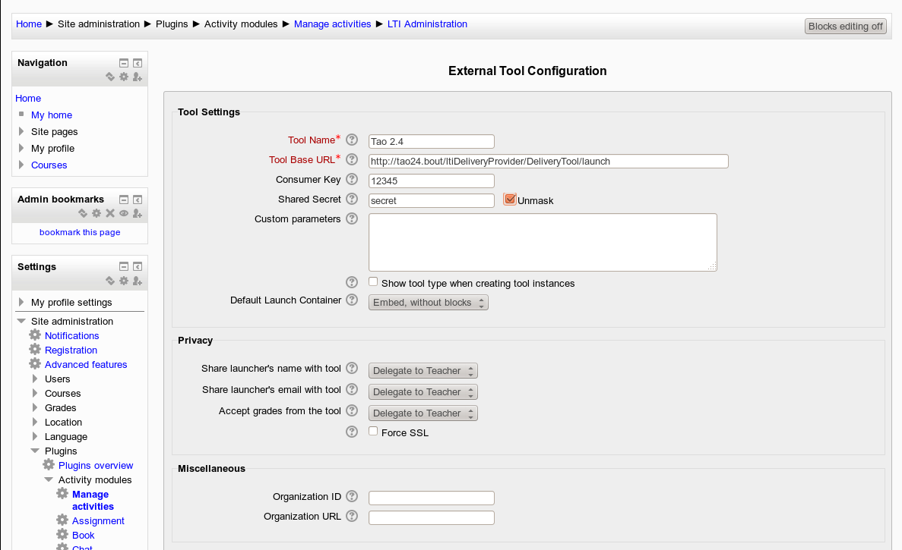
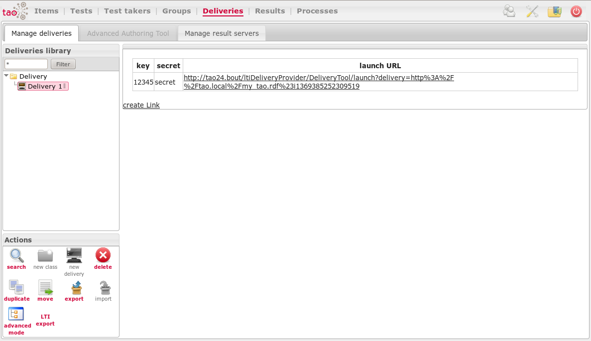
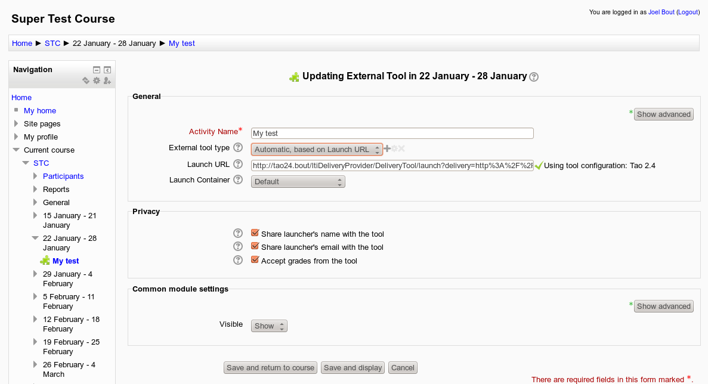

<!--
authors:		
  - 'Joel Bout'		
tags: 
  - Tutorials
  - LTI
--->
 # How to deliver a test using LTI

## Preparation

- Install TAO 2.4+
- Install a LTI Consumer (This tutorial uses Moodle 2.4 https://moodle.org/)
- in TAO: Create a delivery (https://userguide.taotesting.com/3.1/deliveries/create-a-new-delivery.html)
- in Moodle: Create a course (http://docs.moodle.org/24/en/Create_your_own_course)

## LTI Installation

to Install the required extensions in Tao:

- go to Settings (Upper right corner)
- open the tab *Extensions manager*
- select the extensions *ltiDeliveryProvider* and *ltiProvider*
- click on install and confirm
- once the extensions are installed, reload the page.

## Exchange Credentials

### in TAO
- click on the new tab *LTI Consumers* on the settings page
- select the class LTI Consumer and click on *add Consumer*
- Name the new consumer and fill in any key and secret you like, callback URL can be left empty
- click on create (if the consumer does not immediately appear in the list, reload the page)

### in Moodle as administrator
- Go to *Site administration* and open *Plugins* (under advanced features) -> *Activity modules* -> *Manage activities*
- Open *Settings* of the *External Tools* and click on *Add external tool configuration*
- Name your configuration and enter the same Consumer Key and Shared Secret that you used in TAO
- The Tool Base URL is TAO_ROOT_URL + *'/ltiDeliveryProvider/DeliveryTool/launch'*.
 (If you don't know the url of your TAO instalation then return to the TAO back office home, look at your url and remove 'tao/Main/index'.
 So if your TAO home is 'http://localhost/tao24/tao/Main/index' then your root url would be 'http://localhost/tao24/'.)
- click on 'save Changes'

## Add the Delivery to Moodle

### in TAO
- Open the Deliveries and select the delivery you prepared earlier
- Please make sure the delivery has been compiled
- Now you should have an action without icon called *LTI export*. Please copy the link it generates.

### in Moodle as a teacher
- Open your course in edit mode
- click on *Add an activity or resource*, select *External Tool* and click on *add*
- Name your activity and copy the url into the *Launch URL* field. Right of the URL a green check mark should appear
- Click on *Save and return to course* to finish adding your TAO delivery to a Moodle course

## Testing it

- Login as a student registered in your course
- Select the course and click on the activity
- ???
- Profit
