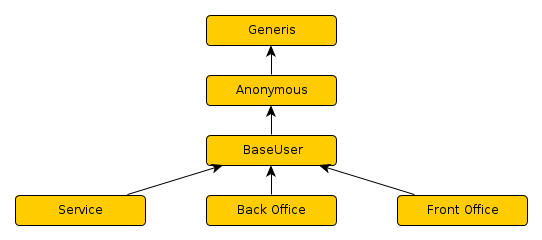
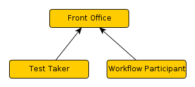

<!--
parent: 'Users Management Model'
created_at: '2014-02-20 10:20:15'
updated_at: '2014-02-20 11:06:50'
authors:
    - 'Joel Bout'
tags:
    - 'Users Management Model'
-->

TAO Roles
=========

These roles are build upon the User Management Model 2.4

The arrows in the diagrams represent included roles, for example: The role “Back Office” includes all access rights provided by “BaseUser”.

Abstract roles
--------------

These roles are abstract and should never be assigned directly to an user, they are however already used to grant access to TAO functionalities.

-   **Generis**: legacy role (might be removed in final 2.6)

-   **Anonymous**: Every person visiting the platform has this role by default. Grants access to the login page.

-   **BaseUser**: Every person that is authenticated has this role.

-   **Service**: This is the base role for all non human access roles (currently unused)

-   **Back Office**: This is the base role for all roles that generate or manage the content. Grants access to the back office menu.

-   **Front Office**: This is the base role for all roles that interact with content that was prepared in the back office

Front Office
------------

-   **Test Taker**: Role of the Test takers, grants access to the Deliver Server, the test/item runners as well as the results interface to submit responses.

-   **Workflow Participant**: This grants access to the workflow server/runner as well as the services accessible by the workflow.

Back Office
-----------

-   **<EXTENSION> Manager** Every extension has by default its own manager that gives full access to this extension. This includes the meta-extension TAO.

-   **Global Manager** This role includes all other extensions managers to form the global manager. This role is automatically assigned to the super user during install.

-   **System Administrator** This role is used for administrative tasks only. It is required to update your platform, install new extensions, change system settings among others. This role is automatically assigned to the super user during install.

### Exceptions

-   “taoDelivery Manager” does NOT grant access to the delivery server, to prevent non test takers from taking tests

-   “taoItems Manager” also grants access to the extensions taoOpenWebItem and taoQTI (QTI item extension) in order to allow authoring of these kind of items

