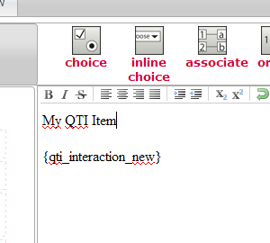

<!--
author:
    - 'Jérôme Bogaerts'
created_at: '2011-02-15 15:28:16'
updated_at: '2013-03-13 12:33:24'
tags:
    - 'Administrator Guide'
-->

FAQs
====

How can I change the software configuration after installation?
---------------------------------------------------------------

The TAO Platform is organized as an aggregate of extensions so that configuration files are distributed among multiple locations on the file system. Each module like Items, Groups or Tests has its own configuration file.

-   **TAO Meta-extension**: *path\_to\_tao/tao/manifest.php*
-   **File Manager**: *path\_to\_tao/filemanager/manifest.php*
-   **Generis**: *path\_to\_tao/generis/common/conf/db.conf.php*
-   **Generis**: *path\_to\_tao/generis/common/conf/generis.conf.php*
-   **Delivery**: *path\_to\_tao/taoDelivery/manifest.php*
-   **Groups**: *path\_to\_tao/taoGroups/manifest.php*
-   **Items**: *path\_to\_tao/taoItems/manifest.php*
-   **Results**: *path\_to\_tao/taoResults/manifest.php*
-   **Subjects**: *path\_to\_tao/taoSubjects/manifest.php*
-   **Tests**: *path\_to\_tao/taoTests/manifest.php*
-   **Workflow Engine**: *path\_to\_tao/wfEngine/manifest.php*
-   **Workflow Engine Authoring**: \_path\_to\_tao\_/wfAuthoring/manifest.php

I cannot see anything in the Item/Test library.
-----------------------------------------------

Please make sure that the **JSON** PHP extension is loaded on your web server. You can check if the JSON extension is loaded by using the *phpinfo()* function. Maybe PHP was compiled with the *—disable-json* or *—disable-all* directive. More information about the **JSON** extension [here](http://us.php.net/manual/en/book.json.php).

The error “Fatal error: class ‘DomDocument’ not found in …” appears on the screen.
----------------------------------------------------------------------------------

Please make sure that the **DOM** PHP extension is loaded on your web server. This extension may be deactivated if PHP was compiled with the *—disable-dom* directive. Use the *phpinfo()* function to get a list of loaded extensions. More information about the **DOM** extension [here](http://us.php.net/manual/en/book.dom.php).

The text “{qti\_interaction\_new}” appears when I add a new QTI interaction to my item.
---------------------------------------------------------------------------------------

This occurs when the PHP **tidy** extension is not loaded. You can check whether or not the extension is loaded with the *phpinfo()* function. Get more information on how to install the **tidy** extension [here](http://us.php.net/manual/en/book.tidy.php).

How do I backup my MySQL database ?
-----------------------------------

    mysqldump --user=[username] --password[password] [database_name] > backup.sql

Which privileges does my database user need to properly run TAO?
----------------------------------------------------------------

It depends on the Database Management System you chose to run TAO. Please refer to the [[DatabaseUserPrivileges|Database User Privileges]] page for more information.

Apache mod\_rewrite is correctly installed but I still have 404 Page Not Found Errors.
--------------------------------------------------------------------------------------

Check if your Apache configuration contains an **AllowOverride** statement set to **None**. It might prevent TAO .htaccess files to be correctly processed.

