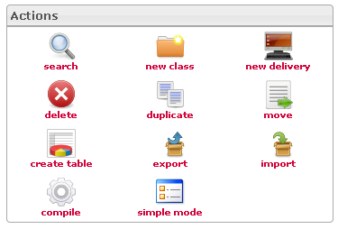

<!--
author:
    - 'Jérôme Bogaerts'
created_at: '2012-04-12 19:09:37'
updated_at: '2013-03-13 14:03:04'
tags:
    - Deliveries
-->

Actions
=======

According to your actions in the interface, the actions icons will be activated or deactivated.

