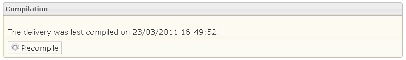

<!--
author:
    - 'Jérôme Bogaerts'
created_at: '2012-03-29 15:39:55'
updated_at: '2013-03-13 14:07:00'
tags:
    - Deliveries
-->

Compilation
===========

-   The Compilation box is displayed when a delivery is selected in the Deliveries library or when a delivery is selected and when the user clicks on the Compile action.
-   The Compilation box compiles the tests composing the selected delivery. The compilation is necessary for the delivery execution.

Compilation
===========

-   The Compilation box is displayed when a delivery is selected in the Deliveries library or when a delivery is selected and when the user clicks on the Compile action.
-   The Compilation box compiles the tests composing the selected delivery. The compilation is necessary for the delivery execution.

