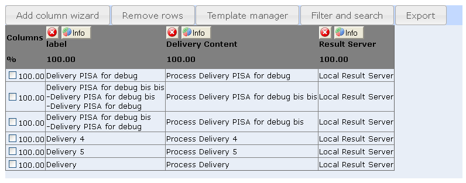

<!--
created_at: '2012-04-12 19:10:18'
updated_at: '2013-03-13 14:08:57'
authors:
    - 'Jérôme Bogaerts'
contributors:
    - 'Sophie Doublet'
tags:
    - Deliveries
-->

Create table
============

The Create table box is displayed when a class is selected in the Items library and when you click on the Create table action.

The Create table box is a workspace where it is possible to build a table to view data selected among all the data that can be viewed on the platform.

