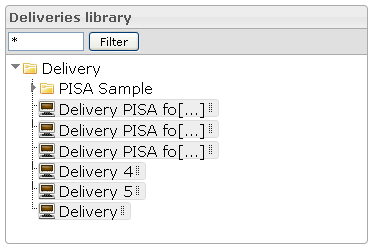

<!--
author:
    - 'Jérôme Bogaerts'
created_at: '2012-03-29 15:11:34'
updated_at: '2013-03-13 14:02:46'
tags:
    - Deliveries
-->

Deliveries library
==================

The Deliveries library provides a tree-view of the Deliveries  and classes  you have created. All are contained in the “Delivery” root class.

You can move deliveries in order to change their belonging class by drag and drop, or with the “Move” icon.

Different actions are available by right clicking (edit, new class, new delivery, move, duplicate, delete) depending on whether a class or a delivery is selected.

You can filter the Deliveries library. Only the deliveries and classes labels that meet the string enter in the text field will be displayed.

Deliveries library
==================

The Deliveries library provides a tree-view of the Deliveries  and classes  you have created. All are contained in the “Delivery” root class.

You can move deliveries in order to change their belonging class by drag and drop, or with the “Move” icon.

Different actions are available by right clicking (edit, new class, new delivery, move, duplicate, delete) depending on whether a class or a delivery is selected.

You can filter the Deliveries library. Only the deliveries and classes labels that meet the string enter in the text field will be displayed.

