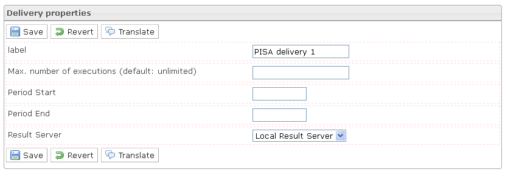

<!--
author:
    - 'Jérôme Bogaerts'
created_at: '2012-03-29 15:37:06'
updated_at: '2013-03-13 14:06:25'
tags:
    - Deliveries
-->

Delivery properties
===================

-   The Delivery properties box is displayed when a delivery is selected in the Deliveries library box.
-   The Deliveries properties box provides the delivery properties which are defined in the parent classes properties and are available for modification.

Delivery properties
===================

-   The Delivery properties box is displayed when a delivery is selected in the Deliveries library box.
-   The Deliveries properties box provides the delivery properties which are defined in the parent classes properties and are available for modification.

