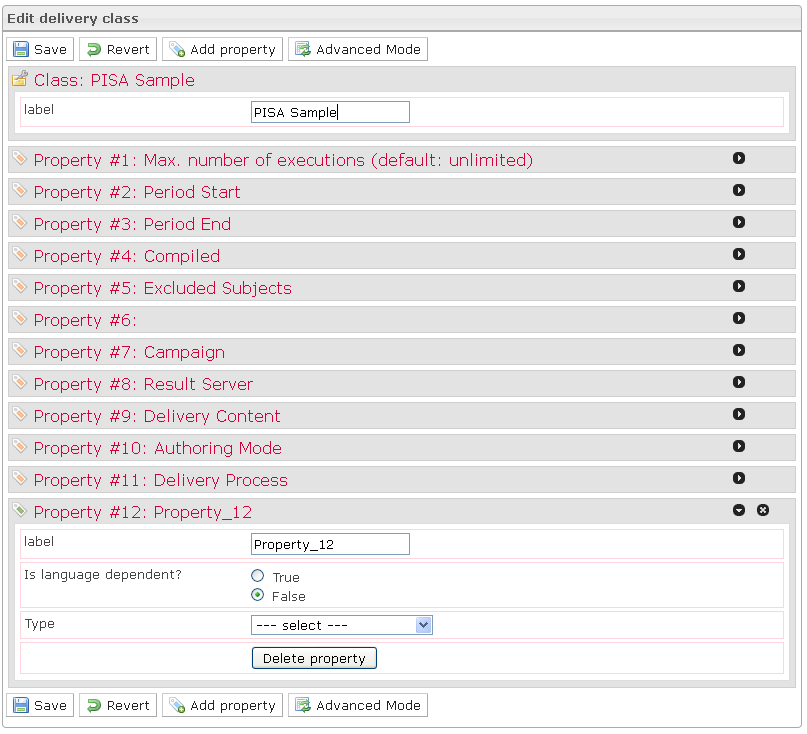

<!--
author:
    - 'Jérôme Bogaerts'
created_at: '2012-03-29 15:18:15'
updated_at: '2013-03-13 14:03:23'
tags:
    - Deliveries
-->

Edit delivery class
===================

-   The Edit delivery class box is displayed when a class is selected in the Deliveries library.
-   The Edit delivery class box provides the possibility creating, modifying or deleting properties. These properties define parameters to define when creating deliveries of class.
-   Eleven properties are predefined as they constitute the specification of a delivery:
    -   Label
    -   Maximum number of execution
    -   Period start
    -   Period end
    -   Compiled
    -   Excluded subjects
    -   Campaign
    -   Result server
    -   Delivery content
    -   Authoring mode
    -   Delivery process
-   The Simple mode allows creating properties from widgets and previously created lists.
-   The Advanced mode allows creating properties from widgets and resources of the platform.

Edit delivery class
===================

-   The Edit delivery class box is displayed when a class is selected in the Deliveries library.
-   The Edit delivery class box provides the possibility creating, modifying or deleting properties. These properties define parameters to define when creating deliveries of class.
-   Eleven properties are predefined as they constitute the specification of a delivery:
    -   Label
    -   Maximum number of execution
    -   Period start
    -   Period end
    -   Compiled
    -   Excluded subjects
    -   Campaign
    -   Result server
    -   Delivery content
    -   Authoring mode
    -   Delivery process
-   The Simple mode allows creating properties from widgets and previously created lists.
-   The Advanced mode allows creating properties from widgets and resources of the platform.

