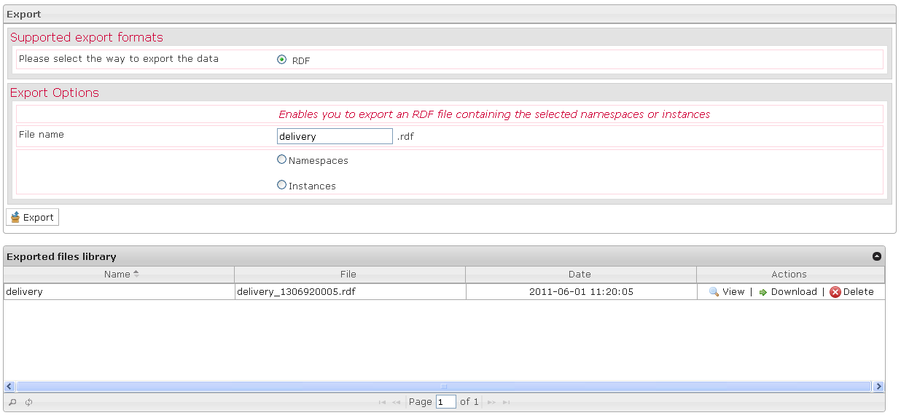

<!--
created_at: '2012-04-12 19:10:41'
updated_at: '2013-03-13 14:09:25'
authors:
    - 'Jérôme Bogaerts'
contributors:
    - 'Sophie Doublet'
tags:
    - Deliveries
-->

Export
======

The Export box is displayed when a delivery or a class is selected in the Deliveries library and when you click on the Export action.

When you export your data, you have just to indicate the data you want.

