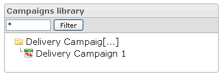
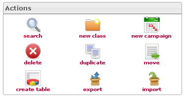
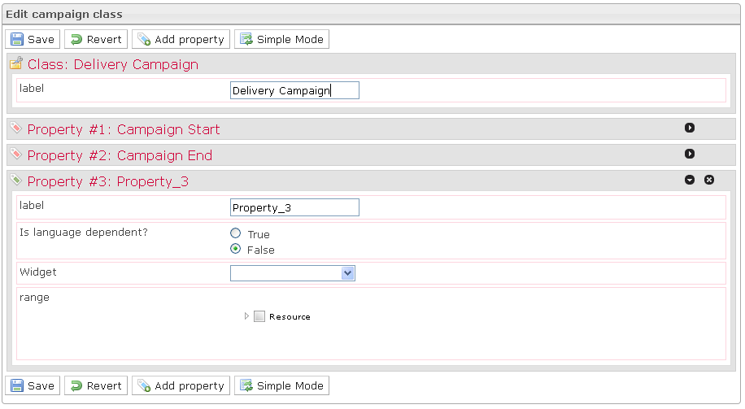
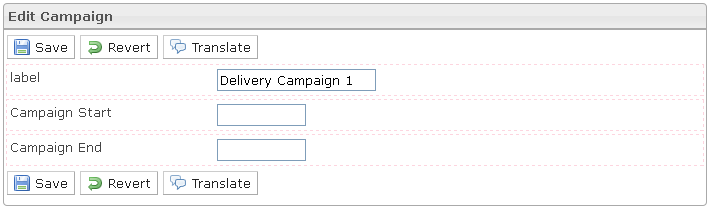
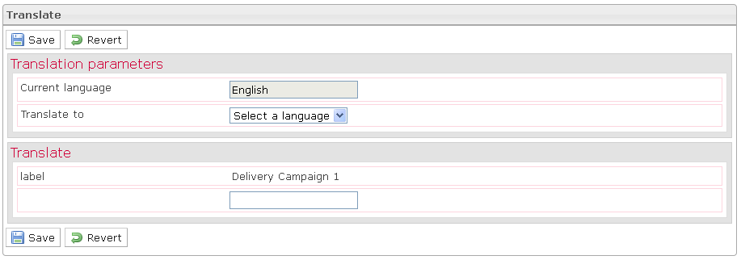
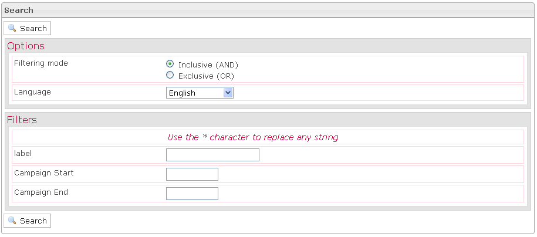
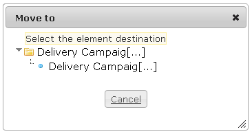
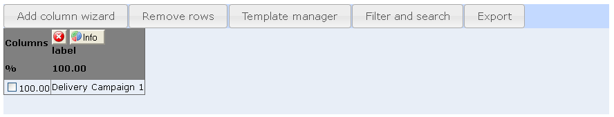
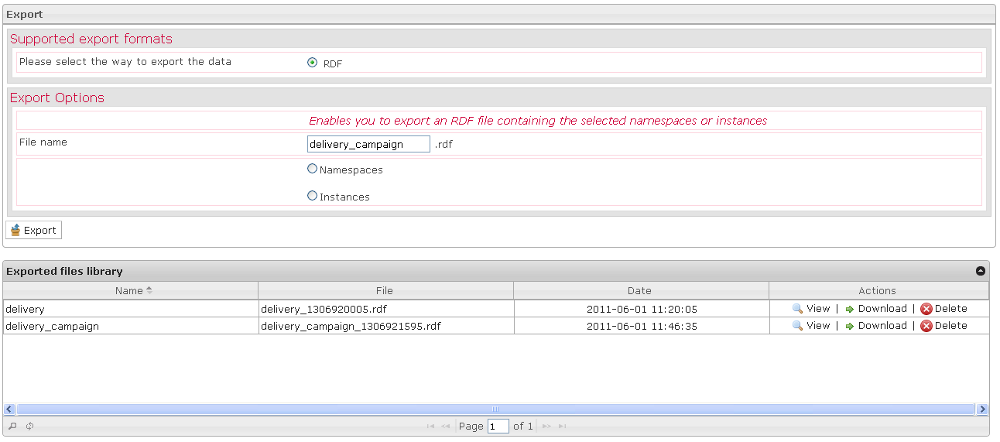
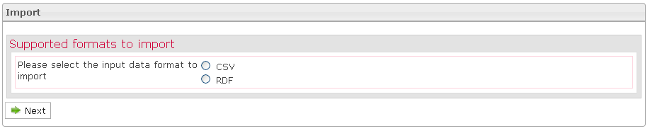

<!--
created_at: '2011-04-22 09:17:37'
updated_at: '2013-03-13 15:12:32'
authors:
    - 'Jérôme Bogaerts'
contributors:
    - 'Franck Gismondi'
tags:
    - Deliveries
-->

Manage Campaigns
================

The main functions of this tab:

Campaigns library box
---------------------

-   It is possible to put a filter on the campaigns tree view. Only campaigns and classes containing the input string will be displayed.
-   When right-clicking the selection in the tree is done, the actions are also displayed as context menu.
-   The classes tree supports drag and drop moving of campaigns into a different class.

Actions box
-----------

-   According to your actions in the interface, the actions icons will be activated or deactivated.

Edit campaign class box
-----------------------

-   The Edit campaign class box is displayed when a class is selected in the Campaigns library.
-   The Edit campaign class box provides the possibility creating, modifying or deleting properties. These properties define parameters to define when creating campaigns of class.
-   Three properties are predefined as they constitute the specification of a campaign: Label, Campaign start and Campaign end.

Select delivery box
-------------------

-   The Select delivery box is displayed when a campaign is selected in the Campaigns library.
-   The Select delivery box allows indicating the deliveries which should constitute the selected campaign.

Edit campaign box
-----------------

-   The Edit campaign box is displayed when a test is selected in the Tests library box.
-   The Edit campaign box provides the campaign properties which are defined in the parent classes properties and are available for modification.

Translate box
-------------

-   In the Edit campaign box, when you click on the Translate button, the Translate box is displayed.
-   The Translate box allows translating the campaign properties.

Search box
----------

-   The Search box is displayed when you click on the Search action, in the Actions box.
-   In the first part of the Search box, you should define the search options which permit to refine search results.
-   In the second part of the Search box, you should define one filter to minimum to allow the search.

Move to box
-----------

-   The Move to box is displayed when a campaign is selected in the tree and when you click on the Move action (in the right-click menu or in the Actions box).
-   To move a campaign, just click on the target class.

Create table box
----------------

-   The Create table box is displayed when a class is selected in the Items library and when you click on the Create table action.
-   The Create table box is a workspace where it is possible to build a table to view data selected among all the data that can be viewed on the platform.

Export box
----------

-   The Export box is displayed when a campaign or a class is selected in the Campaigns library and when you click on the Export action.
-   When you export your data, you have just to indicate the data you want.

Import box
----------

-   The Import box is displayed when a class is selected in the Campaigns library and when you click on the Import action.
-   You can import your data to CSV or to RDF.
-   If you choose to import your data to CSV, the import is occurring in three steps: first define the common options of your CSV file, second select your file in your file system by clicking the Browse button and thirdly map the columns of your CSV file to the properties of your class.
-   If you choose to import your data to RDF, you must indicate the RDF item you want to import.

Manage Campaigns
================

The main functions of this tab:

Campaigns library box
---------------------

-   It is possible to put a filter on the campaigns tree view. Only campaigns and classes containing the input string will be displayed.
-   When right-clicking the selection in the tree is done, the actions are also displayed as context menu.
-   The classes tree supports drag and drop moving of campaigns into a different class.

Actions box
-----------

-   According to your actions in the interface, the actions icons will be activated or deactivated.

Edit campaign class box
-----------------------

-   The Edit campaign class box is displayed when a class is selected in the Campaigns library.
-   The Edit campaign class box provides the possibility creating, modifying or deleting properties. These properties define parameters to define when creating campaigns of class.
-   Three properties are predefined as they constitute the specification of a campaign: Label, Campaign start and Campaign end.

Select delivery box
-------------------

-   The Select delivery box is displayed when a campaign is selected in the Campaigns library.
-   The Select delivery box allows indicating the deliveries which should constitute the selected campaign.

Edit campaign box
-----------------

-   The Edit campaign box is displayed when a test is selected in the Tests library box.
-   The Edit campaign box provides the campaign properties which are defined in the parent classes properties and are available for modification.

Translate box
-------------

-   In the Edit campaign box, when you click on the Translate button, the Translate box is displayed.
-   The Translate box allows translating the campaign properties.

Search box
----------

-   The Search box is displayed when you click on the Search action, in the Actions box.
-   In the first part of the Search box, you should define the search options which permit to refine search results.
-   In the second part of the Search box, you should define one filter to minimum to allow the search.

Move to box
-----------

-   The Move to box is displayed when a campaign is selected in the tree and when you click on the Move action (in the right-click menu or in the Actions box).
-   To move a campaign, just click on the target class.

Create table box
----------------

-   The Create table box is displayed when a class is selected in the Items library and when you click on the Create table action.
-   The Create table box is a workspace where it is possible to build a table to view data selected among all the data that can be viewed on the platform.

Export box
----------

-   The Export box is displayed when a campaign or a class is selected in the Campaigns library and when you click on the Export action.
-   When you export your data, you have just to indicate the data you want.

Import box
----------

-   The Import box is displayed when a class is selected in the Campaigns library and when you click on the Import action.
-   You can import your data to CSV or to RDF.
-   If you choose to import your data to CSV, the import is occurring in three steps: first define the common options of your CSV file, second select your file in your file system by clicking the Browse button and thirdly map the columns of your CSV file to the properties of your class.
-   If you choose to import your data to RDF, you must indicate the RDF item you want to import.

