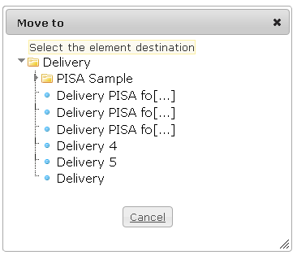

<!--
parent: Deliveries
created_at: '2012-04-12 19:09:58'
updated_at: '2013-03-13 14:08:13'
authors:
    - 'Jérôme Bogaerts'
contributors:
    - 'Sophie Doublet'
tags:
    - Deliveries
-->

Move to
=======

The Move to box is displayed when a delivery is selected in the tree and when you click on the Move action (in the right-click menu or in the Actions box).

To move a test, just click on the target class.

