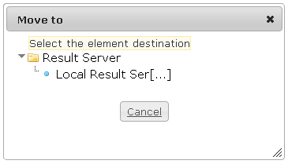

<!--
created_at: '2012-03-29 15:59:20'
updated_at: '2013-03-13 14:20:30'
authors:
    - 'Jérôme Bogaerts'
contributors:
    - 'Franck Gismondi'
tags:
    - Deliveries
-->

Move to
=======

-   The Move to box is displayed when a result server is selected in the tree and when you click on the Move action (in the right-click menu or in the Actions box).
-   You can edit a comment at the selected result server. For that you should click on the Edit icon, write a comment in the box which appears and click on the Save button.

Move to
=======

-   The Move to box is displayed when a result server is selected in the tree and when you click on the Move action (in the right-click menu or in the Actions box).
-   You can edit a comment at the selected result server. For that you should click on the Edit icon, write a comment in the box which appears and click on the Save button.

