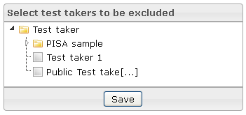

<!--
parent:
    title: Deliveries
author:
    - 'Jérôme Bogaerts'
created_at: '2012-03-29 15:35:21'
updated_at: '2013-03-13 14:06:08'
tags:
    - Deliveries
-->

Select test takers to be excluded
=================================

-   The Select test takers to be excluded box is displayed when a delivery is selected in the Deliveries library.
-   The Select test takers to be excluded box allows indicating the test takers who should be excluded to the delivery.

