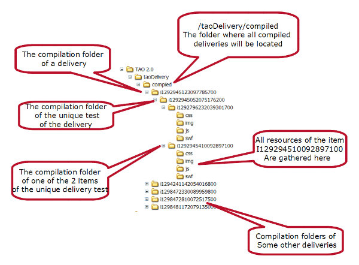
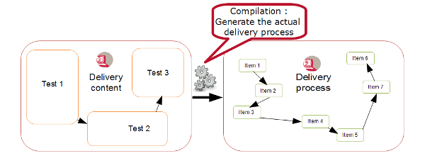

<!--
parent:
    title: Delivery
author:
    - 'Jérôme Bogaerts'
created_at: '2011-03-03 11:37:27'
updated_at: '2013-03-13 13:08:34'
tags:
    - Delivery
-->

{{\>toc}}

Compile a delivery
==================

Compiling a delivery means getting the delivery content ready for execution.

1. Why compilation?
-------------------

The need for test compilation is due to the potential issue of server access and/or overload during test campaign. Typically, many subjects are likely to run the test at once. The server overload issue is particularly true when the delivery includes items, with many media files that are located in different remote servers.\
The path to a compiled item of a test of a delivery execution is *taoDelivery/compiled/deliveryId/testId/itemId/*\

2. Operation performed
----------------------

Firstly, it consists in building the compiled folder path where the content and the resources of every item of every test contained in a delivery will be gathered. Then, the delivery process is generated from the delivery definition (i.e. delivery content). For more information on the difference between a delivery process and a delivery content, see [[Create and author a delivery|previous section]].\

The method that compiles a test is *taoDelivery\_models\_classes\_DeliveryService::compileTest()*.\
It loops over all items of the test and deploy them individually in the proper folder.\
For more information on the item deployment process, see the source of the method *taoItems\_models\_classes\_ItemsService::deployItem()*.

