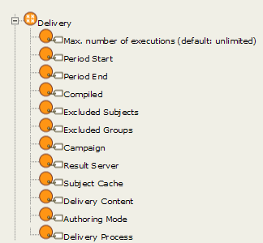
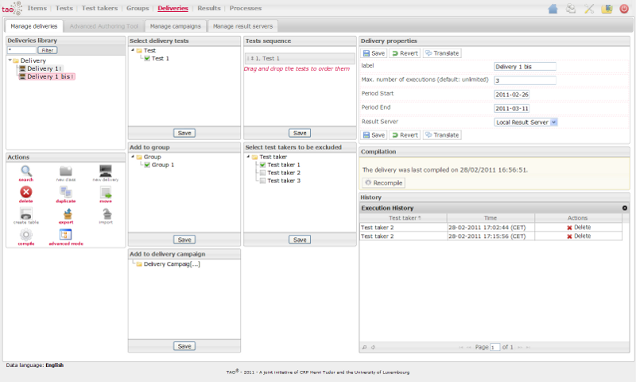

<!--
created_at: '2011-03-03 11:52:14'
updated_at: '2013-03-13 13:08:57'
authors:
    - 'Jérôme Bogaerts'
contributors:
    - 'Somsack Sipasseuth'
tags:
    - Delivery
-->

Execute a Delivery
==================

In the delivery model, delivery properties define the execution environment, i.e. the constraints on the execution:

The delivery editing interface allows defining the values of these properties.

(see user guide: Edit a delivery)

To determine whether a test taker is allowed to execute a delivery process, the method *taoDelivery_models_classes_DeliveryServerService::getDeliveries* is called in the delivery server. It returns an array of deliveries for the logged subject, according to the properties set previously by the delivery creator. 

The parameter *checkList* allows tuning the checking with a list of check methods to perform. By default, all methods starting by *check* are called :

-   checkPeriod()
-   checkCompiled()
-   checkResultServer()
-   checkExcludedSubject()
-   checkMaxExecution()

It is thus easy to extend or limit this functionality according to your needs by adding new custom check functions with your own conditions. The simple example below shows how you can filter the delivery to match the difficulty adapted to the current subject:

Supposing that the subject and delivery models have the property “difficulty” are created and are defined in the constants:

    define('DIFFICULTY_EASY', 1);
    define('DIFFICULTY_MEDIUM', 2);
    define('DIFFICULTY_HARD', 3);
    define('PROPERTY_SUBJECT_DIFFULTY', '#propertyDeliveryDifficulty');//i.e. uri of the subject difficulty property here
    define('PROPERTY_DELIVERY_DIFFULTY', '#propertySubjectDifficulty');

You only need to add this function to the delivery server service *taoDelivery_models_classes_DeliveryServerService*, or better, to a class that extends this class, e.g. taoDelivery_models_classes_myDeliveryServerService (following the [Guidelines](../developer-guide/guidelines.md) for naming conventions)

    //a class created in /taoDelivery/models/classes/class.myDeliveryServerService.php
    class taoDelivery_models_classes_myDeliveryServerService extends taoDelivery_models_classes_DeliveryServerService{

        // your function here...

    }

And the check function would be:

    public function checkDifficulty(){

        $returnValue = (bool) false;

        if($this->hasParameters($param, array('delivery', 'subject'))){//hasParameters check if the parameters exists

            $delivery = $param['delivery'];
            $subject = $param['subject'];

            //get the difficulty
            $subjectDifficulty = $subject->getOnePropertyValue(new core_kernel_classes_Property(PROPERTY_SUBJECT_DIFFULTY));
            $deliveryDifficulty = $delivery->getOnePropertyValue(new core_kernel_classes_Property(PROPERTY_DELIVERY_DIFFULTY));

            if(intval((string) $subjectDifficulty) == intval((string) $deliveryDifficulty)){
                $returnValue = true;
            }
        }

        return (bool) $returnValue;
    }

All check functions must start by “check”. 

They will be given an array of parameters (currently, the delivery and the subject resources) and must return a variable with the boolean type (true if the condition is fulfilled, false otherwise).

You can add a property in the model and make the corresponding check on a custom delivery server check function.

