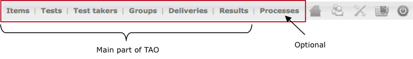
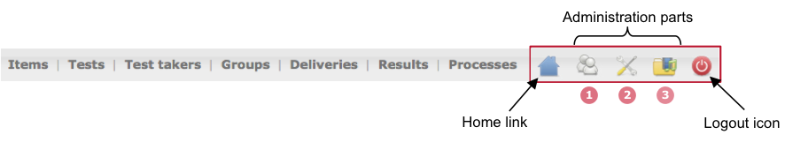
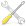
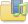

<!--
author:
    - 'Jérôme Bogaerts'
created_at: '2011-10-24 16:09:52'
updated_at: '2013-03-13 13:14:47'
tags:
    - 'General features'
-->

Menus
=====

On the top left of the screen
-----------------------------

You can navigate through the different parts of the platform by clicking on the choosing one on the menu bar.

On the top right of the screen
------------------------------

The icons allows you to perform different actions: 

**1** **Users** 

Here you can manage users, that is to say, adding, modifying and deleting user profiles.

**2** **Settings** 

Settings part enables you to choose the interface and data language.

**3** **Media manager** 

With the Media Manager you can manage (upload, delete, etc.) the different resources (images, videos, etc.) used in TAO.

