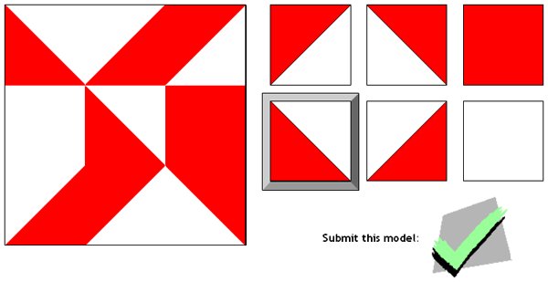
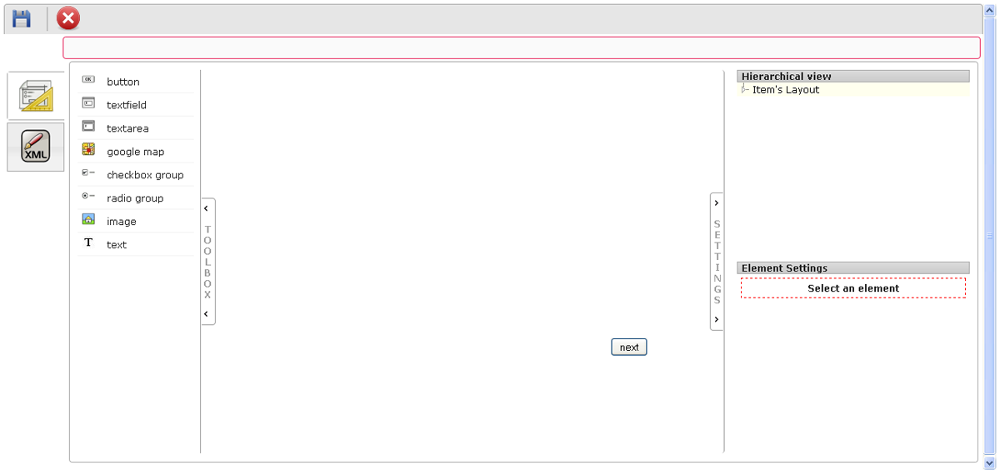

<!--
parent:
    title: Items
author:
    - 'Jehan Bihin'
created_at: '2012-06-29 08:55:20'
updated_at: '2012-06-29 08:55:45'
tags:
    - Items
-->

Authoring
=========

{{\>toc}}

Item types before TAO 2.2.

The Kohs editor
---------------

\> \* The Kohs editor is displayed when a Kohs item is selected in the Items library box and when you click on the Authoring button in the Edit item box or on the Authoring tab. 

\> \* The authoring of a Kohs-test offers a square with nine fields (left side) and six cubes with different designs (right side). 

\> \* Clicks on one of the cubes to select it and then on the field(s) where it should be positioned. 

\> \* After all fields are filled a check mark will appear. Click on it to save the pattern. Your Kohs item is ready for testing.

The C-Test editor
-----------------

\> \* The C-Test editor is displayed when a C-Test item is selected in the Items library box and when you click on the Authoring button in the Edit item box or on the Authoring tab. 

\> \* To create a C-Test you have to write the text into the text field. Mark (double click) the appropriate word to obtain automatically a gap. 

\> \* There is one parameter to define, it is the time allowed to fill in the gaps. The test taker won’t be able to access a following text before the specified time has expired. 

\> \* Apply your changes by clicking on the Save button.

The HAWAI editor
----------------

\> \* The HAWAI editor is displayed when a HAWAI item is selected in the Items library box and when you click on the Authoring button in the Edit item box or on the Authoring tab. 

\> \* The HAWAI editor has three modes: the templates mode, the designer mode and the XML mode. 

\> \* The templates mode is the simplest mode. It allows building an item from a template. To choose a template, just click on it, after that, the construction of the item is fully coordinate by the system. Simply answer the various questions it asks you. (En attente de répondre concernant la gestion des réponses …)\
\> \* The designer mode allows building an item from “graphical user interface elements”. To choose a graphical user interface element, just click on it, after that, the construction of the graphical user interface element is fully coordinate by the system. Simply answer the various questions it asks you. 

\> \* The XML mode allows building an item using the XML computer language.

