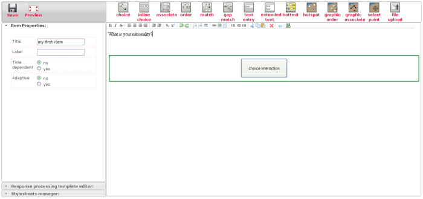
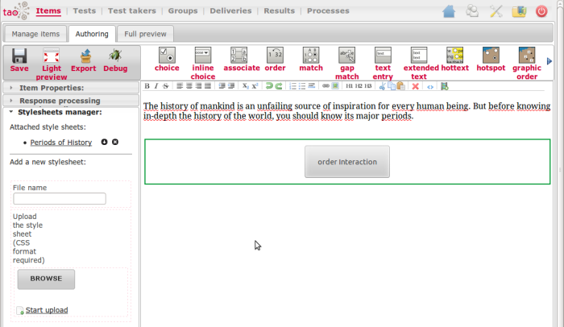
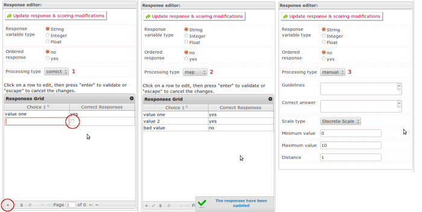
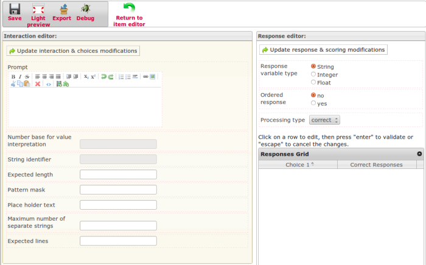

<!--
author:
    - 'Jérôme Bogaerts'
created_at: '2011-05-27 17:00:53'
updated_at: '2013-03-13 13:17:36'
tags:
    - Items
-->

QTI
===

QTI stands for Question and Tests Interoperability, a specification defined by the IMS consortium and that allow items interoperability between platforms. TAO implements this specification and allows users to create QTI compliant QTI items using the embedded QTI authoring tool.\
The specification may be consulted here : http://www.imsglobal.org/question/qti\_v2p0/imsqti\_oviewv2p0.html

QTI covers common needs in terms of items with a focus on the type of items and interaction types that are deliverable on paper. More complex interactions taking benefit of the use of computers may be achieved in TAO through the use of Open Web Items.

QTI and TAO
===========

TAO currently supports largely QTI 2.0.\
The features available are the following :

-   Import QTI Items
-   Import QTI Packages
-   Save the item content in the QTI format (XML)
-   Edit a QTI item (Authoring)
-   Export item in QTI
-   Render QTI item in XHTML

QTI Examples in TAO
===================

\
A reordering item in TAO built with the QTI authoring tool\
\
A scale item in TAO built with the QTI authoring tool\
\
A hot spot item

The authoring tool
==================

How to reach the QTI authoring tool in TAO ?
--------------------------------------------

The QTI editor is displayed when a QTI item is selected in the Items library box and when you click on the Authoring button in the Edit item box or on the Authoring tab.

Overview
--------

The Graphical User Interface of the authoring is made of 4 different spaces

-   The Menu on the top left allowing for global operations on the item
-   The Settings menu on the left side
-   The interactions toolbar where the user can pick up some interactions and add them to the item content
-   The workspace that is the main item content editor

### The Menu

1.  The menu on the top left allows to save the item. Make sure you save regularly, if you exit the authoring tool and go to another part of the platform, if you close your web browser, all data entered won’t be saved if you didn’t click this button explicitely.
2.  Light preview\
    This preview allows you tog et a quick preview in a pop-up window
3.  Export function\
    The export function is intended for advanced users. It allows you to download the source xml format of your item for edition outside tao. (see the hints section)
4.  The debug function\
    This function is intended for software developers only.

### The settings menu

The properties is a multi-level menu giving to you the possibility to edit some properties about the item, change the response processing or add stylesheet.

### The workspace

### Adding new interactions to the workspace

\> \* The QTI item authoring is mainly composed of 2 sections: the item editor and the interaction editor.\
\> \* The item editor is what you see when you enter in the QTI item and the interaction editor is display when you click on an interaction in the item content.\
\> \* The item editor allows you to create the content of your item, which could be formatted test and images, as well as inserting QTI interactions in the wanted place.\
\> \* You can start editing the content of your item simply by clicking on the text area. You can use the text tool bar above to format the text the way you want. When you have entered the text content and are ready to insert an interaction, just click on the specific place in your text, you want your interaction to be inserted, then click on one of the available interaction.\
\> \* To open the interaction editor, click on the interaction button in your item content. All interaction editors are composed of 3 main blocs, which are the interaction properties, choices editor and response editor.\
\> \* The interaction properties section allows you to set the properties values available in the QTI standard for a given interaction type: for more information on the interaction attributes, please refer to the official IMS webpage (http://www.imsglobal.org/question/).\
\> \* The choices editor allows you to add, edit and delete choices of the current interaction.\
\> \* The response editor allows you to select the way you want the response of your interaction to be processed. The available types are correct, map and map point. These three response-processing templates are standard QTI template: for more information on the default QTI response processing templates, please refer to the official IMS webpage (http://www.imsglobal.org/question/).

#### Stylesheet

A feature of the QTI specification allows to layout items using a stylesheet, this gives the opportunity to focus on the content creation and apply a style sheet on items with a consistent layout across items and reducing effort in layout activities.

The layout of QTI items is driven by [CSS](http://en.wikipedia.org/wiki/Cascading_Style_Sheets) (Cascading Style Sheets). The default style sheet ([qti.css](http://forge.taotesting.com/projects/tao/repository/entry/trunk/tao/trunk/taoItems/trunk/views/js/QTI/css/qti.css)) TAO applies to each QTI items can be overrode following your needs.

If you are using the [QTI Authoring tool](http://forge.taotesting.com/projects/tao/wiki/The_Authoring_tab), you will be able to upload your style sheet to override the default one.

Send your own css file, one or more.

The uploaded file is putted under ‘style/’ folder, so you have your item structure as :

- qti.xml\
- style /\
\>- mycss.css

Usable css class :

-   qti\_item\
    \> \* qti\_item\_body\
    \> \> \* qti\_widget\
    \> \> \> \* prompt (p)\
    \> \* qti\_control\
    \> \> \* qti\_validate
-   qti\_simple\_interaction

Interaction css class :

-   qti\_text\_entry\_interaction
-   qti\_extended\_text\_interaction
-   qti\_match\_interaction
-   qti\_order\_interaction
-   qti\_choice\_interaction
-   qti\_inline\_choice\_interaction
-   qti\_associate\_interaction
-   qti\_end\_attempt\_interaction
-   qti\_upload\_interaction
-   qti\_slider\_interaction
-   qti\_select\_point\_interaction
-   qti\_graphic\_gap\_match\_interaction
-   qti\_graphic\_associate\_interaction
-   qti\_graphic\_order\_interaction
-   qti\_hottext\_interaction
-   qti\_hotspot\_interaction

### External Objects

Use the green piece icon to add an external object in the content. Next, click on the object button to edit it.

Juste put the url of the resource, the width and height. Preview your item to see the result.

Response Processing form
------------------------

The response processing depend of the type of interaction, but globally it’s the same operation.

Choose your type of response processing :

1.  correct
2.  map
3.  manual (only if the response processing template is set to composite)

*Correct* and *map* allow you to set the defined one or more correct responses, the differences is that *map* allow you to define score corresponding to the answer.

Manual, comming with the *taoCoding extension*, allow you to define manual scoring for the interaction. You set the guidelines for scoring and the expected answer, next you choose the type of scale and set the parameters.

### Quick tip

To add correct answer for *correct* and *map* use the ‘+’ button in the grid bottom left corner. New fields appears to be filled, use **enter** to validate your entries.

Quick start
===========

1.  Add an item and click the Authoring button
2.  In the left column edit the properties as you wich
3.  Select the second left menu (by the bottom) to define the response processing (manual scoring is available in composite)
4.  In the workspace (right main zone), put the static content as text, pictures…
5.  Insert interaction(s) where you want in the content (displaying block)
6.  Don’t forget to save (upper left button)
7.  Click on the block interaction button to define it

1.  Define the question (prompt) and, depending to the interaction, define the interactions parameters
2.  Click on the update button (top of the frame)
3.  Define the response properties as requested and depending to the response processing selected (see point 3)
4.  The form evolve depending of your choice, fill it as requested
5.  Click on the update button (top of the frame)
6.  Don’t forget to save (upper left button)
7.  You just have to preview your item, if you want, you can add a stylesheet (last left menu, see the bottom) and customize your display.

Hints
=====

**Saving**

Don’t forget to save your changes. Use the upper left save button to save your item.

Note: in the interaction editor or response editor, the update button only prepare your changes for saving but doesn’t save.

**Advanced QTI items or Improve efficiency in creatin items**

QTI items are described in XML as specified by the IMS consortium.

- Another possibility to create qti items in TAO consists in editing Xml files with an xml editor according to the specifications or any other platforms. It is important here to consider that all the platforms don’t implement the same way the standards and that differences in the rendering or in the processing may still apply. Also, advanced features of the specifications may not be implmented. Please, check that the feature is correctly implemented before producing large number of items and report any misconception.

- You may also download the content of an item produced using the authoring tool, edit the file with variations (change the question content, etc. ) then upload them a new item

QTI
===

QTI stands for Question and Tests Interoperability, a specification defined by the IMS consortium and that allow items interoperability between platforms. TAO implements this specification and allows users to create QTI compliant QTI items using the embedded QTI authoring tool. 

The specification may be consulted here : http://www.imsglobal.org/question/qti\_v2p0/imsqti\_oviewv2p0.html

QTI covers common needs in terms of items with a focus on the type of items and interaction types that are deliverable on paper. More complex interactions taking benefit of the use of computers may be achieved in TAO through the use of Open Web Items.

QTI and TAO
===========

TAO currently supports largely QTI 2.0. 

The features available are the following :

-   Import QTI Items
-   Import QTI Packages
-   Save the item content in the QTI format (XML)
-   Edit a QTI item (Authoring)
-   Export item in QTI
-   Render QTI item in XHTML

QTI Examples in TAO
===================

\
A reordering item in TAO built with the QTI authoring tool\
\
A scale item in TAO built with the QTI authoring tool\
\
A hot spot item

The authoring tool
==================

How to reach the QTI authoring tool in TAO ?
--------------------------------------------

The QTI editor is displayed when a QTI item is selected in the Items library box and when you click on the Authoring button in the Edit item box or on the Authoring tab.

Overview
--------

The Graphical User Interface of the authoring is made of 4 different spaces

-   The Menu on the top left allowing for global operations on the item
-   The Settings menu on the left side
-   The interactions toolbar where the user can pick up some interactions and add them to the item content
-   The workspace that is the main item content editor

### The Menu

1.  The menu on the top left allows to save the item. Make sure you save regularly, if you exit the authoring tool and go to another part of the platform, if you close your web browser, all data entered won’t be saved if you didn’t click this button explicitely.
2.  Light preview\
    This preview allows you tog et a quick preview in a pop-up window
3.  Export function\
    The export function is intended for advanced users. It allows you to download the source xml format of your item for edition outside tao. (see the hints section)
4.  The debug function\
    This function is intended for software developers only.

### The settings menu

The properties is a multi-level menu giving to you the possibility to edit some properties about the item, change the response processing or add stylesheet.

### The workspace

### Adding new interactions to the workspace

\> \* The QTI item authoring is mainly composed of 2 sections: the item editor and the interaction editor. 

\> \* The item editor is what you see when you enter in the QTI item and the interaction editor is display when you click on an interaction in the item content. 

\> \* The item editor allows you to create the content of your item, which could be formatted test and images, as well as inserting QTI interactions in the wanted place. 

\> \* You can start editing the content of your item simply by clicking on the text area. You can use the text tool bar above to format the text the way you want. When you have entered the text content and are ready to insert an interaction, just click on the specific place in your text, you want your interaction to be inserted, then click on one of the available interaction. 

\> \* To open the interaction editor, click on the interaction button in your item content. All interaction editors are composed of 3 main blocs, which are the interaction properties, choices editor and response editor. 

\> \* The interaction properties section allows you to set the properties values available in the QTI standard for a given interaction type: for more information on the interaction attributes, please refer to the official IMS webpage (http://www.imsglobal.org/question/). 

\> \* The choices editor allows you to add, edit and delete choices of the current interaction. 

\> \* The response editor allows you to select the way you want the response of your interaction to be processed. The available types are correct, map and map point. These three response-processing templates are standard QTI template: for more information on the default QTI response processing templates, please refer to the official IMS webpage (http://www.imsglobal.org/question/).

#### Stylesheet

A feature of the QTI specification allows to layout items using a stylesheet, this gives the opportunity to focus on the content creation and apply a style sheet on items with a consistent layout across items and reducing effort in layout activities.

The layout of QTI items is driven by [CSS](http://en.wikipedia.org/wiki/Cascading_Style_Sheets) (Cascading Style Sheets). The default style sheet ([qti.css](http://forge.taotesting.com/projects/tao/repository/entry/trunk/tao/trunk/taoItems/trunk/views/js/QTI/css/qti.css)) TAO applies to each QTI items can be overrode following your needs.

If you are using the [QTI Authoring tool](http://forge.taotesting.com/projects/tao/wiki/The_Authoring_tab), you will be able to upload your style sheet to override the default one.

Send your own css file, one or more.

The uploaded file is putted under ‘style/’ folder, so you have your item structure as :

- qti.xml\
- style /\
\>- mycss.css

Usable css class :

-   qti\_item\
    \> \* qti\_item\_body
    \> \> \* qti\_widget
    \> \> \> \* prompt (p)
    \> \* qti\_control
    \> \> \* qti\_validate
-   qti\_simple\_interaction

Interaction css class :

-   qti\_text\_entry\_interaction
-   qti\_extended\_text\_interaction
-   qti\_match\_interaction
-   qti\_order\_interaction
-   qti\_choice\_interaction
-   qti\_inline\_choice\_interaction
-   qti\_associate\_interaction
-   qti\_end\_attempt\_interaction
-   qti\_upload\_interaction
-   qti\_slider\_interaction
-   qti\_select\_point\_interaction
-   qti\_graphic\_gap\_match\_interaction
-   qti\_graphic\_associate\_interaction
-   qti\_graphic\_order\_interaction
-   qti\_hottext\_interaction
-   qti\_hotspot\_interaction

### External Objects

Use the green piece icon to add an external object in the content. Next, click on the object button to edit it.

Juste put the url of the resource, the width and height. Preview your item to see the result.

Response Processing form
------------------------

The response processing depend of the type of interaction, but globally it’s the same operation.

Choose your type of response processing :

1.  correct
2.  map
3.  manual (only if the response processing template is set to composite)

*Correct* and *map* allow you to set the defined one or more correct responses, the differences is that *map* allow you to define score corresponding to the answer.

Manual, comming with the *taoCoding extension*, allow you to define manual scoring for the interaction. You set the guidelines for scoring and the expected answer, next you choose the type of scale and set the parameters.

### Quick tip

To add correct answer for *correct* and *map* use the ‘+’ button in the grid bottom left corner. New fields appears to be filled, use **enter** to validate your entries.

Quick start
===========

1.  Add an item and click the Authoring button
2.  In the left column edit the properties as you wich
3.  Select the second left menu (by the bottom) to define the response processing (manual scoring is available in composite)
4.  In the workspace (right main zone), put the static content as text, pictures…
5.  Insert interaction(s) where you want in the content (displaying block)
6.  Don’t forget to save (upper left button)
7.  Click on the block interaction button to define it

1.  Define the question (prompt) and, depending to the interaction, define the interactions parameters
2.  Click on the update button (top of the frame)
3.  Define the response properties as requested and depending to the response processing selected (see point 3)
4.  The form evolve depending of your choice, fill it as requested
5.  Click on the update button (top of the frame)
6.  Don’t forget to save (upper left button)
7.  You just have to preview your item, if you want, you can add a stylesheet (last left menu, see the bottom) and customize your display.

Hints
=====

**Saving**

Don’t forget to save your changes. Use the upper left save button to save your item.

Note: in the interaction editor or response editor, the update button only prepare your changes for saving but doesn’t save.

**Advanced QTI items or Improve efficiency in creatin items**

QTI items are described in XML as specified by the IMS consortium.

- Another possibility to create qti items in TAO consists in editing Xml files with an xml editor according to the specifications or any other platforms. It is important here to consider that all the platforms don’t implement the same way the standards and that differences in the rendering or in the processing may still apply. Also, advanced features of the specifications may not be implmented. Please, check that the feature is correctly implemented before producing large number of items and report any misconception.

- You may also download the content of an item produced using the authoring tool, edit the file with variations (change the question content, etc. ) then upload them a new item

