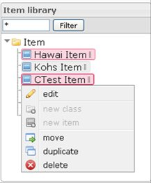
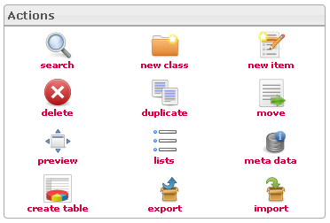
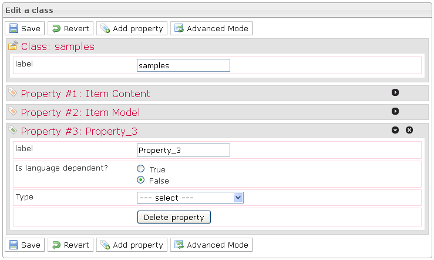
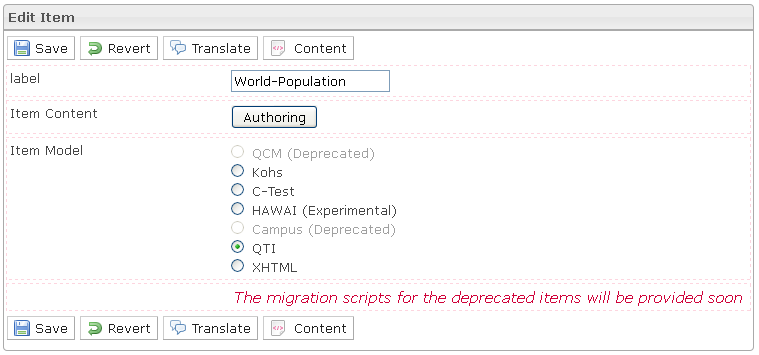
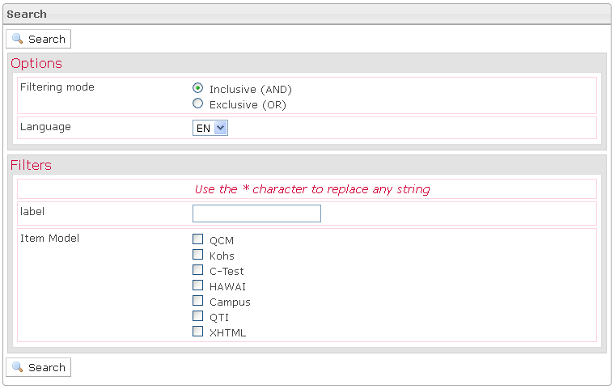
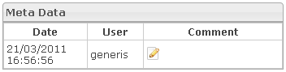
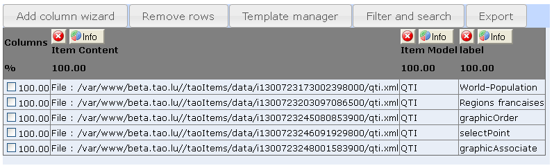
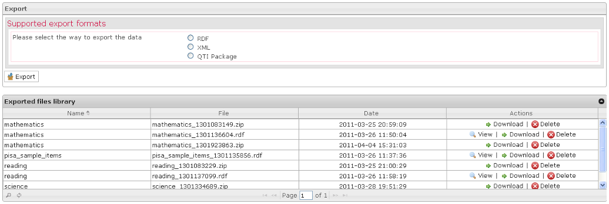
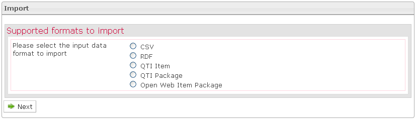

<!--
parent: Items
created_at: '2011-04-21 16:04:55'
updated_at: '2013-03-13 13:17:15'
authors:
    - 'Jérôme Bogaerts'
contributors:
    - 'Franck Gismondi'
tags:
    - Items
-->

Manage Items¶
=============

The main functions of this section:

Items library pane
------------------

\* It is possible to put a filter on the items tree view. Only items and classes that contain the input string will be displayed. 

\* When right-clicking the selection is done in the tree, the actions are also displayed as context menu. 

  
* The classes tree supports drag and drop to move items into a different class.

Actions pane¶
-------------

\* According to your actions in the interface, the actions icons will be activated or deactivated.

Edit a class pane¶
------------------

\* The Edit a class box is displayed when a class is selected in the Items library. 

  
* The Edit a class box provides the possibility to create, modify or delete properties. These properties determine parameters to define the creation of items class. 

  
* Three properties are predefined as they constitute the specification of an item: Label, Item content and Item model. 

  
* The Simple mode allows you to create properties with widgets and with previously created lists. 

  
* The Advanced mode allows you to create properties from widgets and all resources of the platform.

Edit item pane¶
---------------

\* The Edit item box is displayed when an item is selected in the Items library box. 

  
* The Edit item box provides you with item properties which are defined in the parent classes properties and are available for modification. 

  
* To modify the Item content you can switch to the authoring mode by clicking on the Authoring button.

Translate pane¶
---------------

\* In the Edit item box, when you click on the Translate button, the Translate box is displayed. 

  
* The Translate box only allows the translation of item properties. To translate the item content, you initially have to choose the data language targeted in the Settings extension, then translate the content in the item Authoring tool.

Manage item content pane¶
-------------------------

\* In the Edit item pane, when you click on the Content button, the Management of the item content box is displayed\
  
* When the item has no content, the Management of the item content box allows you to import content for your item. 

  
* When the item has content, the Management of the item content box also allows you to download this content on your computer.

Search pane¶
------------

\* The Search pane is displayed when you click on the Search icon, in the Actions pane. 

  
* In the first extension of the Search box, you should define the search options which permit to refine search results. 

  
* In the second extension of the Search box, you should define at least one filter to allow the search.

Move to pane¶
-------------

\* The Move to pane is displayed when an item is selected in the tree and when you click on the Move icon (in the right click menu or in the Actions pane). 

  
* To move an item, just click on the target class.

Create a list pane¶
-------------------

\* The Create a list pane is displayed when you click on the Lists icon. 

  
* To create a list, just define the name and the number of elements. 

  
* After that, you have to edit the elements in the created list and save it.

Meta data pane¶
---------------

\* The Meta data pane is displayed when an item is selected in the Items library and when you click on the Meta data icon. 

  
* You can edit a comment for the selected item. In order to do that, you should click on the Edit icon, write a comment in the pane which appears and click on the Save button.

Create table pane¶
------------------

\* The Create table box is displayed when a class is selected in the Items library and when you click on the Create table action. 

  
* The Create table box is a workspace where it is possible to build a table to view data selected among all the data that can be viewed on the platform.

Export pane¶
------------

\* The Export pane is displayed when an item or a class is selected in the Items library and when you click on the Export icon. 

  
* You can export your data to RDF or to XML. 

  
* If you choose to export your data to RDF, you must indicate the namespaces or the instances you want to export. 

  
* If you choose to export your data to XML, you have to indicate the items you want to export.

Import pane¶
------------

\* The Import pane is displayed when a class is selected in the Items library and when you click on the Import icon. 

  
* You can import your data to CSV, to RDF, to QTI Item, to QTI Package, or to XHML Package. 

  
* If you choose to import your data to CSV, the import is occurring in three steps: first define the common options of your CSV file, second select your file in your file system by clicking the Browse button and thirdly map the columns of your CSV file to the properties of your class. 

  
* If you choose to import your data to RDF, you must indicate the RDF item you want to import. 

  
* If you choose to import your data to QTI Item, you must indicate the QTI item you want to import. 

  
* If you choose to import your data to QTI Package, you must indicate the QTI item you want to import (in ZIP format). 

  
* If you choose to import your data to XHTML Package, you must indicate the XHTML item you want to import (in ZIP format).

