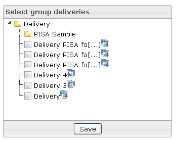

<!--
parent: 'Manage Groups'
created_at: '2012-04-03 15:27:52'
updated_at: '2013-03-13 13:58:07'
authors:
    - 'Jérôme Bogaerts'
contributors:
    - 'Sophie Doublet'
tags:
    - 'Manage Groups'
-->

Select group deliveries
=======================

The Select group deliveries pane is displayed when a group is selected in the Groups library.

The Select group deliveries pane allows indicating the deliveries which should be associated with the selected group.

