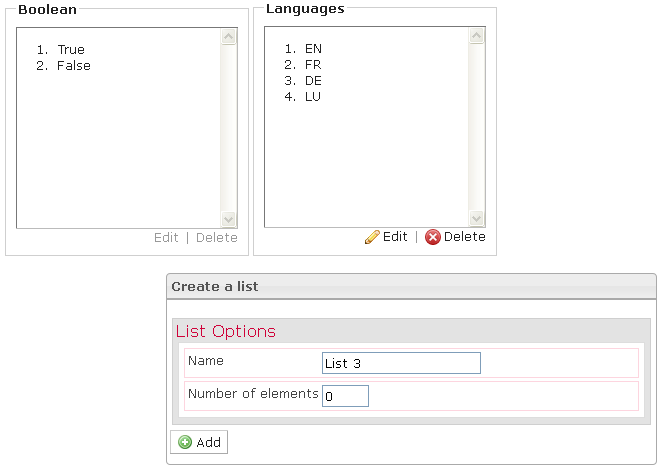

<!--
created_at: '2012-04-12 16:52:34'
updated_at: '2013-03-13 13:32:18'
authors:
    - 'Jérôme Bogaerts'
contributors:
    - 'Sophie Doublet'
tags:
    - 'Manage Items'
-->

Create a list
=============

The Create a list pane is displayed when you click on the Lists icon. 

To create a list, just define the name and the number of elements. 

After that, you have to edit the elements in the created list and save it.

