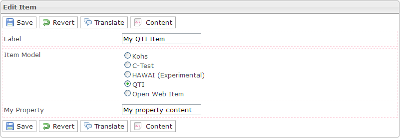

<!--
created_at: '2012-03-16 17:01:37'
updated_at: '2013-03-13 13:19:04'
authors:
    - 'Jérôme Bogaerts'
contributors:
    - 'Sophie Doublet'
tags:
    - 'Manage Items'
-->

Edit item
=========

The Edit item box is displayed when an item is selected in the Items library box.

Here you can:

-   define the Label of your Item
-   select an Item model (Kohs, C-Test, QTI or Open Web Item)
-   and edit properties that you have created in the parent class

After saving, you can edit your item content by the “Authoring” button or tab.

