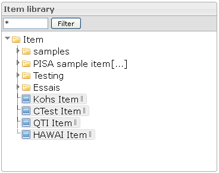

<!--
author:
    - 'Jérôme Bogaerts'
created_at: '2012-02-29 15:29:32'
updated_at: '2013-03-13 13:18:14'
tags:
    - 'Manage Items'
-->

Items library
=============

The Item library provides a tree-view of the items  and classes  you have created. All are contained in the “Item” root class.

You can move items in order to change their belonging class by drag and drop, or with the “Move” icon.

Different actions are available by right clicking (edit, new class, new item, move, duplicate, delete) depending on whether a class or an item is selected.

You can filter the Items library. Only the items and classes labels that meet the string enter in the text field will be displayed.

