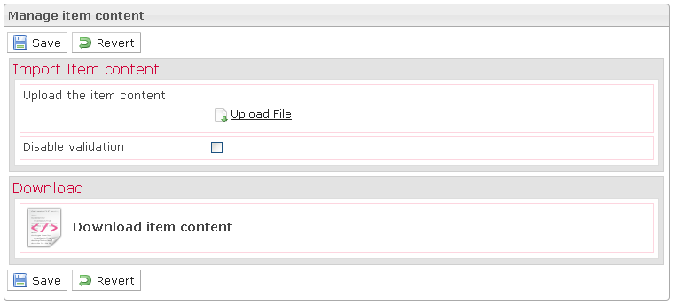

<!--
parent:
    title: Manage_Items
author:
    - 'Jérôme Bogaerts'
created_at: '2012-03-19 18:59:45'
updated_at: '2013-03-13 13:31:09'
tags:
    - 'Manage Items'
-->

Manage item content
===================

In the Edit item pane, when you click on the Content button, the Manage item content pane is displayed.

Here you can:

-   **import** the content of your item

<!-- -->

-   **download** the content of your item on your computer (*if defined already*)

