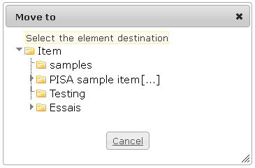

<!--
created_at: '2012-04-12 16:51:04'
updated_at: '2013-03-13 13:32:03'
authors:
    - 'Jérôme Bogaerts'
contributors:
    - 'Sophie Doublet'
tags:
    - 'Manage Items'
-->

Move to
=======

The Move to pane is displayed when an item is selected in the tree and when you click on the Move icon (in the right click menu or in the Actions pane).

To move an item, just click on the target class.

