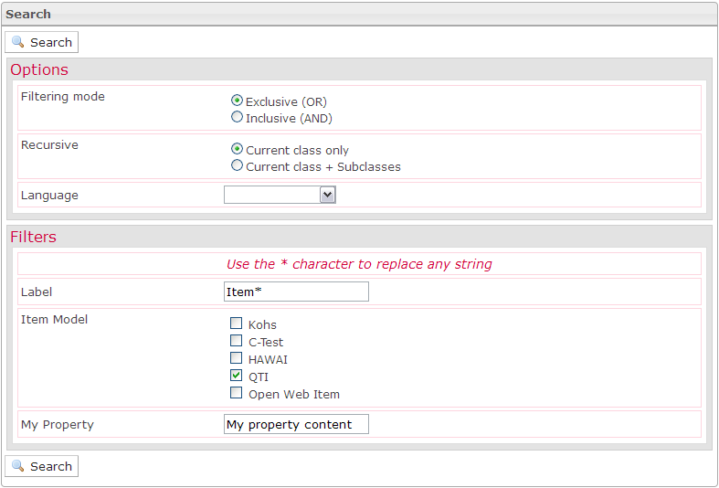

<!--
author:
    - 'Jérôme Bogaerts'
created_at: '2012-04-12 16:47:40'
updated_at: '2013-03-13 13:31:28'
tags:
    - 'Manage Items'
-->

Search
======

The Search pane is displayed when you click on the Search icon, in the Actions pane.

In the first extension of the Search box, you should define the search options which permit to refine search results.

In the second extension of the Search box, you should define at least one filter to allow the search.

Search
======

The Search pane is displayed when you click on the Search icon, in the Actions pane.

In the first extension of the Search box, you should define the search options which permit to refine search results.

In the second extension of the Search box, you should define at least one filter to allow the search.

