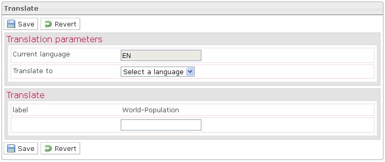

<!--
created_at: '2012-03-16 17:18:39'
updated_at: '2013-03-13 13:30:45'
authors:
    - 'Jérôme Bogaerts'
contributors:
    - 'Sophie Doublet'
tags:
    - 'Manage Items'
-->

Translate
=========

In the Edit item pane, when you click on the Translate button, the Translate box appears.

Here you can translate the **item properties**.

—\> To translate the **item content**, you initially have to choose the data language targeted in the Settings extension, then translate the content in the item Authoring tool.

Translate
=========

In the Edit item pane, when you click on the Translate button, the Translate box appears.

Here you can translate the **item properties**.

—\> To translate the **item content**, you initially have to choose the data language targeted in the Settings extension, then translate the content in the item Authoring tool.

