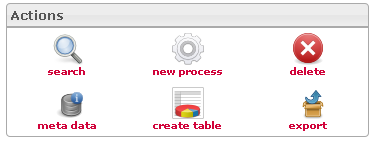

<!--
created_at: '2012-04-17 14:11:09'
updated_at: '2013-03-13 14:27:45'
authors:
    - 'Jérôme Bogaerts'
contributors:
    - 'Sophie Doublet'
tags:
    - 'Manage Processes'
-->

Actions
=======

According to your actions in the interface, the actions icons will be activated or deactivated.

Actions
=======

According to your actions in the interface, the actions icons will be activated or deactivated.

