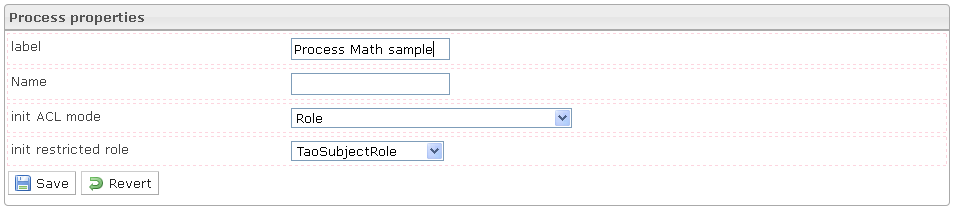

<!--
parent:
    title: Manage_Processes
author:
    - 'Jérôme Bogaerts'
created_at: '2012-04-17 14:15:04'
updated_at: '2013-03-13 14:27:59'
tags:
    - 'Manage Processes'
-->

Process properties
==================

The Process properties box is displayed when a process is selected in the Processes library box.The Process properties box provides the process properties to define.

The Init ACL mode (Initialization Acess Control List mode) property allows restraining the access of the process initialization. The ACL mode integrates three options: Role, Role restricted user and User. The Role option consists in restricting the access to one Role, in this situation all users that have this Role can access the process initialization. The Role restricted user consists in restricting the access to the process initialization to the first user that has the Role. The User option consists in restricting the access to one user, in this situation only the selected user can access the process initialization.

The Init restricted role property allows indicating the specific Role used to restrict the access at the process initialization.

