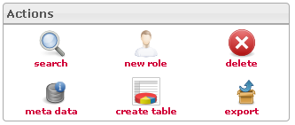

<!--
author:
    - 'Jérôme Bogaerts'
created_at: '2012-04-18 14:48:12'
updated_at: '2013-03-13 14:33:20'
tags:
    - 'Manage Roles'
-->

Actions
=======

•According to your actions in the interface, the actions icons will be activated ar deactivated.

