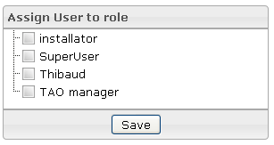

<!--
created_at: '2012-03-29 16:28:57'
updated_at: '2013-03-13 14:33:39'
authors:
    - 'Jérôme Bogaerts'
contributors:
    - 'Franck Gismondi'
tags:
    - 'Manage Roles'
-->

Assign user to role
===================

-   The Assign user to role box is displayed when a role is selected in the Roles library.
-   The Assign user to role box allows putting the selected role at different users.

Assign user to role
===================

-   The Assign user to role box is displayed when a role is selected in the Roles library.
-   The Assign user to role box allows putting the selected role at different users.

